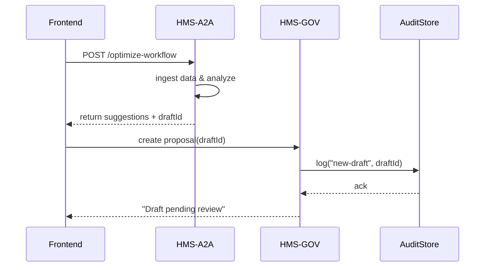

# Chapter 4: AI Representative Agent (HMS-A2A)

In the last chapter, we learned how **Intent-Driven Navigation** guides users through the right forms automatically. Now, let’s meet our AI “process consultant” in action: the **AI Representative Agent (HMS-A2A)**.

---

## 1. Why an AI Representative Agent?

Imagine the **Bureau of Federal Health Appointments** wants to streamline how veterans schedule follow-up visits. They have:

- Usage logs from the scheduling micro-frontend  
- Citizen feedback about confusing steps  
- Existing policies on appointment limits  

Instead of manually combing through all that data, you call in your **AI Representative Agent**. It ingests the logs, feedback, and rules, then:

1. Analyzes where delays happen  
2. Drafts optimized workflow changes  
3. Suggests updates to policy rules  
4. Optionally pushes those changes (with human oversight)

It’s like briefing a manager with an automated, always-on consultant!

---

## 2. Key Concepts

1. **Data Ingestion**  
   The agent gathers usage metrics, feedback text, and current policy files.

2. **Analysis Engine**  
   It applies ML or rule-based checks to spot bottlenecks (e.g., long wait times).

3. **Suggestion Drafting**  
   The agent generates proposed workflow edits or policy tweaks in text form.

4. **Proposal Pusher**  
   With the right permissions, it can submit these drafts into the **[Admin/Gov Portal (HMS-GOV)](02_admin_gov_portal__hms_gov__.md)** for review.

5. **Oversight Hook**  
   All changes wait in a “pending” state until a human approves, linking to our **[Human-in-the-Loop Mechanism](05_human_in_the_loop__hitl__mechanism_.md)**.

---

## 3. How to Use HMS-A2A to Optimize a Workflow

### 3.1 Calling the Agent API

Here’s a minimal example where our frontend asks HMS-A2A to suggest improvements:

```js
// file: optimizeWorkflow.js
async function optimizeSchedule() {
  const response = await fetch('/api/ai/agent/optimize-workflow', {
    method: 'POST',
    headers: { 'Content-Type': 'application/json' },
    body: JSON.stringify({
      usageData: usageLogs,           // array of events
      feedback: userComments,         // text array
      policies: currentPolicyFiles    // JSON or text
    })
  });
  return response.json();            // returns { suggestions: [...], draftId: 123 }
}

// Example usage
optimizeSchedule().then(result => {
  console.log('AI Suggestions:', result.suggestions);
});
```

Explanation:  
- We POST data to `/api/ai/agent/optimize-workflow`.  
- The agent returns a list of human-readable suggestions and a draft ID.

### 3.2 Reviewing Suggestions

```js
// file: reviewDraft.js
async function loadDraft(draftId) {
  const draft = await fetch(`/api/ai/drafts/${draftId}`).then(r => r.json());
  showInEditor(draft.text);         // load into a simple text editor
}
```

Explanation:  
- We fetch the drafted workflow or policy text.  
- The UI shows it for a manager to edit or approve.

---

## 4. Step-by-Step Walkthrough



1. **Frontend** requests optimization.  
2. **HMS-A2A** ingests and analyzes data.  
3. Agent returns **suggestions** and a **draft ID**.  
4. Frontend pushes draft into **HMS-GOV**.  
5. **HMS-GOV** logs the event.  
6. Manager sees “pending review.”

---

## 5. Under the Hood

### 5.1 Non-Code Flow

1. Agent fetches usage logs, feedback, policies from storage.  
2. Analysis engine identifies hotspots (e.g., “20% drop-off at step 3”).  
3. Suggestion module crafts text like “Combine steps 2 & 3 into a single form.”  
4. Draft stored with an identifier and metadata (“createdAt”, “sourceData”).  
5. Exposed via REST endpoints for listing and retrieval.

### 5.2 Simple Implementation Example

```js
// file: aiAgent.js
export async function handleOptimize(req, res) {
  const { usageData, feedback, policies } = req.body;
  // 1. Analyze
  const issues = analyzeUsage(usageData);
  // 2. Draft suggestions
  const text = draftWorkflow(issues, feedback, policies);
  // 3. Store draft
  const draftId = await saveDraft({ text, issues });
  res.json({ suggestions: issues, draftId });
}

// Helpers (details skipped)
function analyzeUsage(logs) { /* returns array of issues */ }
function draftWorkflow(issues, feedback, policies) { /* returns text */ }
async function saveDraft(draft) { /* saves in DB, returns id */ }
```

Explanation:  
- **handleOptimize** glues together analysis, drafting, and storage.  
- Helper functions isolate each concern for clarity.

---

## Conclusion

You’ve seen how the **AI Representative Agent**:

- Ingests real-world data (usage, feedback, policies)  
- Analyzes and drafts improvement suggestions  
- Exposes proposals via simple APIs  
- Hands off to **[HMS-GOV](02_admin_gov_portal__hms_gov__.md)** for human review

Next up, we’ll explore how humans and machines collaborate in real time with the **[Human-in-the-Loop Mechanism](05_human_in_the_loop__hitl__mechanism_.md)**.

---

Generated by [AI Codebase Knowledge Builder](https://github.com/The-Pocket/Tutorial-Codebase-Knowledge)