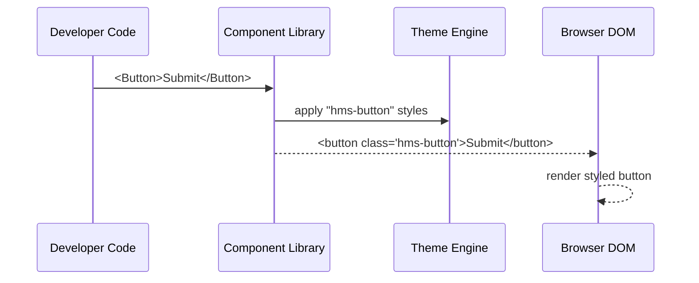

# Chapter 4: Frontend Component Library

In the last chapter, we saw how the [Admin/Gov Portal](03_admin_gov_portal_.md) uses buttons, tables, and dialogs to let staff approve or reject requests. As we build more screens—both in the User Portal and the Admin/Gov Portal—we don’t want to rewrite the same form fields or buttons over and over. That’s where our **Frontend Component Library** comes in.

---

## Why a Component Library?

Imagine you’re furnishing a brand-new office. Instead of buying custom desks, chairs, and cabinets every time, you choose a modular office‐furniture catalog:

- Every desk and shelf has the same finish and connectors.  
- You can mix and match pieces to fit any room.  
- If you need more storage later, you grab a matching shelf.

In HMS-EHR, our **Component Library** is that catalog of UI modules—buttons, inputs, tables, dialogs, and charts—that:

- **Speeds development** of new screens  
- **Ensures a consistent look & feel** across portals  
- **Makes it easier to maintain** accessibility and usability standards  

---

## Key Concepts

1. **Components**  
   Self-contained UI pieces (e.g., `<Button>`, `<TextField>`, `<DataTable>`).

2. **Styles & Themes**  
   CSS rules or design tokens that keep colors, spacing, and typography consistent.

3. **Documentation & Examples**  
   A searchable style guide where developers see how to use each component.

4. **Packaging & Distribution**  
   Published as an NPM package (`@hms-ehr/ui-library`) so any portal can install it.

---

## Quick Start: Using the Library

1. Install the package in your portal project:

   ```bash
   npm install @hms-ehr/ui-library
   ```

2. Import and use components in your screen code:

   ```jsx
   // src/portal/NewApplication.jsx
   import { Button, TextField } from '@hms-ehr/ui-library';

   export function NewApplicationForm() {
     return (
       <form>
         <TextField label="Citizen ID" name="citizenId" />
         <TextField label="Description" name="description" />
         <Button type="submit">Submit Application</Button>
       </form>
     );
   }
   ```

When you run your portal, you’ll see a styled text field and button—no extra CSS needed.

---

## Under the Hood: What Happens When You Render `<Button>`

Here’s a high-level sequence of events:



1. Your code calls the `Button` component.  
2. The library adds a CSS class from our theme.  
3. The browser renders a styled `<button>`.  

---

## Inside the Library: Component Code

Let’s look at the minimal code for our `Button`.

1. Component definition:

   ```jsx
   // src/components/Button.jsx
   export function Button({ children, onClick, type = 'button' }) {
     return (
       <button
         className="hms-button"
         type={type}
         onClick={onClick}
       >
         {children}
       </button>
     );
   }
   ```

2. Styles for that button:

   ```css
   /* src/styles/button.css */
   .hms-button {
     background: #0072c3;
     color: #fff;
     padding: 8px 16px;
     border: none;
     border-radius: 4px;
     cursor: pointer;
   }
   ```

3. Package entry point:

   ```js
   // src/index.js
   import './styles/button.css';
   import { Button } from './components/Button';
   // ... import other components
   export { Button /*, TextField, DataTable, Dialog */ };
   ```

When we publish, `npm publish` takes our `src/` files and makes them available under `@hms-ehr/ui-library`.

---

## Adding a New Component

Suppose we need a **Modal Dialog**:

1. Create `src/components/Dialog.jsx`:

   ```jsx
   export function Dialog({ title, children, onClose }) {
     return (
       <div className="hms-dialog-backdrop">
         <div className="hms-dialog">
           <header>{title}</header>
           <button onClick={onClose}>✕</button>
           <main>{children}</main>
         </div>
       </div>
     );
   }
   ```

2. Add styles in `src/styles/dialog.css`:

   ```css
   .hms-dialog-backdrop { /* semi-transparent background */ }
   .hms-dialog { /* centered white box */ }
   ```

3. Export it in `src/index.js`:

   ```js
   import './styles/dialog.css';
   export { Dialog } from './components/Dialog';
   ```

Publish a new version (`npm version patch && npm publish`), and all portals can grab the updated library.

---

## Summary

In this chapter, you learned:

- Why a **Frontend Component Library** speeds up development and keeps UI consistent.  
- How to install and use components like `<Button>` and `<TextField>`.  
- What happens under the hood when you render a component.  
- How to build, style, and publish your own component.

Up next, we’ll dive into the [Governance Layer](05_governance_layer_.md) that ensures components and configurations follow organizational policies.

---

Generated by [AI Codebase Knowledge Builder](https://github.com/The-Pocket/Tutorial-Codebase-Knowledge)