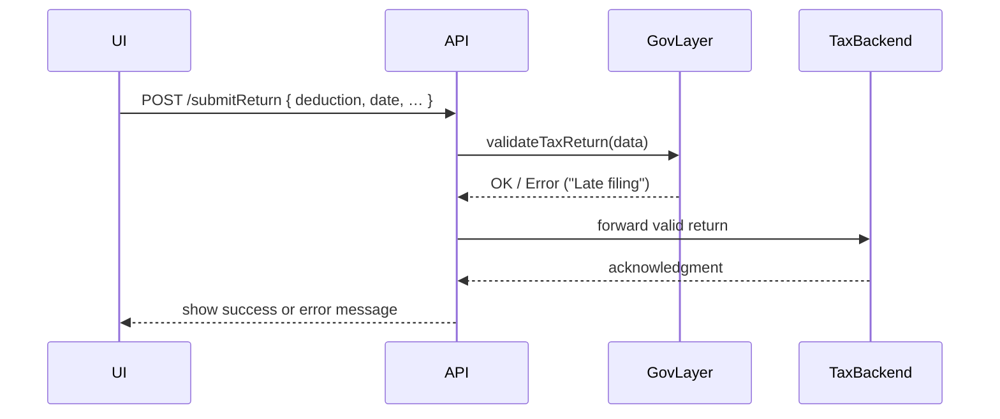

# Chapter 5: Governance Layer

Now that we have a consistent set of UI widgets from the [Frontend Component Library](04_frontend_component_library_.md), it’s time to define the “constitution” of our HMS-EHR system: the **Governance Layer**. This chapter will show you how to encode high-level rules, policies, and compliance frameworks so that every action in our system stays legally sound.

---

## Why a Governance Layer?

Imagine the federal tax agency receives thousands of electronic tax returns every day. It must ensure:

- Taxpayers don’t claim deductions above legal limits  
- Returns are filed before the statutory deadline  
- Any exceptions or flags (e.g., high refunds) are audited  

The **Governance Layer** is like the agency’s constitution: it loads tax-code rules, applies them to each submission, logs every check for audits, and prevents illegal operations before they happen.

---

## Key Concepts

1. **Policy Definitions**  
   A machine-readable file (JSON, YAML or DSL) that encodes rules (e.g., maximum deduction, deadlines).

2. **Rule Evaluator**  
   A service that loads policies and applies them to incoming data, throwing errors or granting approval.

3. **Compliance Logging**  
   Every rule check is recorded in an audit log for later review.

4. **Integration Points**  
   The Governance Layer sits between your API and backend services—no return is processed without passing these checks.

---

## A Simple Tax-Return Use Case

Let’s walk through what happens when a citizen submits a tax return:



1. The portal sends the return data to your API.  
2. Your API calls the Governance Layer to **validate** it.  
3. The Governance Layer applies each rule, logs the result, and returns OK or an error.  
4. Only valid returns reach the backend processing system.

---

## Defining Your Policies

Create a JSON file—`tax_policies.json`—to hold your rules:

```json
{
  "maxDeduction": 5000,
  "filingDeadline": "2024-04-15"
}
```

- `maxDeduction`: no one may claim more than $5,000 in itemized deductions.  
- `filingDeadline`: any return with a date after April 15, 2024 is late.

---

## Loading and Applying Policies

### 1. Load policies from disk

File: `src/governance/policyLoader.js`

```js
const fs = require('fs');

function loadPolicies(path) {
  const raw = fs.readFileSync(path, 'utf-8');
  return JSON.parse(raw);
}

module.exports = { loadPolicies };
```

This simple loader reads your JSON and returns an object of rules.

### 2. Validate a tax return

File: `src/governance/service.js`

```js
const { loadPolicies } = require('./policyLoader');
const { logCheck } = require('./auditLogger');

class GovernanceService {
  constructor(policyPath) {
    this.policies = loadPolicies(policyPath);
  }

  validateTaxReturn({ deduction, date }) {
    const max = this.policies.maxDeduction;
    const deadline = new Date(this.policies.filingDeadline);
    // Check deduction
    const okDeduction = deduction <= max;
    logCheck('maxDeduction', okDeduction);
    if (!okDeduction) throw new Error(`Deduction > ${max}`);
    // Check deadline
    const okDeadline = new Date(date) <= deadline;
    logCheck('filingDeadline', okDeadline);
    if (!okDeadline) throw new Error('Return filed late');
    return true;
  }
}

module.exports = GovernanceService;
```

- We load the policies once in the constructor.  
- For each rule, we log its result and throw an error if it fails.

### 3. Audit logging

File: `src/governance/auditLogger.js`

```js
function logCheck(ruleName, result) {
  const entry = {
    timestamp: new Date().toISOString(),
    rule: ruleName,
    passed: result
  };
  // In production, write to a secure audit store
  console.log('[Audit]', JSON.stringify(entry));
}

module.exports = { logCheck };
```

Every check is recorded with a timestamp and pass/fail status—crucial for compliance reviews.

---

## Putting It All Together in Your API

Here’s how your Express route might use the Governance Layer:

```js
// src/api/routes.js
const express = require('express');
const GovernanceService = require('../governance/service');
const router = express.Router();

const gov = new GovernanceService('tax_policies.json');

router.post('/submitReturn', (req, res) => {
  try {
    gov.validateTaxReturn(req.body);
    // If valid, forward to back-end
    forwardToTaxBackend(req.body);
    res.json({ success: true });
  } catch (err) {
    res.status(400).json({ error: err.message });
  }
});

module.exports = router;
```

- We instantiate `GovernanceService` with our policy file.  
- On each POST, we call `validateTaxReturn`. If it throws, we return a 400 error.

---

## Summary

In this chapter you learned how to:

- Treat your system’s high-level rules like a “constitution”  
- Define policies in a JSON file  
- Load and evaluate rules in a central **GovernanceService**  
- Log every rule check for compliance audits  

Next, you’ll see how to build out more detailed policy workflows in the [Policy Module](06_policy_module_.md).

---

Generated by [AI Codebase Knowledge Builder](https://github.com/The-Pocket/Tutorial-Codebase-Knowledge)