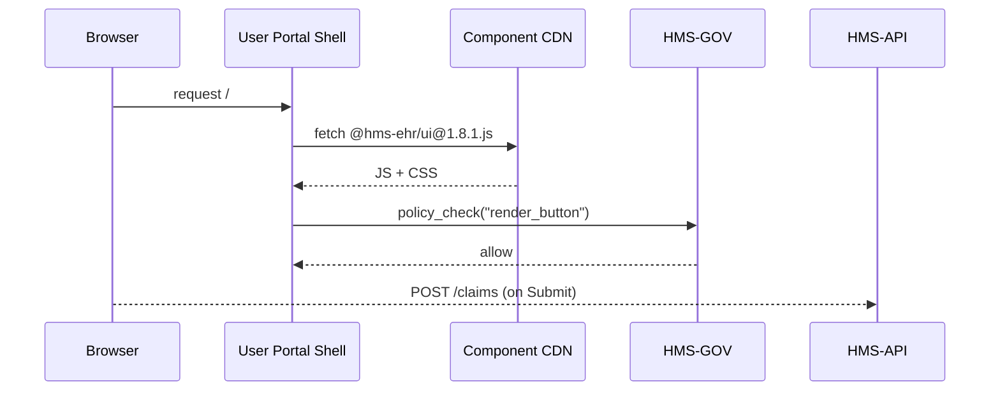

# Chapter 5: Interface Layer (HMS-MFE / Portals)  
*(File: 05_interface_layer__hms_mfe___portals__.md)*  

[← Back to Role-Based Access Control (RBAC)](04_role_based_access_control__rbac__.md)

---

## 1. Why Do We Need an “Interface Layer”?

Imagine a veteran, **Maria**, who wants to:

1. Log in, upload medical bills, and track her housing-benefit status. (User Portal)  
2. A county official, **Mr. Kim**, tweaks reimbursement limits. (Admin Portal)  
3. A non-profit contractor, **Hope-Homes**, pulls nightly CSV feeds. (Partner Portal)

All three screens should:

* Look and behave the same (buttons, fonts, error messages).  
* Respect the same security & RBAC rules.  
* Get design fixes instantly—without each team redeploying code.

That is exactly what the **Interface Layer (HMS-MFE)** provides.

> Think of HMS-MFE as the federal **service counter**:  
> one facade, many windows, same helpful experience.

---

## 2. Key Concepts in Plain English

| Term | What it really means | Friendly analogy |
|------|----------------------|------------------|
| Portal | A full website (User, Admin, Partner) | Different windows at DMV |
| Micro-Frontend (MFE) | A small UI module (e.g., UploadWidget) that can run alone or be composed into any portal | Lego brick |
| Component Library | Shared set of buttons, date-pickers, alerts | U.S. Web Design System toolbox |
| Theme Token | Color/spacing variables that make portals “look on-brand” | Paint buckets |
| Live Update | Fresh library version auto-loads in every portal | Central street-sign replacement—overnight every sign changes |

---

## 3. Quick-Start — Build a Page in 15 Lines

Let’s create a **“Submit Housing Claim”** page that works in every portal.

### 3.1 Install the Library

```bash
npm install @hms-ehr/ui
```

### 3.2 Write the Page (React, 15 lines)

```jsx
// file: SubmitClaimPage.jsx
import { Page, TextField, FileUploader, Button } from "@hms-ehr/ui";

export default function SubmitClaimPage() {
  return (
    <Page title="Housing Benefit Claim">
      <TextField   label="Veteran ID"      name="vetId"   required />
      <FileUploader label="Upload Bills"   name="docs"    accept=".pdf" />
      <Button      type="submit">Submit</Button>
    </Page>
  );
}
```

What happens?  
1. TextField & FileUploader already know how to show **error states**, respect **SCF encryption**, and call **HMS-API**.  
2. The styling comes from the same token set the Admin and Partner portals use—no extra CSS!

### 3.3 Mount It in Any Portal

```jsx
// User Portal router
<Route path="/claim" element={<SubmitClaimPage/>} />
```

Boom—page appears in the User Portal.  
Admin Portal can import the same page for “Impersonate User” testing; Partner Portal can embed it inside an `<iframe>`.

---

## 4. Under the Hood — How Does a Button Get on Screen?



1. Portal shell is **tiny**—it just fetches the current library from the CDN.  
2. Before showing sensitive widgets, it calls [Governance Layer](01_governance_layer__hms_gov__.md).  
3. When the user clicks **Submit**, the page calls [Backend API Gateway](09_backend_api_gateway__hms_api__.md).  
4. No portal code changes when **@hms-ehr/ui** revs to 1.8.2; the shell fetches the new file at next reload.

---

## 5. Inside the Library — Mini Tour

### 5.1 Button Component (simplified)

```jsx
// packages/ui/Button.jsx
import tokens from "./tokens";

export default function Button({children,...props}) {
  return (
    <button
      style={{
        background: tokens.primary,
        padding: tokens.spacingMd
      }}
      {...props}
    >
      {children}
    </button>
  );
}
```

Explanation  
• Uses **design tokens** so theme can change colors globally.  
• Props spread allows `<Button disabled>` etc.

### 5.2 Auto-Update Loader

```js
// portal-shell/loadLib.js
const v = localStorage.getItem("uiVersion") || "latest";
import(`https://cdn.example.gov/@hms-ehr/ui@${v}.js`)
  .then(() => console.log("UI ready ✅"))
  .catch(() => alert("CDN error"));
```

*Beginners’ takeaway:* the portal loads whatever version is advertised; ops can flip `"uiVersion"` once and every user gets the fix.

---

## 6. How Do Portals Respect RBAC?

Remember Chapter 4? The button should disable itself if the user lacks permission.

```jsx
import { useHasRole } from "@hms-ehr/ui/auth";

function SubmitClaimPage() {
  const canSubmit = useHasRole(["Veteran","Proxy"]);
  return (
    <Button disabled={!canSubmit}>Submit</Button>
  );
}
```

`useHasRole` reads the JWT produced by the SAML/OIDC flow and applies the RBAC table shipped from [RBAC Layer](04_role_based_access_control__rbac__.md).

---

## 7. Theming a Portal in 3 Steps

```js
// file: theme.js
export default {
  primary:   "#002D62",   // Navy blue
  accent:    "#FFC72C",   // Gold
  spacingMd: "12px"
};
```

```jsx
import { ThemeProvider } from "@hms-ehr/ui";
import theme from "./theme";

root.render(
  <ThemeProvider tokens={theme}>
    <App/>
  </ThemeProvider>
);
```

All components instantly adopt the new color palette—great for agency branding.

---

## 8. Common Pitfalls & Quick Fixes

| Pitfall | Symptom | Fix |
|---------|---------|-----|
| Forgetting to wrap with `ThemeProvider` | Gray boxes / no styles | Import and wrap once in `App.jsx` |
| Hard-coding colors in custom components | Inconsistent dark-mode | Use `tokens` instead |
| Skipping `policy_check` before rendering a sensitive form | Form shows but API call gets blocked | Call HMS-GOV early to fail fast |

---

## 9. Try It Yourself

1. Clone the repo and run `npm run dev:user`.  
2. Browse to `http://localhost:3000/claim` and submit a PDF.  
3. Edit `packages/ui/tokens.js` to change `primary` color, reload—watch every portal update.  
4. Toggle your JWT role to `Receptionist`, refresh, and see the **Submit** button disable itself.

---

## 10. What You Learned

✓ Why HMS-MFE is the **single storefront** for citizens, officials, and partners.  
✓ How micro-frontends + a shared component library give **consistency** and **instant updates**.  
✓ How RBAC and Governance checks still apply right in the browser.  
✓ A 15-line page that will run in any portal with zero extra CSS.

Next we’ll teach the interface to **guide users automatically** based on what they *intend* to do rather than which form they know: [Intent-Driven Navigation](06_intent_driven_navigation_.md).

---

---

Generated by [AI Codebase Knowledge Builder](https://github.com/The-Pocket/Tutorial-Codebase-Knowledge)