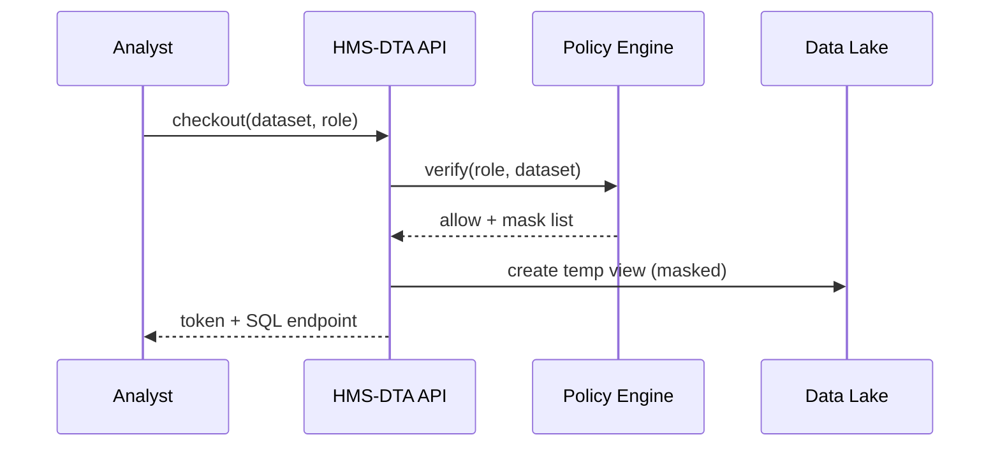
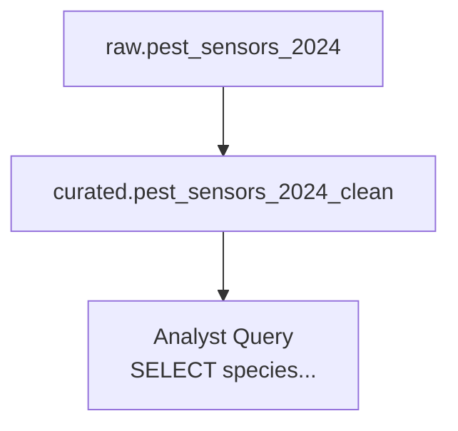

# Chapter 6: HMS-DTA (Data Lake & Governance)
*[← Back to Chapter 5: HMS-A2A](05_hms_a2a__inter_agency_exchange__.md)*  

---

## 1. Why Do We Need HMS-DTA?

Imagine a Category-4 hurricane hits the Gulf Coast.  
• **FEMA** needs real-time shelter capacity.  
• **CDC** wants medical-supply counts.  
• **DOT** must reroute traffic around flooded roads.

Today those numbers live in **separate spreadsheets, S3 buckets, and email threads**.  
HMS-DTA is the **central library** where every dataset—CSV, video stream, or Kafka topic—arrives, is catalogued, and can be “checked-out” by approved analysts **with a single policy engine watching the door**.

Result: agencies make decisions in minutes, not days.

---

## 2. Key Concepts (Plain English)

| Term | Analogy | One-Sentence Meaning |
|------|---------|----------------------|
| Raw Zone | Back room of unopened boxes | First stop; files are stored exactly as received. |
| Clean Zone | Bookbinding workshop | Automated jobs convert, validate, and tag data. |
| Curated Zone | Reading room | Golden, analyst-friendly tables (Parquet/Delta). |
| Catalog | Library index cards | Metadata: owner, schema, PII flags, retention rules. |
| Policy Engine | Strict librarian | Enforces “who can see what”, retention dates, and masking. |
| Lineage Graph | Breadcrumb trail | Shows every transformation from Raw → Curated. |
| Checkout Token | Library checkout slip | Time-bound credential that lets an analyst query a dataset. |

---

## 3. The 5-Minute “Hello-DTA”

Goal:  
1) Ingest a CSV from [HMS-A2A](05_hms_a2a__inter_agency_exchange__.md).  
2) Auto-clean & catalog it.  
3) Let a FEMA analyst query the curated table.

### 3.1 Ingest

```python
# file: ingest.py
from hms_dta import ingest

ingest(
    source="a2a://dtic/pest_sensor_batch_2024.csv",
    dataset_id="pest_sensors_2024",
    owner="DTIC",
    tags=["agriculture", "pest"],
)
```
What happens?  
• File lands in **Raw Zone**.  
• Catalog entry `pest_sensors_2024` is created with owner = DTIC.

### 3.2 Auto-Clean Job

```python
# file: clean_job.py
from hms_dta import clean

clean(
    dataset_id="pest_sensors_2024",
    script="""
        SELECT id,
               CAST(temp AS FLOAT)   AS temp_c,
               UPPER(species)        AS species,
               event_time
        FROM __RAW__;
    """
)
```
Explanation  
• `__RAW__` placeholder refers to Raw table.  
• Result lands in **Curated Zone** as `pest_sensors_2024_clean`.

### 3.3 Analyst Checkout

```python
# file: analyst.py
from hms_dta import checkout, query

token = checkout(
    dataset="pest_sensors_2024_clean",
    role="fema_analyst",
    duration="2h"              # expires automatically
)

rows = query(
    sql="SELECT species, COUNT(*) AS hits FROM dataset GROUP BY species",
    token=token
)
print(rows[:3])
```
Output (example):

```
[{'species': 'LOCUST', 'hits': 87},
 {'species': 'CORN BORER', 'hits': 54},
 {'species': 'ARMYWORM', 'hits': 31}]
```
The analyst never sees classified GPS columns—they were masked by the Policy Engine.

---

## 4. How “Checkout” Works (Step-by-Step)



1. Analyst requests access.  
2. Policy Engine checks role, retention dates, and column sensitivity.  
3. A **time-bound token** points to an auto-masked temp view.  
4. Analyst can only run `SELECT` within the allowed window.

---

## 5. Under the Hood (Mini Walkthrough)

### 5.1 Storage Layout

```
/lake
  ├─ raw/
  │   └─ pest_sensors_2024/part-000.csv
  ├─ clean/
  │   └─ pest_sensors_2024_clean/part-000.parquet
  └─ _catalog.json
```

### 5.2 Catalog Entry (trimmed)

```json
{
  "id": "pest_sensors_2024_clean",
  "owner": "DTIC",
  "columns": {
    "id": "INT",
    "temp_c": "FLOAT",
    "species": {"type":"STRING","pii":false},
    "event_time": "TIMESTAMP"
  },
  "retention_days": 365,
  "lineage": ["raw/pest_sensors_2024"],
  "tags": ["agriculture","pest"]
}
```

### 5.3 Policy Rule (YAML)

```yaml
# file: policies/default.yaml
- dataset: "*"
  role: "public"
  mask: ["ssn", "geo.*_classified*"]
- dataset: "pest_sensors_*"
  role: "fema_analyst"
  allow: "read"
```

### 5.4 Tiny Checkout Implementation

```python
# file: hms_dta/checkout.py
def checkout(dataset, role, duration):
    policy = PolicyEngine(dataset, role)
    if not policy.allowed("read"):
        raise PermissionError
    view = Lake.create_view(dataset, mask=policy.masked_cols())
    return Token(view, expires_in=duration)
```

Less than 10 lines: verify policy → create masked view → return token.

---

## 6. Data Lineage in One Glance


Clicking any node in the UI shows timestamp, job ID, and script used—handy for audits or bug hunts.

---

## 7. How Other HMS Layers Use DTA

* **[HMS-A2A](05_hms_a2a__inter_agency_exchange__.md)** → Pushes envelopes directly into *Raw Zone* via `ingest()`.
* **[HMS-SVC](04_hms_svc__core_backend_services__.md)** → Streams user-activity logs to DTA for long-term analytics.
* **[HMS-MFE](02_hms_mfe__micro_frontend_experience__.md)** → Dashboards fetch aggregated views using short-lived checkout tokens.
* **[HMS-ACT](11_hms_act__agent_action_orchestrator__.md)** AI agents request tokens the same way human analysts do—no backdoors.

---

## 8. FAQ & Troubleshooting

| Symptom | Likely Cause | Quick Fix |
|---------|--------------|-----------|
| “Permission denied” on checkout | Role not in policy | Add rule or request elevated role. |
| Column comes back `NULL` | Masking in effect | Check `PolicyEngine.masked_cols()`. |
| Clean job fails | Bad SQL | Test with `SELECT * FROM __RAW__ LIMIT 10` first. |
| Data gone after 1 year | Retention rule | Extend `retention_days` in catalog before expiry. |

---

## 9. What You Learned

You now know how HMS-DTA:

1. Takes **any** dataset from any agency.  
2. Cleans, catalogs, and applies governance rules automatically.  
3. Lets analysts (or AI agents) “check out” data safely with a single token.  
4. Records lineage so auditors can trace every byte.

In the next chapter we’ll see how legal obligations like HIPAA or FOIA are continuously monitored using machine intelligence in **Legal Compliance Intelligence**.  

→ *Continue to* [HMS-ESQ (Legal Compliance Intelligence)](07_hms_esq__legal_compliance_intelligence__.md)

---

Generated by [AI Codebase Knowledge Builder](https://github.com/The-Pocket/Tutorial-Codebase-Knowledge)