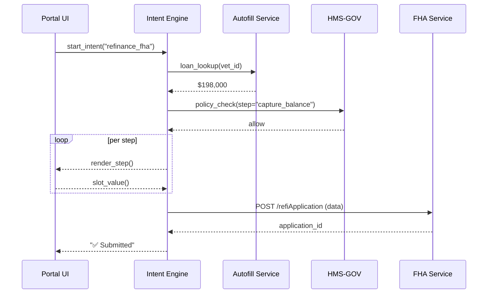

# Chapter 6: Intent-Driven Navigation  
*(File: 06_intent_driven_navigation_.md)*  

[← Back to Interface Layer (HMS-MFE / Portals)](05_interface_layer__hms_mfe___portals__.md)

---

## 1. Why Another Navigation System? – A 60-Second Story

Maria, a veteran living in Anchorage, opens the “Housing” portal.  
She **doesn’t** know which of the 42 forms, 8 eligibility charts, and 11 PDF guides applies to her.  
She only knows the outcome she wants:

> “I want to refinance my FHA-backed loan to lower my monthly payment.”

With **Intent-Driven Navigation (IDN)** Maria types (or says) that sentence; the platform:

1. Detects the *intent* (`refinance_fha`),  
2. Builds a step-by-step “wizard” (forms → eligibility → document uploads),  
3. Pre-fills anything it already knows (address, loan balance),  
4. Skips unneeded steps (she’s already on active duty, so no DD-214 upload),  
5. Hands off to the next layer when human review is required (see upcoming [AI Representative Agent](07_ai_representative_agent__hms_a2a__.md)).

No menu spelunking, no PDF spelunking—just progress.

---

## 2. Key Concepts in Plain English

| Term | What it really means | Friendly analogy |
|------|----------------------|------------------|
| Intent | The citizen’s desired outcome (`renew_passport`, `refinance_fha`) | “I’d like a driver’s license” request at DMV |
| Slot | A piece of info the system must gather (e.g., *property address*) | Blank line on a paper form |
| Journey Map | Ordered list of screens / API calls to satisfy the intent | Checklist the DMV clerk follows |
| Step Handler | Code that renders one screen and validates its slot(s) | Individual DMV window |
| Autofill | AI routine that guesses a slot value from existing data | Clerk typing your name after scanning your ID |
| Guardrail | Real-time check (policy, RBAC) before moving to next step | DMV vision test before license approval |
| Resume Token | Encrypted bookmark so users can quit and resume later | Claim ticket for unfinished DMV visit |

---

## 3. A 3-Step Quick-Start (Refinance FHA Example)

### Step 1 – Describe the Intent

```yaml
# file: intents/refinance_fha.yml
id: refinance_fha
title: "Refinance my FHA-backed loan"
slots:
  - name: property_address
    type: address
  - name: current_loan_balance
    type: money
    autofill: "hms_ai.loan_lookup"      # <- call AI helper
  - name: annual_income_doc
    type: file
journey:
  - step: capture_property
  - step: capture_balance
  - step: upload_income
  - step: eligibility_check
```

Beginners’ view:  
• **slots** list data we need.  
• **journey** is the order we’ll ask for them.

### Step 2 – Implement Tiny Step Handlers

```python
# file: step_handlers.py
from idn_core import get_slot, set_slot

def capture_property(ctx):
    addr = input("🏠  Enter property address: ")
    set_slot(ctx, "property_address", addr)

def capture_balance(ctx):
    bal = get_slot(ctx, "current_loan_balance")  # may be autofilled
    if not bal:
        bal = input("💵  Current loan balance: ")
        set_slot(ctx, "current_loan_balance", bal)

def upload_income(ctx):
    print("📄  Please drag-and-drop last year’s W-2.")
    # (file picker UI skipped)
```

Each handler: ≤6 lines, collects or confirms one slot.

### Step 3 – Launch the Intent

```python
# file: run_intent.py
from idn_core import start_intent

start_intent("refinance_fha")
```

Running `python run_intent.py` starts the wizard:

```
🏠  Enter property address: 123 Veterans Dr, Anchorage, AK
💵  Current loan balance:            (auto-filled: $198,000)
📄  Please drag-and-drop last year’s W-2.
✅  Eligibility passed – application submitted!
```

---

## 4. What Happens Behind the Curtain?



Five players, simple loop: **render → collect → validate → next**.

---

## 5. Inside `idn_core` – Mini Code Tour

### 5.1 Intent Registry

```python
# idn_core/registry.py
import yaml, glob
INTENTS = {}

for f in glob.glob("intents/*.yml"):
    data = yaml.safe_load(open(f))
    INTENTS[data["id"]] = data
```

Loads every YAML file at startup.

### 5.2 Start & Drive an Intent

```python
# idn_core/__init__.py
from .registry import INTENTS
from .state import new_ctx, next_step

def start_intent(intent_id):
    spec = INTENTS[intent_id]
    ctx  = new_ctx(spec["slots"])          # creates empty slot map
    for step_def in spec["journey"]:
        next_step(step_def["step"], ctx)   # calls handler by name
    print("✅  Done – data stored & routed")
```

≤10 lines; calls each *step handler* in order.

### 5.3 Slot State & Resume Token

```python
# idn_core/state.py
import json, base64, os

def new_ctx(slots):
    return {"slots": {s["name"]: None for s in slots}}

def save_ctx(ctx):
    blob = json.dumps(ctx).encode()
    return base64.b64encode(blob).decode()      # resume token

def load_ctx(token):
    blob = base64.b64decode(token)
    return json.loads(blob)
```

• `save_ctx` returns a safe string users can bookmark.  
• `load_ctx` lets them resume on another device.

---

## 6. Where Do RBAC & Governance Fit?

Before a step renders, IDN calls:

```python
from hms_rbac.engine import RBACEngine
from hms_gov import check_permission

allowed = RBACEngine(RBAC).allowed(user_role, "view", step_id)
if not allowed:
    raise PermissionError("RBAC deny")
check_permission(role=user_role, action="view", resource=step_id)
```

Thus IDN inherits the same guardrails covered in [Role-Based Access Control (RBAC)](04_role_based_access_control__rbac__.md) and [Governance Layer](01_governance_layer__hms_gov__.md).

---

## 7. Adding Your Own Intent in 4 Lines

```yaml
# intents/renew_passport.yml
id: renew_passport
title: "Renew my passport"
slots: [ {name: name}, {name: exp_date}, {name: photo, type: file} ]
journey: [ {step: capture_name}, {step: upload_photo}, {step: pay_fee} ]
```

Create 3 tiny step handlers, run `start_intent("renew_passport")`—done.

---

## 8. Common Pitfalls & Quick Fixes

| Pitfall | Symptom | Fix |
|---------|---------|-----|
| Forgot to list a slot | Step handler can’t store value | Add slot to YAML under `slots:` |
| Long step handler (>20 lines) | Hard to maintain | Split into multiple steps |
| Skipped governance check | Works in dev, blocked in prod | Always call `check_permission` helper |
| No resume token saved | Users lose progress | Call `save_ctx(ctx)` on each step |

---

## 9. Try It Yourself

1. Clone the repo, copy `intents/refinance_fha.yml`.  
2. Run `python run_intent.py`.  
3. Interrupt with `Ctrl-C`, note the printed **Resume Token** (if enabled).  
4. Run `python resume.py <token>` to pick up where you left off.  
5. Add a new slot (`credit_score`) and watch IDN ask for it automatically.

---

## 10. What You Learned

✓ Navigation by *outcome* (intent), not by labyrinthine menus.  
✓ Anatomy of an intent: slots, journey map, step handlers.  
✓ How AI autofill, Governance checks, and RBAC blend seamlessly.  
✓ A minimal `idn_core` you can read in minutes and extend in hours.

Next, we’ll empower the system with an **AI Representative Agent** that can *speak* to users, make recommendations, and even fill slots on their behalf.

[Continue to AI Representative Agent (HMS-A2A)](07_ai_representative_agent__hms_a2a__.md)

---

Generated by [AI Codebase Knowledge Builder](https://github.com/The-Pocket/Tutorial-Codebase-Knowledge)