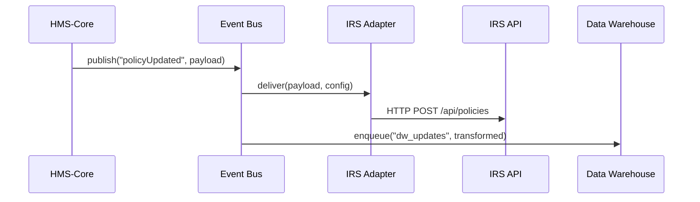
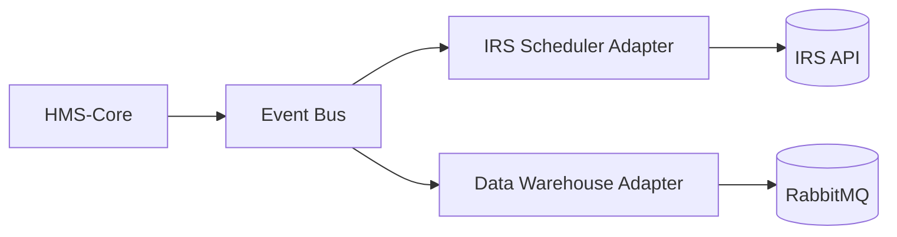

# Chapter 7: External System Integration

In the previous chapter, we saw how policies and workflows get enforced by the [Policy and Process Engine](06_policy_and_process_engine_.md). Now let’s build the “logistics network” that carries those updates out to other systems—schedulers, data warehouses, partner APIs—without anyone pushing buttons.

---

## 1. Why External System Integration?

Imagine the **Tax Court** just updated its hearing‐scheduling policy in HMS. That rule change needs to flow automatically to:

- The IRS scheduling engine  
- A central data warehouse for historical records  
- A partner portal used by outside attorneys  

Manually emailing spreadsheets or running ad-hoc scripts is slow and error-prone. With **External System Integration**, HMS becomes a fleet of cargo trucks:

- It watches for policy or workflow updates  
- Packs each change into a standard “shipment” format  
- Delivers it in real time to every registered system  

No more manual work—every external system stays in sync instantly.

---

## 2. Key Concepts

1. **Event Publisher**  
   Emits internal events when things change (e.g., “policyUpdated”).

2. **Connector / Adapter**  
   A small piece of code specific to each external system (e.g., IRS API, Data Warehouse).

3. **Transformer**  
   Maps HMS data structures into the external system’s format.

4. **Delivery Mechanism**  
   HTTP webhook, message queue (e.g., RabbitMQ), or batch file.

5. **Registration & Discovery**  
   A config store listing who subscribes to which events, and where to send them.

---

## 3. Solving the Tax Court Use Case

### 3.1 Register External Systems

First, define who wants which events in `integrations.json`:

```json
[
  {
    "name": "IRS Scheduler",
    "event": "policyUpdated",
    "url": "https://irs.gov/api/policies",
    "transformer": "irsPolicyTransformer"
  },
  {
    "name": "Data Warehouse",
    "event": "policyUpdated",
    "queue": "dw_updates",
    "transformer": "dwPolicyTransformer"
  }
]
```

Explanation:  
- **IRS Scheduler** gets HTTP POSTs.  
- **Data Warehouse** consumes from a message queue.

### 3.2 Emit an Event in HMS

When a policy changes, HMS fires an event:

```js
// file: eventPublisher.js
import { publish } from './eventBus.js';

export function onPolicyUpdate(policy) {
  publish('policyUpdated', { id: policy.id, rules: policy.rules });
}
```

Explanation:  
- `publish` broadcasts to all subscribers configured above.

### 3.3 Adapter Delivers the Payload

An adapter listens on the bus and sends out:

```js
// file: irsAdapter.js
import { subscribe } from './eventBus.js';
import { transform } from './transformers.js';

subscribe('policyUpdated', async (data, cfg) => {
  const body = transform(cfg.transformer, data);
  await fetch(cfg.url, { method: 'POST', body: JSON.stringify(body) });
});
```

Explanation:  
1. `subscribe` picks up the `policyUpdated` event.  
2. `transform` remaps fields for the IRS API.  
3. HTTP POST delivers the update.

---

## 4. Step-by-Step Walkthrough



1. **HMS-Core** publishes an event.  
2. **Event Bus** fans it out.  
3. **IRS Adapter** POSTs to IRS API.  
4. **Data Warehouse** adapter enqueues a message.

---

## 5. Under the Hood

1. **Registration & Discovery**  
   - On startup, the Integration Service loads `integrations.json`.  
   - Builds a map: event → list of targets.

2. **Event Bus**  
   - A simple in-memory or Redis pub/sub.  
   - `publish(event, data)` and `subscribe(event, handler)`.

3. **Adapter Loader**  
   - For each target, load its module (e.g., `irsAdapter.js`).  
   - Call `subscribe` with the right config object.

4. **Transformer Library**  
   - Exports functions like `irsPolicyTransformer` and `dwPolicyTransformer`.  
   - Each function takes HMS payload and returns the external shape.

---

## 6. Internal Implementation Example

### 6.1 eventBus.js

```js
// A minimal pub/sub
const topics = {};

export function publish(event, data) {
  (topics[event] || []).forEach(fn => fn(data, fn.cfg));
}

export function subscribe(event, handler, cfg) {
  handler.cfg = cfg;
  topics[event] = topics[event] || [];
  topics[event].push(handler);
}
```

Explanation:  
- `topics` holds arrays of subscriber functions.  
- When `publish` runs, each gets called with `(data, cfg)`.

### 6.2 service.js

```js
import integrations from './integrations.json';
import * as adapters from './adapters';

for (let cfg of integrations) {
  const adapter = adapters[cfg.name.replace(/ /g, '')];
  adapter(cfg);
}
```

Explanation:  
- Reads each integration config.  
- Looks up and invokes the matching adapter factory.

---

## 7. Architecture Overview



- **Event Bus** is the hub.  
- **Adapters** are the spokes delivering to external endpoints.

---

## Conclusion

In this chapter, you learned how **External System Integration**:

- Publishes HMS events in real time  
- Uses adapters to transform and deliver payloads  
- Keeps external systems—schedulers, data warehouses, partner APIs—always in sync  

Next up, we’ll expose the same core events and workflows over a standard HTTP interface in the [Backend API Layer (HMS-API)](08_backend_api_layer__hms_api__.md).

---

Generated by [AI Codebase Knowledge Builder](https://github.com/The-Pocket/Tutorial-Codebase-Knowledge)