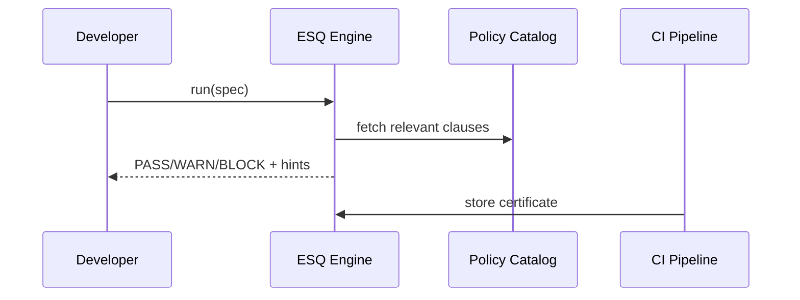

# Chapter 7: HMS-ESQ (Legal Compliance Intelligence)
*[← Back to Chapter 6: HMS-DTA (Data Lake & Governance)](06_hms_dta__data_lake___governance__.md)*  

---

## 1. Why Do We Need HMS-ESQ?

Picture the **Centers for Disease Control (CDC)** launching a mobile app that lets citizens import their pharmacy vaccination records so they can show a digital card at airports.  
Exciting! …until someone asks:

* “Does sending those pharmacy rows to a phone break **HIPAA 45 CFR § 164.502(a)**?”  
* “What about minors—do we need guardian consent?”  
* “Who signs off before we push to production?”

Without help, a developer must skim 600 pages of regulations.  
**HMS-ESQ is the ever-present lawyer in the CI/CD pipeline**.  
It scans every **form**, **data flow**, and **AI decision** and shouts *“Stop! Clause 164.502(a) conflict!”* long before citizens are impacted.

---

## 2. Key Concepts (Plain English)

| Term | Analogy | One-Sentence Meaning |
|------|---------|----------------------|
| Policy Catalog | Law library | Machine-readable snapshots of HIPAA, GDPR, FOIA, etc. |
| Context Extractor | Court stenographer | Pulls *who, what, where* from a form, API spec, or ML feature set. |
| Verdict | Judge’s ruling | PASS / WARN / BLOCK plus a human-friendly explanation. |
| Remediation Hint | Compliance coach | Concrete fix suggestion (“Hash `patient_id` before export”). |
| Legal Footnote | Bluebook citation | Exact statute & subsection that triggered the verdict. |
| Live Sentinel | Security camera | Runtime hook that checks every request, not just pre-deploy. |
| Certificate | Signed green light | JSON blob stored in Git to prove a build passed compliance. |

---

## 3. The 5-Minute “Hello-ESQ”

Goal: CDC engineer wants to publish *“/export-vax”* API that streams vaccination rows to phones. Let’s see ESQ in action.

### 3.1 Describe the Proposed Flow

```python
# file: spec.py  (10 lines)
from hms_esq import FlowSpec

spec = FlowSpec(
    name="ExportVaccination",
    source="datalake.cdc.bulk_vax",
    sink="public_api:/export-vax",
    fields=["patient_id", "vax_type", "date_given"],
    auth="end_user_jwt"
)
```

*What we just did*  
– Pointed ESQ at the **source table**, **destination**, and **fields** we plan to expose.

### 3.2 Run the Compliance Check

```python
# file: check.py  (5 lines)
from hms_esq import ESQ

report = ESQ.run("spec.py")
print(report.verdict)         # → "BLOCK"
print(report.hints[0])        # → "De-identify `patient_id` (HIPAA §164.502(a))."
```

Output Explained  
`verdict = BLOCK` means deployment halts.  
ESQ pinpoints the clause, plus a remediation hint.

### 3.3 Apply the Fix & Re-run

```python
# file: spec.py  (changed 1 line)
fields=["hash(patient_id)", "vax_type", "date_given"]
```

```python
report = ESQ.run("spec.py")
print(report.verdict)   # → "PASS"
```

A green light! ESQ also emits a **certificate** (`certs/ExportVaccination.json`) automatically signed by the compliance officer’s key.

---

## 4. Live Sentinel in a Front-End

Even after deployment, HMS-ESQ can guard every call:

```tsx
// React parcel (6 lines)
import { useBridge } from "@hms-mfe/bridge";

async function downloadCard() {
  const rsp = await useBridge().get("/export-vax");
  /* no extra code: ESQ Live Sentinel intercepts server-side */
}
```

If someone later adds `patient_ssn` to the export, Sentinel flips to **403 Forbidden** with a log entry:  
“Violation: HIPAA §164.312(e)(1).”

---

## 5. How It Works (High-Level)



1. Spec lands in ESQ.  
2. Context Extractor tags data as **PHI**.  
3. Engine matches tags to Policy Catalog.  
4. Verdict & hints return in <200 ms, then CI stores the signed certificate.

---

## 6. Peek Under the Hood

### 6.1 A Tiny Policy Snippet (YAML)

```yaml
# hipaa_disclosure.yaml
- id: hipaa_164_502_a
  when:
    consent: false
    contains: ["PHI"]
    sink_scope: "public_api"
  then:
    effect: "BLOCK"
    message: "Must de-identify PHI before public disclosure."
    cite: "HIPAA 45 CFR §164.502(a)"
```

### 6.2 Core Rule Evaluator (8 lines)

```python
# file: esq/eval.py
def evaluate(spec, rule):
    ctx = extract(spec)                # tags fields as PHI, PII, etc.
    if match(ctx, rule["when"]):
        return Verdict(rule["then"])
    return Verdict("PASS")
```

### 6.3 Certificate Format (JSON)

```json
{
  "spec": "ExportVaccination",
  "verdict": "PASS",
  "timestamp": "2024-03-26T18:09Z",
  "hash": "9c8a...ef",
  "signed_by": "compliance_officer@cdc.gov"
}
```

Certificates live in the repo so auditors can prove a build complied *at that commit*.

---

## 7. Common Recipes

### 7.1 Guard an AI Model Decision

```python
from hms_esq import guard

@guard("HIPAA")
def triage_score(features):
    # your ML code
    return model.predict(features)
```

Any output traceable back to PHI automatically gets a risk score; high-risk outputs are masked or require human sign-off.

### 7.2 Batch Scan an Entire Data Lake

```python
from hms_esq import scan_lake
problems = scan_lake(zone="curated", agency="CDC")
print(len(problems), "datasets flagged")
```

Quick sanity check before releasing a disaster-response dashboard.

---

## 8. FAQ & Troubleshooting

| Symptom | Likely Cause | Quick Fix |
|---------|--------------|-----------|
| “Policy Catalog not found” | Wrong env var | Set `ESQ_POLICY_PATH=/etc/esq_policies`. |
| Verdict always PASS | Context tags missing | Ensure `fields` list includes sensitive columns. |
| Live Sentinel slows API | Debug mode on | Run with `ESQ_SENTINEL_MODE=prod`. |
| Certificate hash mismatch | Repo rebased | Re-run ESQ to regenerate certificates. |

---

## 9. What You Learned

You can now:

1. Describe any data flow or AI decision in **FlowSpec**.  
2. Let HMS-ESQ instantly tell you if it violates HIPAA, GDPR, FOIA, etc.  
3. Embed **Live Sentinel** for runtime protection.  
4. Produce signed **certificates** that keep auditors (and Congress) happy.

Next we’ll move from legal safeguards to the dollars and cents—processing payments and reimbursements in [HMS-ACH (Financial Transaction Core)](08_hms_ach__financial_transaction_core__.md).

---

Generated by [AI Codebase Knowledge Builder](https://github.com/The-Pocket/Tutorial-Codebase-Knowledge)