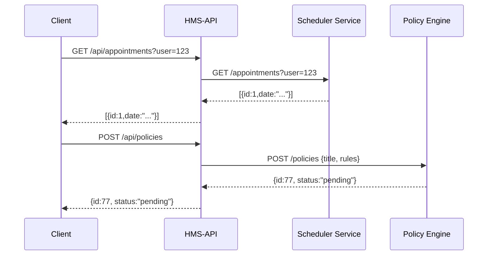
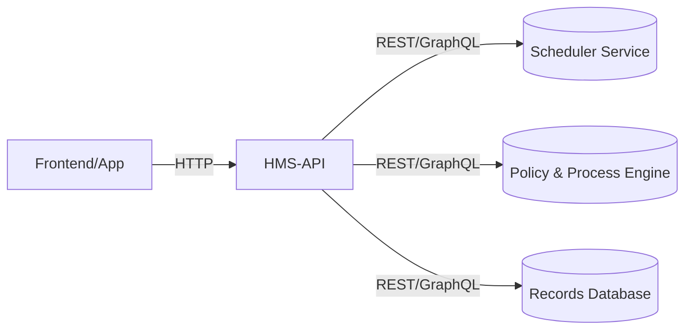

# Chapter 8: Backend API Layer (HMS-API)

In the previous chapter, we saw how to push updates to outside systems in [External System Integration](07_external_system_integration_.md). Now let’s build the “wait staff” of HMS‐EHR: the **Backend API Layer (HMS-API)**, which takes requests from frontends or agents, forwards them to the right service, and returns results.

---

## 1. Why a Backend API Layer?

Use Case: A citizen mobile app wants to  
1. View their health records  
2. Schedule a follow-up visit  
3. Fetch the latest policy updates  

Without a unified API, the app would need to call each service directly (Records, Scheduler, Policy), handle different URLs, credentials, and data shapes. HMS-API solves this by providing a single, consistent interface—just like a waiter who takes your order and brings food from different kitchen stations.

---

## 2. Key Concepts

1. **RESTful Endpoints**  
   Standard URLs with HTTP verbs (GET, POST) for CRUD operations.

2. **GraphQL Endpoint**  
   A single `/graphql` endpoint where clients ask exactly what they need.

3. **Routing & Proxying**  
   HMS-API analyzes each request and forwards it to the appropriate microservice (Scheduler, Policy Engine, Data Store).

4. **Auth & Validation**  
   Checks tokens, scopes, and request data before passing them on.

5. **Aggregation**  
   Combines data from multiple services into one response when needed.

---

## 3. Solving the Use Case

### 3.1 Defining REST Endpoints

Below is a minimal Express setup:

```js
// file: server.js
const express = require('express');
const api = require('./hmsApiRouter');
const app = express();
app.use(express.json());
app.use('/api', api);
app.listen(4000, () => console.log('HMS-API listening on 4000'));
```

Explanation:  
- All routes under `/api` are handled by our router.  
- We parse JSON bodies for POST/PUT calls.

```js
// file: hmsApiRouter.js
const express = require('express');
const fetch = require('node-fetch');
const router = express.Router();

// Forward GET /api/appointments?user=123
router.get('/appointments', async (req, res) => {
  const resp = await fetch(`http://scheduler:3001/appointments?user=${req.query.user}`);
  const data = await resp.json();
  res.json(data);
});

// Forward POST /api/policies
router.post('/policies', async (req, res) => {
  const resp = await fetch('http://policy-engine:3002/policies', {
    method: 'POST',
    body: JSON.stringify(req.body),
    headers: { 'Content-Type': 'application/json' }
  });
  res.status(resp.status).json(await resp.json());
});

module.exports = router;
```

Explanation:  
- We proxy calls to `scheduler` and `policy-engine` services.  
- `req.body` and query params flow through unchanged.

### 3.2 Client Call Examples

```js
// In a mobile app or frontend
// 1. Fetch appointments
fetch('/api/appointments?user=123')
  .then(r => r.json())
  .then(list => console.log(list));

// 2. Create a new policy
fetch('/api/policies', {
  method: 'POST',
  body: JSON.stringify({ title: 'Mask Update', rules: [...] }),
  headers: { 'Content-Type': 'application/json' }
});
```

---

## 4. Step-by-Step Flow



1. Client calls HMS-API.  
2. API routes to the correct service.  
3. Service responds.  
4. API returns the unified response.

---

## 5. Under the Hood

### 5.1 Architecture Overview



- **HMS-API** is the central gateway.  
- It routes, validates, and aggregates calls to downstream services.

### 5.2 Internal Implementation Sketch

1. **Authentication Middleware**  
   Verify JWT tokens and scopes.

```js
// file: authMiddleware.js
module.exports = (req, res, next) => {
  const token = req.headers.authorization;
  // Simplified check
  if (!token || !isValid(token)) return res.status(401).send('Unauthorized');
  next();
};
```

2. **GraphQL Setup** (optional)

```js
// file: graphql.js
const { ApolloServer, gql } = require('apollo-server-express');
const typeDefs = gql`
  type Appointment { id: ID, date: String }
  type Query { appointments(user: ID!): [Appointment] }
`;
const resolvers = {
  Query: {
    appointments: (_, { user }) =>
      fetch(`http://scheduler:3001/appointments?user=${user}`)
        .then(r => r.json())
  }
};
module.exports = new ApolloServer({ typeDefs, resolvers });
```

3. **Putting It All Together**

```js
// server.js (updated)
const express = require('express');
const auth = require('./authMiddleware');
const api = require('./hmsApiRouter');
const gqlServer = require('./graphql');
const app = express();

app.use(express.json());
app.use(auth);
app.use('/api', api);
gqlServer.applyMiddleware({ app, path: '/graphql' });

app.listen(4000, () => console.log('HMS-API running'));
```

Explanation:  
- We enforce auth on every request.  
- We mount REST routes under `/api` and GraphQL under `/graphql`.

---

## Conclusion

In this chapter you learned how the **Backend API Layer (HMS-API)**:

- Provides a single gateway for REST and GraphQL calls  
- Authenticates, validates, and forwards requests to microservices  
- Aggregates and normalizes responses for clients  

Next, we’ll dive into the “engine room” itself in [Core System Platform (HMS-SYS)](09_core_system_platform__hms_sys__.md).

---

Generated by [AI Codebase Knowledge Builder](https://github.com/The-Pocket/Tutorial-Codebase-Knowledge)