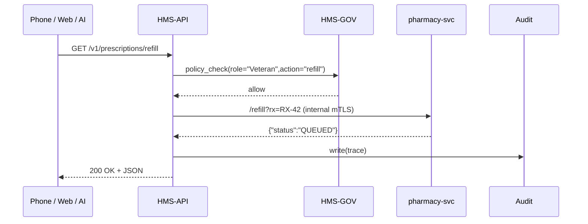

# Chapter 9: Backend API Gateway (HMS-API)
*(File: 09_backend_api_gateway__hms_api__.md)*  

[← Back to Human-In-The-Loop Decision Point](08_human_in_the_loop_decision_point_.md)

---

## 1. Why an “API Gateway”? – A 60-Second Story

A veteran named **Carlos** opens the **VA Mobile** app on his phone.  
He taps **“Refill Prescription”**.

What absolutely **must** happen before a single pill is shipped:

1. **Identity** – Is the caller really Carlos?  
2. **Quota** – Has this prescription already been refilled this month?  
3. **Routing** – Which micro-service handles refills today (cluster A or B)?  
4. **Encryption** – The response must be HTTPS/TLS so no one can see Carlos’s medical data.  

All of those concerns are solved **once**—inside the **Backend API Gateway (HMS-API)**—instead of being re-implemented by every micro-service.

> Think of HMS-API as a **federal switchboard**:  
> every phone call, web request, or AI bot knocks here first, gets screened, and is forwarded to the right “bureau.”

---

## 2. Key Concepts (Plain English)

| Term | What it really means | Friendly analogy |
|------|----------------------|------------------|
| Ingress | Single public URL (`api.vets.gov`) that outsiders hit | Front door of a federal building |
| Route | Mapping of URL ➜ micro-service | Receptionist’s call sheet |
| Identity Provider (IdP) | Validates JWT / CAC / OAuth tokens | Security guard checking badges |
| Quota / Rate-Limit | Max calls per user per time | Take-a-number system |
| mTLS | Mutual TLS – server **and** client present certs | Two-way handshake |
| Service Mesh | Internal traffic network after the gateway | Hallways inside building |

---

## 3. Quick-Start: Call the Gateway in 5 Lines

Carlos’s phone just wants to refill RX #`RX-42`.

```bash
curl -H "Authorization: Bearer $JWT" \
     "https://api.vets.gov/v1/prescriptions/refill?rx=RX-42"
```

What you’ll see:

```json
{ "status":"QUEUED", "pickup":"03-Oct-2024" }
```

Behind this one URL, HMS-API:

1. Verified the **JWT** signature.  
2. Checked Carlos’s **RBAC** role is `Veteran`.  
3. Confirmed the **quota**: 1 refill / 30 days.  
4. Forwarded the call to `pharmacy-svc` in the correct region.  
5. Logged everything for auditors.

---

## 4. High-Level Flow – What Really Happens



Only **five** actors, but every security box is ticked before the JSON goes back to the phone.

---

## 5. Inside the Gateway – Bird-Eye Code Tour

### 5.1 Super-Tiny Router (`gateway.py` – 15 lines)

```python
# file: gateway.py
from hms_gov import check_permission
from rbac_table import RBAC
import requests, flask, os

app = flask.Flask(__name__)
ROUTES = { "/v1/prescriptions/refill": "http://pharmacy-svc:7000/refill" }

def _verify_jwt(token):  # < 5 lines, uses IdP
    # ...contact IdP, return {"user":"123","role":"Veteran"}
    pass

@app.route("/<path:path>")
def handle(path):
    user = _verify_jwt(flask.request.headers["Authorization"].split()[1])
    if not check_permission(role=user["role"], action=flask.request.method,
                            resource=path):
        return {"error":"Forbidden"}, 403         # Governance deny
    target = ROUTES.get("/"+path)
    if not target:
        return {"error":"Not Found"}, 404
    # Forward request (very naïve)
    resp = requests.get(target, params=flask.request.args, timeout=2)
    return resp.json(), resp.status_code
```

Explanation (line-by-line):

1. `ROUTES` is a simple dict: **URL in ➜ URL out**.  
2. `_verify_jwt` calls the government IdP—returns user & role.  
3. `check_permission` ensures the role is allowed (**Governance Layer**).  
4. If all good, the request is proxied to `pharmacy-svc`.  
5. Result is piped back to the client—easy!

### 5.2 Add a Quota Plug-in (`quota.py` – 8 lines)

```python
import time, collections
BUCKET = collections.defaultdict(list)   # {user:[timestamps]}

def ok(user, max_per_day=3):
    now = time.time()
    BUCKET[user] = [t for t in BUCKET[user] if now - t < 86400]
    if len(BUCKET[user]) >= max_per_day:
        return False
    BUCKET[user].append(now)
    return True
```

Inject it into `handle()`:

```python
if not quota.ok(user["user"]):
    return {"error":"Too Many Requests"}, 429
```

Under 10 lines you get a working **rate-limit**.

---

## 6. Registering a New Micro-Service in 3 Steps

1. Add a route:

```yaml
# file: routes.yml
/v1/voting/ballots        : http://election-svc:7100/ballots
```

2. Expose `/health` and `/refDocs` endpoints in the new service.  
3. Deploy—HMS-API hot-reloads `routes.yml` every 30 s.

Congratulations! Your new “Election Ballot” service is online without touching any firewall rules.

---

## 7. How HMS-API Ties Into Other Layers

| Concern | Which Layer Handles It | Link |
|---------|-----------------------|------|
| Policy check (“Is ‘Veteran’ allowed to GET /refill?”) | Governance Layer | [Governance Layer (HMS-GOV)](01_governance_layer__hms_gov__.md) |
| Role verification | RBAC | [Role-Based Access Control (RBAC)](04_role_based_access_control__rbac__.md) |
| Encryption / TLS certs | Security & Compliance Framework | [Security & Compliance Framework](03_security___compliance_framework_.md) |
| AI or HITL calls that patch backend | AI Agent & HITL | [AI Representative Agent](07_ai_representative_agent__hms_a2a__.md), [HITL](08_human_in_the_loop_decision_point_.md) |
| Downstream service discovery | Management Layer | [Management Layer](02_management_layer__hms_sys___hms_svc__.md) |

---

## 8. Common Pitfalls & Quick Fixes

| Pitfall | Symptom | Fix |
|---------|---------|-----|
| Route missing a trailing slash | 404 even though service is up | Keep *exact* string in `ROUTES` |
| JWT expired | Clients get 401 | Refresh token on the client side |
| Quota too strict | 429 for legit users | Bump `max_per_day` or use role-specific limits |
| Service unhealthy | 502 errors | Gateway checks `/health`; make sure your service returns `200 OK` |

---

## 9. Try It Yourself

1. Clone the repo; from `examples/` run `python gateway.py`.  
2. Hit `curl http://localhost:8000/v1/test` before adding a route—expect **404**.  
3. Add `"/v1/test": "http://echo-service:9000"` to `ROUTES`, save.  
4. Re-run curl—see the echo response.  
5. Set `max_per_day=1` in `quota.ok()`, call the same URL twice, watch the second call return **429**.

---

## 10. What You Learned

✓ HMS-API is the **only doorway** into the data center—screening, routing, and logging every request.  
✓ How identity, quotas, and encryption are centralised so micro-services stay lean.  
✓ A 15-line Python gateway that demonstrates the core ideas.  
✓ How HMS-API collaborates with Governance, RBAC, and other layers.  

Next up we’ll orchestrate **policies** and **multi-step processes** *inside* those micro-services with the [Policy & Process Engine](10_policy___process_engine_.md).

---

Generated by [AI Codebase Knowledge Builder](https://github.com/The-Pocket/Tutorial-Codebase-Knowledge)