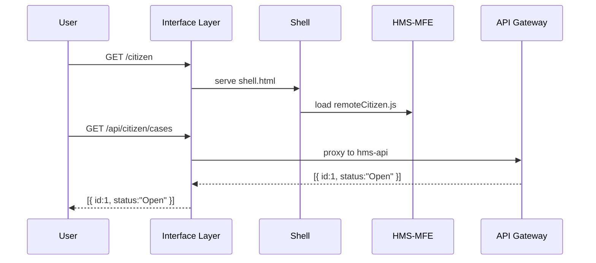
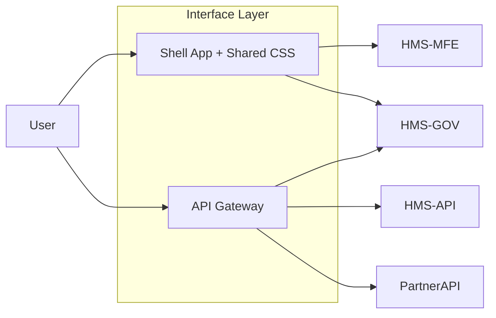

# Chapter 10: Interface Layer

In the previous chapter, we explored how services find each other and exchange events in [Core System Platform (HMS-SYS)](09_core_system_platform__hms_sys__.md). Now we build the **Interface Layer**, the “customer service desk” of HMS-EHR that welcomes citizens, policy-makers, and partner systems under one roof.

## 1. Why an Interface Layer?

**Use Case**: The Federal Mine Safety and Health Review Commission needs:

- A public site for miners to check case status (HMS-MFE)  
- A secure dashboard for commissioners to review appeals (HMS-GOV)  
- A machine API for partner systems to pull data  

Without a unified interface, you’d build three separate portals—each with its own login, router, and style. The Interface Layer:

- Provides **three lobbies** (`/citizen`, `/gov`, `/partner`) for different audiences  
- Shares a **common header, footer, and theme** for consistent branding  
- Acts as an **API gateway** so clients call one URL and get routed to the right backend  

This makes life easier for users, developers, and partners.

## 2. Key Concepts

1. **Lobby Entrances**  
   Routes that direct to different audiences:  
   - `/citizen` → HMS-MFE  
   - `/gov`     → HMS-GOV  
   - `/partner` → partner API  

2. **Shell Application**  
   A UI container that dynamically loads micro-frontends based on the route.

3. **Shared Component Library**  
   Common UI pieces (buttons, nav bars, colors) used by every lobby.

4. **API Gateway**  
   A single HTTP endpoint that proxies path prefixes to backend services.

5. **Authentication & Routing**  
   Centralized login check and route guard before handing off to UIs or APIs.

## 3. Solving the Use Case

### 3.1 Shell Setup (React)

```js
// file: shell.js
import { registerModule, initShell } from './moduleLoader';

// Map lobby names to remote entries
registerModule('Citizen', '/remoteCitizen.js');
registerModule('Gov',     '/remoteGov.js');

initShell('#root', {
  paths: { citizen: 'Citizen', gov: 'Gov' }
});
```
This code tells the shell to load `remoteCitizen.js` when users hit `/#/citizen` and `remoteGov.js` for `/#/gov`.

### 3.2 API Gateway (Express)

```js
// file: apiGateway.js
const express = require('express');
const { createProxyMiddleware } = require('http-proxy-middleware');
const app = express();

app.use('/api/citizen', createProxyMiddleware({ target: 'http://hms-api:4000' }));
app.use('/api/gov',     createProxyMiddleware({ target: 'http://hms-gov:4001' }));
app.use('/api/partner', createProxyMiddleware({ target: 'http://partner-api:4002' }));

app.listen(3000, ()=>console.log('Interface Layer up on 3000'));
```
Clients call `http://portal:3000/api/...` and magically reach the correct service.

## 4. Step-by-Step Flow



1. **User** hits `/citizen`, gets the shell.  
2. Shell loads the **HMS-MFE** micro-frontend.  
3. When the UI calls `/api/citizen/...`, the gateway proxies to **HMS-API**.

## 5. Under the Hood

### 5.1 Non-Code Walkthrough

1. Interface Layer server listens on port 3000.  
2. `express.static` serves `index.html`, `shell.js`, and shared assets.  
3. Proxy rules forward API traffic to the right microservice.  
4. Shell JS uses Module Federation to fetch and mount micro-frontends.  
5. Authentication middleware checks tokens once at the gateway.

### 5.2 Minimal Server + Shell Example

```js
// file: server.js
const express = require('express');
const app = express();

// 1. Serve static UI files
app.use(express.static('public'));

// 2. Mount API gateway (see apiGateway.js)
require('./apiGateway')(app);

app.listen(3000);
```

```html
<!-- public/index.html -->
<!DOCTYPE html>
<html>
<head><title>HMS-EHR Portal</title></head>
<body>
  <div id="root"></div>
  <script src="shell.js"></script>
</body>
</html>
```
- `public/index.html` is the “lobby” for all UIs.  
- `shell.js` loads the right remote based on the URL hash.

## 6. Architecture Overview



- **Shell App** handles UI lobbies for citizens and policy-makers.  
- **API Gateway** routes data calls to multiple backends.

## Conclusion

In this chapter you learned how the **Interface Layer**:

- Creates multiple “lobbies” (`/citizen`, `/gov`, `/partner`) under one roof  
- Shares common components and branding across UIs  
- Dynamically loads micro-frontends ([HMS-MFE](01_frontend_interface__hms_mfe__.md), [HMS-GOV](02_admin_gov_portal__hms_gov__.md))  
- Proxies API requests to the correct backend services  

Next up, we’ll explore the **[Management Layer](11_management_layer_.md)**, where administrators configure, monitor, and operate all these interfaces.

---

Generated by [AI Codebase Knowledge Builder](https://github.com/The-Pocket/Tutorial-Codebase-Knowledge)