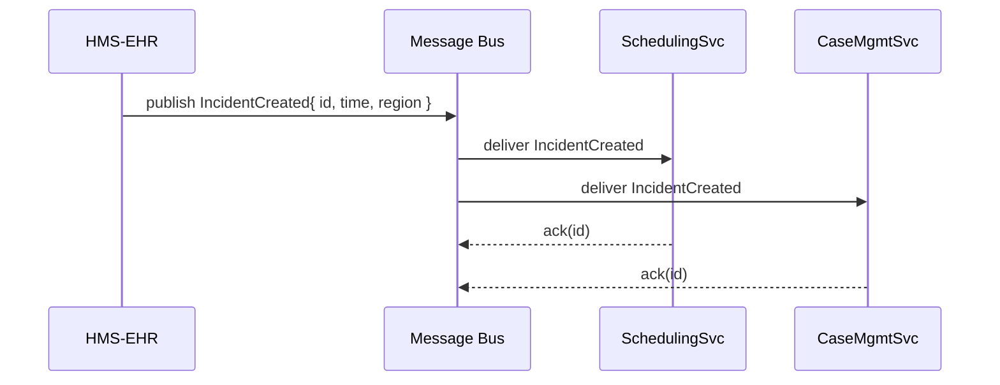
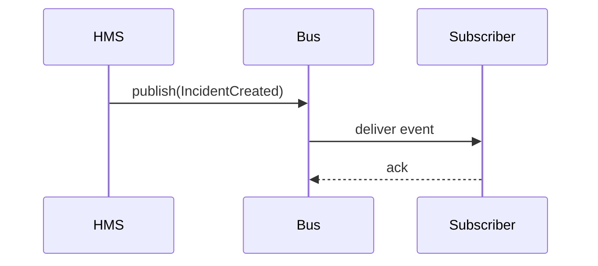

# Chapter 11: External System Synchronization

Welcome back! In [Chapter 10: Microservices Mesh](10_microservices_mesh_.md), we saw how our services discover and communicate securely. Now let’s learn how to keep **real-time data and policy consistency** between HMS-EHR and external systems—what we call **External System Synchronization**.

---

## Why External System Synchronization?

Imagine the National Transportation Safety Board (NTSB) collects incident reports from multiple regional centers. Each center has its own database. To run unified analytics, the NTSB needs every new report, schedule change, or policy update to appear everywhere **instantly**.

Without synchronization, one office might miss a critical safety alert another office already logged. It’s like having an international clock network: every timepiece (system) must tick together.

---

## Key Concepts

1. **Event-Driven Messaging**  
   Systems publish “events” (e.g., `IncidentCreated`) to a shared bus. Subscribers receive those events in real time.

2. **Data Contracts**  
   A shared JSON schema (or Avro, protobuf) defines the shape of each event so everyone understands the fields.

3. **Idempotency & Deduplication**  
   If an event is sent twice (network hiccup), handlers must detect and ignore duplicates.

4. **Conflict Resolution**  
   When two systems update the same record, we need rules (e.g., last-write-wins, version check).

5. **Security & Authorization**  
   Use API keys, OAuth tokens, or mTLS so only trusted systems can publish or consume events.

---

## A Simple Use Case

When HMS-EHR logs a new **incident report**, we want to sync it to:

- A **scheduling system** (to assign investigators)  
- A **case management system** (for follow-up)  
- A **reporting warehouse** (for analytics dashboards)

Here’s the sequence:



1. HMS publishes `IncidentCreated` event.  
2. The Message Bus fans it out to all subscribers.  
3. Each service acknowledges receipt to avoid redelivery.

---

## How to Use Event-Driven Sync

### 1. Define the Event Schema

File: `schemas/IncidentCreated.json`

```json
{
  "type": "object",
  "properties": {
    "id": { "type": "string" },
    "time": { "type": "string", "format": "date-time" },
    "region": { "type": "string" }
  },
  "required": ["id","time","region"]
}
```

*Explanation:* This JSON schema ensures every subscriber expects the same fields.

### 2. Publish an Event

File: `src/sync/eventPublisher.js`

```js
const amqp = require('amqplib');
async function publishIncident(incident) {
  const conn = await amqp.connect('amqp://broker');
  const ch   = await conn.createChannel();
  await ch.assertExchange('incidents','fanout');
  ch.publish('incidents','', Buffer.from(JSON.stringify(incident)));
  console.log('Published', incident.id);
  await ch.close(); await conn.close();
}
module.exports = { publishIncident };
```

*Explanation:*  
- Connects to RabbitMQ.  
- Declares a `fanout` exchange named `incidents`.  
- Publishes our incident object.

### 3. Subscribe to an Event

File: `src/sync/eventSubscriber.js`

```js
const amqp = require('amqplib');
async function subscribe(handler) {
  const conn = await amqp.connect('amqp://broker');
  const ch   = await conn.createChannel();
  await ch.assertExchange('incidents','fanout');
  const q = await ch.assertQueue('',{exclusive:true});
  await ch.bindQueue(q.queue,'incidents','');
  ch.consume(q.queue, msg => {
    const data = JSON.parse(msg.content.toString());
    handler(data).then(() => ch.ack(msg));
  });
}
module.exports = { subscribe };
```

*Explanation:*  
- Each service creates a temporary queue.  
- Binds to the `incidents` exchange and processes every message.  
- Calls `handler(data)`, then acknowledges.

### 4. Handle Idempotency

```js
// in SchedulingSvc
async function handleIncident(data) {
  if (await seenBefore(data.id)) return;   // dedupe
  await saveToSchedule(data);
}
```

*Explanation:* Check if `data.id` was processed; skip duplicates.

---

## Under the Hood: Step-by-Step

1. **Register** HMS and external systems with authentication credentials.  
2. HMS calls `publishIncident()` when an incident is created.  
3. The **Message Bus** stores the event until every subscriber ACKs it.  
4. Each service’s `eventSubscriber` picks up the event, validates it against the schema, and processes it.  
5. If any service fails to ACK (e.g., down for maintenance), the bus retries.



---

## Internal Implementation Files

1. **Event Schema**  
   `schemas/IncidentCreated.json` (shown above).

2. **Publisher**  
   `src/sync/eventPublisher.js` (publishes to RabbitMQ).

3. **Subscriber**  
   `src/sync/eventSubscriber.js` (consumes and dispatches to handler).

4. **Handler Example**  
   In each service, e.g. `src/scheduling/handler.js`:

   ```js
   const { subscribe } = require('../sync/eventSubscriber');
   subscribe(async incident => {
     // validate schema… (omitted)
     if (!await isDuplicate(incident.id)) {
       await createTask(incident);
     }
   });
   ```

*Explanation:* Each microservice imports the generic subscriber and provides its own processing logic.

---

## Summary

In this chapter you learned how to:

- Use **event-driven messaging** to synchronize data in real time.  
- Define a shared **data contract** (JSON schema).  
- Handle **idempotency**, **conflict resolution**, and **security**.  
- Wire up a simple publisher/subscriber with RabbitMQ.

Next up, we’ll build an intelligent proxy that acts on your behalf: the [AI Representative Agent](12_ai_representative_agent_.md). Great job so far!

---

Generated by [AI Codebase Knowledge Builder](https://github.com/The-Pocket/Tutorial-Codebase-Knowledge)