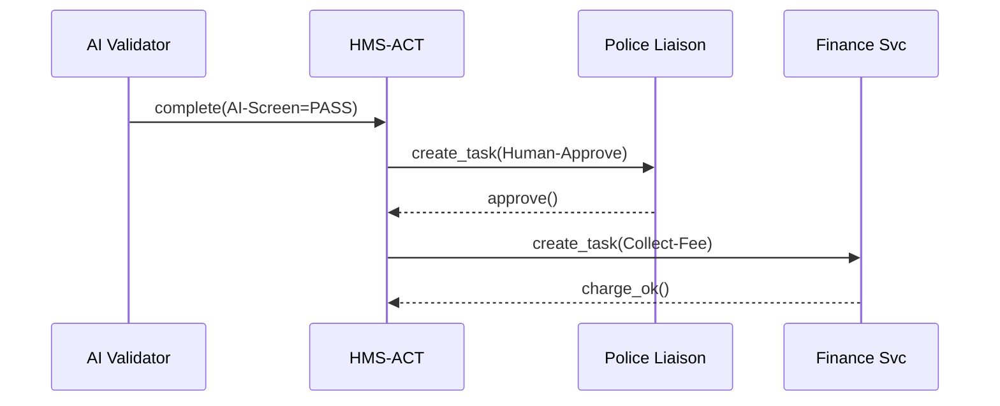

# Chapter 11: HMS-ACT (Agent Action Orchestrator)
*[← Back to Chapter 10: Human-in-the-Loop Oversight (HITL)](10_human_in_the_loop_oversight__hitl__.md)*  

---

## 1 . Why do we need HMS-ACT?

Imagine the **U.S. Department of Justice (DOJ)** is rolling out a new **“Public Protest Permit”** service.

1. A citizen fills out a web form.  
2. An AI agent checks the date, location, crowd size, and suggests *“APPROVE”*.  
3. A police liaison must okay the crowd-control plan.  
4. A finance clerk charges the $40 processing fee.  
5. The final permit PDF is e-mailed to the applicant.

Each step might be done by **different people, Bots, or micro-services**.  
If we just let them shout across Slack or cron jobs, something will get lost:

* Who actually pressed *Approve*?  
* Why did the fee retry three times at 2 a.m.?  
* Where’s the full activity log for tomorrow’s congressional hearing?

**HMS-ACT is “Mission Control.”**  
It watches every proposed action coming from agents, queues the right human or service to finish the job, retries failures, and keeps a **“who did what, when, and why”** trail.

---

## 2 . Key Concepts (Plain English)

| Term | Friendly Analogy | One-Sentence Meaning |
|------|------------------|----------------------|
| Playbook | Recipe card | Ordered list of steps (“AI validate → Human approve → Collect fee”). |
| Task | To-do sticky note | One unit of work assigned to **a role** (agent or person). |
| Schedule | Kitchen timer | When a task should run; handles retries & deadlines. |
| Action Log | Black box | Immutable record of every task state change. |
| Token | Permission slip | Time-bound right that lets a worker act on a task. |

---

## 3 . The 5-Minute “Hello-ACT”

Goal: build a **3-step playbook** for the DOJ protest permit.

```python
# file: permit_playbook.py
from hms_act import Playbook, Step

permit = Playbook(id="protest_permit") \
  .add_step( Step("AI-Screen",
        role="agent:validator",
        call="ai_validator.check_form")
  ) \
  .add_step( Step("Human-Approve",
        role="human:police_liaison")
  ) \
  .add_step( Step("Collect-Fee",
        role="svc:finance",
        call="hms_ach.charge $40")
  )

permit.save()
```
What it does  
1. Defines three **ordered** steps.  
2. Tells HMS-ACT *who* should do each one.  
3. Persists the Playbook to the orchestrator.

### 3.1 Start a Run

```python
# file: submit.py
from hms_act import run_playbook

run_id = run_playbook("protest_permit", payload={"form_id": 123})
print("Run started:", run_id)
```
• The first task, “AI-Screen,” is immediately assigned to the `agent:validator` role.  
• Humans see nothing until it passes.

### 3.2 AI Agent Completes Its Task

```python
# file: agent_worker.py
from hms_act import next_task, complete_task

task = next_task(role="agent:validator")
result = ai_validator.check_form(task.payload)
complete_task(task.id, outcome="PASS")
```
After completion HMS-ACT:

1. Logs *AI-Screen → PASS*.  
2. Activates the “Human-Approve” task and e-mails the police liaison.

### 3.3 Human Approver (CLI)

```python
# file: liaison_cli.py
from hms_act import next_task, complete_task

t = next_task(role="human:police_liaison")
print("Reviewing form", t.payload["form_id"])
decision = input("Approve? (y/n) ")
status = "PASS" if decision == "y" else "FAIL"
note = input("Reason: ")
complete_task(t.id, outcome=status, note=note)
```
If approved, HMS-ACT triggers “Collect-Fee”.  
If rejected, the playbook ends in **FAIL** state.

---

## 4 . What Happens Behind the Curtain?



1. A **task state machine** lives in HMS-ACT.  
2. Each `complete_task` advances the pointer to the next Step.  
3. Failures trigger retries or stop the run based on Playbook rules.  

---

## 5 . A Peek at the Source

### 5.1 Tiny State Machine (simplified)

```python
# file: hms_act/core.py
def advance(run, task, outcome):
    log(run.id, task.id, outcome)          # Action Log
    if outcome != "PASS":
        run.status = "FAIL"
        return
    nxt = run.playbook.next_after(task)
    if nxt:
        enqueue(nxt, run.payload)
    else:
        run.status = "DONE"
```

*Less than 10 lines* but covers pass/fail paths and logs everything.

### 5.2 Minimal Scheduler Tick

```python
# file: hms_act/scheduler.py
def tick():
    for task in queue.due_now():
        assign_to_worker(task)
```
Runs every minute via `cron` or a background thread.

---

## 6 . Where HMS-ACT Meets Other Layers

* **Agents** – tasks for `agent:*` roles are fetched with `next_task()` (see [HMS-AGT](09_hms_agt___hms_agx__core___extended_ai_agent_framework__.md)).  
* **Humans** – UI widgets in [HMS-MFE](02_hms_mfe__micro_frontend_experience__.md) list tasks for `human:*` roles.  
* **HITL** – “Proposal approved” events from [Human-in-the-Loop](10_human_in_the_loop_oversight__hitl__.md) become **tasks** here.  
* **Payments** – finance tasks call [HMS-ACH](08_hms_ach__financial_transaction_core__.md).  
* **Audit** – Action Log streams to [HMS-DTA](06_hms_dta__data_lake___governance__.md).

---

## 7 . FAQ & Troubleshooting

| Symptom | Likely Cause | Quick Fix |
|---------|--------------|-----------|
| Next step never fires | `complete_task` missing | Ensure every worker calls `complete_task()` even on errors. |
| Task keeps retrying | `max_retries` not set | Add `Step(..., retries=3)` in Playbook. |
| Human sees “Token expired” | Long review time | Increase `token_ttl` on that Step or allow renew. |
| Cannot edit Playbook | Active runs exist | Clone to `v2` and migrate new requests. |

---

## 8 . What You Learned

You now know how to:

1. Draft a **Playbook** of mixed human, agent, and service steps.  
2. Kick off a run with one line of code.  
3. Let HMS-ACT handle assignment, retries, and an immutable **Action Log**.  

Next we’ll zoom out and see how these playbooks integrate with broader **Operational Workflows**—case management, SLAs, and dashboards—in the **Operational Workflow Manager**.  

→ *Continue to [HMS-OMS (Operational Workflow Manager)](12_hms_oms__operational_workflow_manager__.md)*

---

Generated by [AI Codebase Knowledge Builder](https://github.com/The-Pocket/Tutorial-Codebase-Knowledge)