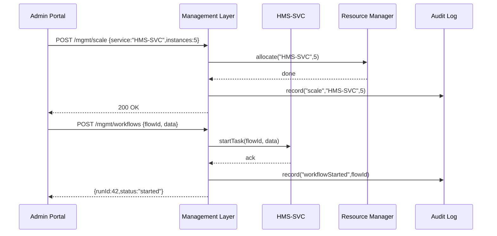
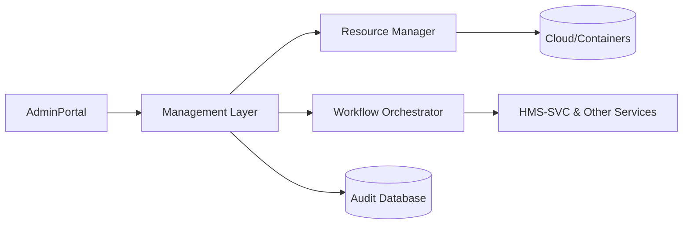

# Chapter 11: Management Layer

In the previous chapter we built the **Interface Layer** to connect UIs and APIs together. Now we’ll meet the “executive team” of HMS-EHR: the **Management Layer**, which runs day-to-day operations, orchestrates microservices, allocates resources, and enforces internal policies.

---

## 1. Why a Management Layer?

Use Case: The Health Resources and Services Administration (HRSA) runs several microservices—patient records (HMS-SVC), appointment scheduler (HMS-API), analytics, etc. They must:

- Keep each service running within its Service Level Agreement (e.g., 99.9% uptime)  
- Scale up the scheduler during peak demand (e.g., open enrollment)  
- Coordinate a multi-step workflow (e.g., data ingest → validation → reporting)  
- Enforce policies (e.g., no more than 5 concurrent analytics jobs per user)

Without a central team, each microservice would try to manage itself. The **Management Layer** is like a transit control center that:

- Watches all services  
- Starts or stops instances  
- Routes workflows end-to-end  
- Logs every action  

---

## 2. Key Concepts

1. **Orchestration**  
   Sending commands to multiple services in sequence or parallel (e.g., “run data validation, then reporting”).

2. **Auto-Scaling**  
   Allocating or de-allocating compute/resources based on real-time metrics.

3. **Workflow Management**  
   Defining and tracking multi-step processes across services.

4. **SLA Enforcement**  
   Monitoring uptime, latency, and triggering alerts or fail-overs.

5. **Policy Enforcement**  
   Ensuring internal rules (e.g., “analytics jobs per user ≤ 5”) are never broken.

---

## 3. Solving the Use Case

### 3.1 Calling the Management Layer

In a simple client file (`mgmtClient.js`), you ask the layer to scale or run workflows:

```js
// mgmtClient.js
async function scaleService(name, count) {
  return fetch('/mgmt/scale', {
    method: 'POST',
    body: JSON.stringify({ service: name, instances: count }),
    headers: { 'Content-Type': 'application/json' }
  });
}

async function runWorkflow(flowId, payload) {
  return fetch('/mgmt/workflows', {
    method: 'POST',
    body: JSON.stringify({ flowId, data: payload }),
    headers: { 'Content-Type': 'application/json' }
  }).then(r => r.json());
}
```

Explanation:  
- `scaleService('HMS-SVC', 3)` asks for 3 instances of the records service.  
- `runWorkflow('reportingFlow', {...})` starts a data-report pipeline.

### 3.2 Example Inputs & Outputs

```js
// Example usage
scaleService('HMS-SVC', 5)
  .then(() => console.log('Scaling requested'));

runWorkflow('exportPatientData', { user: 123 })
  .then(res => console.log('Workflow status:', res.status));
```

- Output:  
  - Console logs “Scaling requested.”  
  - A workflow status like `{ status: "started", runId: 42 }`.

---

## 4. What Happens Step-by-Step?



1. **Admin Portal** requests scaling or a workflow.  
2. **Management Layer** calls the internal **Resource Manager** or target service.  
3. It logs every action in the **Audit Log**.  
4. Returns a status to the UI.

---

## 5. Under the Hood

### 5.1 Non-Code Walkthrough

1. **Receive Request**  
   API endpoint `/mgmt/*` catches client calls.  
2. **Authenticate & Authorize**  
   Ensure the caller has rights to scale or start workflows.  
3. **Route to Subsystem**  
   - For scaling: go to **Resource Manager**  
   - For workflows: go to **Orchestrator**  
4. **Update State & Logs**  
   Persist the action in a Management Database and Audit Log.  
5. **Monitor & Enforce**  
   Continuously check SLAs and policies, auto-correct if needed.

### 5.2 Core Implementation Example

```js
// file: managementService.js
const express = require('express');
const router = express.Router();
const rm = require('./resourceManager');
const wf = require('./workflowOrchestrator');
const audit = require('./auditLog');

router.post('/scale', async (req, res) => {
  const { service, instances } = req.body;
  await rm.scale(service, instances);
  await audit.record('scale', { service, instances });
  res.sendStatus(200);
});

router.post('/workflows', async (req, res) => {
  const { flowId, data } = req.body;
  const runId = await wf.start(flowId, data);
  await audit.record('workflowStarted', { flowId, runId });
  res.json({ runId, status: 'started' });
});

module.exports = router;
```

- `resourceManager.scale` handles cloud/container APIs.  
- `workflowOrchestrator.start` kicks off a series of tasks.  
- `audit.record` saves an immutable log entry.

---

## 6. Architecture Overview



- **AdminPortal** sends commands to **Management Layer**.  
- The layer talks to **Resource Manager** (for scaling) or **Workflow Orchestrator** (for multi-step jobs).  
- All actions are stored in **Audit Database**.

---

## Conclusion

You’ve learned how the **Management Layer**:

- Orchestrates microservice workflows  
- Allocates and scales resources automatically  
- Enforces internal policies and SLAs  
- Logs every administrative action for accountability  

Next up, we’ll explore how high-level rules and compliance are handled in the [Governance Layer](12_governance_layer_.md).

---

Generated by [AI Codebase Knowledge Builder](https://github.com/The-Pocket/Tutorial-Codebase-Knowledge)