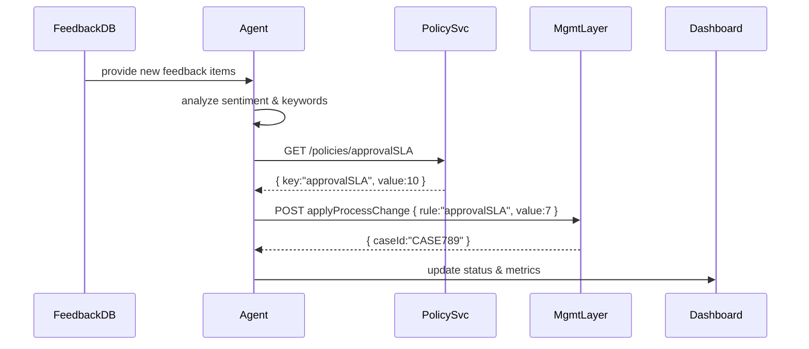

# Chapter 12: AI Representative Agent

In [Chapter 11: External System Synchronization](11_external_system_synchronization_.md), we learned how to keep data in sync across multiple services and external systems. Now, let’s meet the **AI Representative Agent**—an autonomous assistant on the Gov/Admin platform that listens to feedback, proposes smarter processes, and watches results to help you continuously improve services.

## Why an AI Representative Agent?

Imagine the **Office for Civil Rights** gets dozens of public complaints about delays in resolving discrimination reports. Manually reviewing every comment can take weeks. An AI Representative Agent can:

- **Collect** citizen feedback  
- **Analyze** text for common themes (e.g., "long wait times")  
- **Suggest** process changes (e.g., faster triage rules)  
- **Track** metrics after you implement those changes  

It’s like hiring a consultant who never sleeps and keeps tuning your operations in real time.

## Key Concepts

1. **Feedback Listener**  
   Polls or subscribes to incoming feedback messages (comments, survey results, chat logs).

2. **Feedback Analyzer**  
   Uses simple AI (keyword extraction or sentiment) to surface trends (e.g., “approval delay” spike).

3. **Proposal Generator**  
   Maps analysis results to concrete process tweaks—like adjusting SLA thresholds or routing rules.

4. **Outcome Monitor**  
   After changes roll out, it measures impact (e.g., average approval time) and alerts if targets aren’t met.

## Using the AI Representative Agent

Below is a minimal example showing how to configure and run one cycle of feedback processing.

```js
// src/agent/runAgent.js
const { AIRepresentativeAgent } = require('./agent');

async function main() {
  const agent = new AIRepresentativeAgent({
    feedbackSource: 'feedback-db',
    policyServiceUrl: 'http://policy-module/policies',
    workflowServiceUrl: 'http://management/applyProcessChange'
  });

  const proposals = await agent.runCycle();
  console.log('Proposals:', proposals);
}

main();
```
- We pass the **feedback database**, the **Policy Module** URL, and the **Management Layer** workflow endpoint.  
- `runCycle()` returns an array of suggested changes, which you can review or auto-apply.

### Sample Input & Output

Input (feedback items):
```json
[
  { "id":"f1", "text":"Takes 10 days to clear approvals" },
  { "id":"f2", "text":"Process unclear on requirements" }
]
```
Output (proposals):
```json
[
  { "rule":"reduceApprovalSLA","value":7 },
  { "rule":"publishChecklist","value":true }
]
```

## Step-by-Step Sequence



1. Agent fetches new feedback.  
2. It analyzes trends and fetches current policy values.  
3. It posts a change request to the Management Layer.  
4. Finally, it updates an internal dashboard or log.

## Inside the Agent: Implementation Overview

1. **Fetch Feedback**: read pending comments from a store.  
2. **Analyze**: simple keyword counts or sentiment scores.  
3. **Propose**: compare analysis against existing policies and create change requests.  
4. **Monitor**: after changes, poll metrics (e.g., average SLA) and log results.

### Core Agent Class

File: src/agent/agent.js
```js
class AIRepresentativeAgent {
  constructor(config) {
    this.source = config.feedbackSource;
    this.policyUrl = config.policyServiceUrl;
    this.workflowUrl = config.workflowServiceUrl;
  }

  async runCycle() {
    const feedback = await this.fetchFeedback();
    const trends  = this.analyzeFeedback(feedback);
    const proposals = await this.generateProposals(trends);
    await this.monitorOutcomes();
    return proposals;
  }
}
module.exports = { AIRepresentativeAgent };
```
- `runCycle()` ties together four main steps.  
- We’ll fill in each helper below.

### Fetching and Analyzing Feedback

File: src/agent/feedbackAnalyzer.js
```js
async function fetchFeedback(source) {
  // pretend to read from DB
  return [{ id:'f1', text:'Slow approvals' }];
}

function analyzeFeedback(items) {
  // very simple: count occurrences of "slow"
  return { slowCount: items.filter(i=>i.text.includes('slow')).length };
}

module.exports = { fetchFeedback, analyzeFeedback };
```
- `fetchFeedback` retrieves raw comments.  
- `analyzeFeedback` derives a simple trend metric.

### Generating Proposals

File: src/agent/proposalService.js
```js
const fetch = require('node-fetch');

async function generateProposals(trends, policyUrl, workflowUrl) {
  const policy = await fetch(policyUrl+'/approvalSLA').then(r=>r.json());
  if (trends.slowCount > 2) {
    // suggest reducing SLA by 2 days
    await fetch(workflowUrl, {
      method:'POST',
      body: JSON.stringify({ rule:'approvalSLA', value:policy.value-2})
    });
    return [{ rule:'approvalSLA', value:policy.value-2 }];
  }
  return [];
}

module.exports = { generateProposals };
```
- We get the current `approvalSLA` policy.  
- If “slow” appears often, we propose lowering the SLA by 2 days.

### Monitoring Outcomes

File: src/agent/monitorService.js
```js
async function monitorOutcomes() {
  // pretend to query metrics API
  console.log('Monitoring: average SLA is 8 days');
}
module.exports = { monitorOutcomes };
```
- After applying changes, we log or visualize key metrics.

## Summary

In this chapter you learned how to:

- Build an **AI Representative Agent** that automates feedback analysis, process proposals, and outcome monitoring.  
- Tie together the [Policy Module](06_policy_module_.md) for current rules and the [Management Layer](08_management_layer_.md) for applying changes.  
- Write minimal code for fetching feedback, generating proposals, and tracking metrics.  

Congratulations on completing this tour of HMS-EHR’s core components!

---

Generated by [AI Codebase Knowledge Builder](https://github.com/The-Pocket/Tutorial-Codebase-Knowledge)