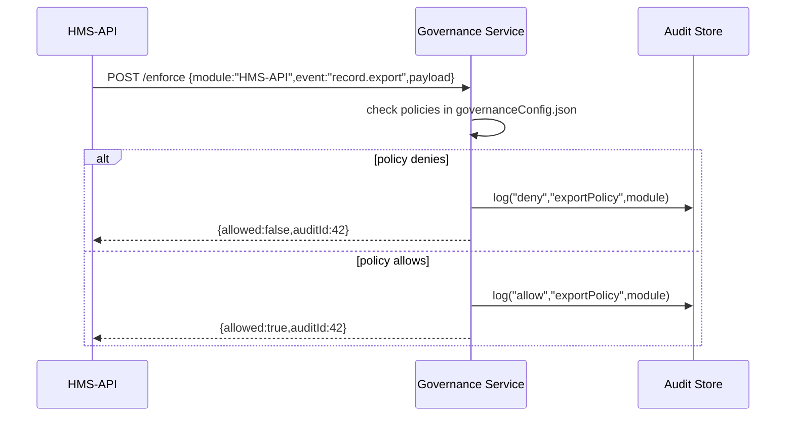

# Chapter 12: Governance Layer

In the previous chapter we explored the [Management Layer](11_management_layer_.md), where administrators scale and orchestrate microservices. Now we’ll meet the “board of directors” for HMS-EHR: the **Governance Layer**, which sets high-level rules, ensures transparency, and enforces ethics and compliance across all modules.

---

## 1. Why a Governance Layer?

Use Case: Imagine the **Federal Health Data Office** must ensure every part of HMS-EHR:

- Records an **audit trail** whenever a patient’s record is viewed  
- Masks or blocks export of **sensitive fields** (e.g., Social Security numbers)  
- Meets **HIPAA** privacy guidelines and federal regulations  

Without a central governance board, each microservice might implement its own checks inconsistently. The **Governance Layer** acts like a city council that passes ordinances and audits every department to guarantee uniform compliance.

---

## 2. Key Concepts

1. **Policy Definitions**  
   High-level rules (e.g., “All data exports must exclude PII.”)

2. **Enforcement Engine**  
   The “referee” that checks requests against policies before allowing them.

3. **Audit Trail Service**  
   Logs every decision—accepted or denied—for later review.

4. **Transparency Dashboard**  
   A read-only portal where auditors can see which module did what and when.

5. **Compliance Hooks**  
   Integration points in each module to call Governance APIs before sensitive actions.

---

## 3. Defining and Using Governance Policies

### 3.1 Sample Policy File

We store policies in a simple JSON file that the Governance Service reads at startup:

```jsonc
// governanceConfig.json
{
  "policies": [
    {
      "id": "exportPolicy",
      "description": "Block PII in exports",
      "action": "denyIf",
      "condition": "data.containsPII === true"
    },
    {
      "id": "auditView",
      "description": "Log every record view",
      "action": "audit",
      "event": "record.view"
    }
  ]
}
```

Explanation:
- The `"exportPolicy"` rule **denies** any export if `containsPII` is true.
- The `"auditView"` rule says **every** `record.view` must be logged.

### 3.2 Calling the Enforcement API

In a microservice (e.g., HMS-API), we check with Governance before sending data:

```js
// file: governanceClient.js
async function enforce(module, event, payload) {
  const res = await fetch('/governance/enforce', {
    method: 'POST',
    body: JSON.stringify({ module, event, payload }),
    headers: { 'Content-Type': 'application/json' }
  });
  return res.json(); // { allowed: true|false, auditId }
}

// Usage example
const { allowed, auditId } = await enforce(
  'HMS-API', 'record.export', { containsPII: true }
);
if (!allowed) throw new Error('Export denied by governance');
```

Explanation:
- We POST `module`, `event`, and `payload` to `/governance/enforce`.
- The service returns whether the action is allowed and an `auditId`.

---

## 4. What Happens Step-by-Step?



1. **HMS-API** asks Governance if it may perform `record.export`.  
2. Governance checks its policy definitions.  
3. It logs the decision in the Audit Store.  
4. Returns a verdict (`allowed`) and an `auditId`.

---

## 5. Under the Hood

### 5.1 Non-Code Walkthrough

1. **Load Policies**  
   Governance Service loads `governanceConfig.json`.  
2. **Receive Enforcement Call**  
   A module calls `/governance/enforce`.  
3. **Evaluate Conditions**  
   The engine iterates through matching policies and runs simple JS conditions.  
4. **Audit**  
   Every decision (allow/deny) is saved with timestamp, module name, and policy ID.  
5. **Respond**  
   The service returns the verdict and audit record ID.

### 5.2 Core Implementation Sketch

```js
// file: governanceService.js
const policies = require('./governanceConfig.json').policies;
const auditDB = require('./auditStore');

async function enforce(req, res) {
  const { module, event, payload } = req.body;
  let allowed = true;
  for (let p of policies) {
    if (p.event === event && eval(p.condition)) {
      allowed = p.action !== 'denyIf';
      break;
    }
  }
  const auditId = await auditDB.log({ module, event, allowed });
  res.json({ allowed, auditId });
}

// Express route
app.post('/governance/enforce', enforce);
```

Explanation:
- We `eval` the `condition` in policy (extremely simplified).  
- Once a policy matches, we set `allowed` accordingly.  
- We log the result and return to the caller.

---

## Conclusion

You’ve learned how the **Governance Layer**:

- Defines high-level policies in simple JSON  
- Provides an enforcement API that every module calls before sensitive actions  
- Logs every decision for full transparency and compliance  

With this in place, HMS-EHR behaves like a well-governed organization—every action is checked by its “board of directors” before taking effect. This completes our core tutorial on HMS-EHR!

---

Generated by [AI Codebase Knowledge Builder](https://github.com/The-Pocket/Tutorial-Codebase-Knowledge)