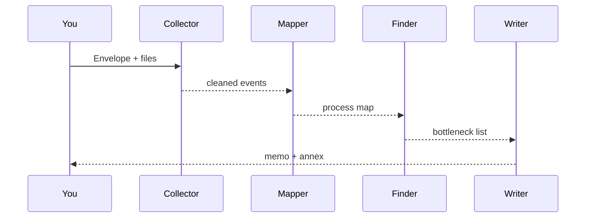

# Chapter 14: AI Representative Agent (Gov/Admin Persona)
*[← Back to Chapter 13 – Model Context Protocol (MCP)](13_hms_mcp__model_context_protocol__.md)*  

---

## 1 . Why Do We Need a “Gov/Admin” Agent?

Imagine you are the **Deputy City Manager of Springfield**.  
Your inbox is exploding with:

* 213 e-mails complaining about long DMV lines  
* 57 PDF incident logs from yesterday alone  
* 1 angry tweet per minute tagged “#DMVWaitTime”

You want two things by tomorrow morning:

1. **A short brief**: *“What exactly is broken?”*  
2. **A step-by-step fix plan** you can forward to the DMV director.

Hiring a team of analysts would take weeks; spinning up an **AI Representative Agent** takes five minutes.  
This specialized persona:

1. **Gathers evidence** (complaints, logs, metrics).  
2. **Maps the process** (intake → queue → service desk).  
3. **Spots bottlenecks** with lightweight simulations.  
4. **Drafts an executive memo** + Gantt-style implementation plan.

Think of it as your **tireless digital policy analyst** who never sleeps and always cites its sources.

---

## 2 . Key Concepts (Plain English)

| Piece                           | Friendly Analogy                      | One-Sentence Meaning |
|---------------------------------|---------------------------------------|----------------------|
| Persona Profile                 | Employee badge                        | Name, tone, scopes (“municipal_management”). |
| Evidence Collector              | News clipping service                 | Ingests e-mails, logs, social-media CSVs. |
| Process Mapper                  | Whiteboard flowchart                  | Learns “how work actually flows” from timestamps. |
| Bottleneck Finder               | Traffic camera                        | Detects steps with longest wait or error spikes. |
| Proposal Writer                 | Speechwriter                          | Crafts a memo + action plan in plain English. |
| Source Annex                    | Footnotes section                     | Hyperlinks to every raw document the agent used. |
| Oversight Hook                  | Editor’s red pen                      | Sends the draft to [Human-in-the-Loop (HITL)](10_human_in_the_loop_oversight__hitl__.md) before publishing. |

All of these run *inside* a standard [HMS-AGT](09_hms_agt___hms_agx__core___extended_ai_agent_framework__.md) kernel, so you already know the plumbing.

---

## 3 . Your First “Policy-Brief Bot” in 18 Lines

Below we’ll feed the agent a folder of raw material and ask for a proposal.

```python
# file: dmv_brief.py  (18 lines)
from hms_agt import Agent
from hms_mcp import Envelope          # safe context passing
from pathlib import Path

agent = Agent.persona(
    role="gov_policy_analyst",
    name="Springfield BriefBot",
    tone="concise, data-driven"
)

# 1) Gather evidence files
evidence = list(Path("evidence/").glob("*.*"))   # e-mails, CSVs, logs

# 2) Ask for a brief
envelope = (
    Envelope()
      .with_prompt("Create a one-page DMV wait-time brief for the city manager.")
      .add_context(files=evidence)
)

draft = agent.call(envelope)        # 2-3 seconds on a laptop
print(draft.text)                   # <— memo appears!
```

What happens?

1. `Agent.persona()` loads the pre-trained **Gov/Admin skill pack**.  
2. `Envelope` safely bundles the user prompt + attached documents (see Chapter 13).  
3. The agent returns a **Markdown memo** with headings: *Findings, Root Causes, Recommendations, Timeline*.

---

## 4 . Reading the Output (shortened)

```
# DMV Wait-Time Reduction Brief
## Findings
– Average queue = 78 min (peak Tues 9 AM, 142 min)  
– 42 % tickets aborted at “Form 12A validation” desk

## Root Causes
1. Single validation desk creates a hard bottleneck.  
2. Legacy printer failure adds 2 min per customer.

## Recommendations (90-Day Plan)
| Week | Action | Owner |
|------|--------|-------|
| 1-2  | Add 2 self-service kiosks | Proc Dept |
| 3-4  | Cross-train 3 clerks for Form 12A | HR      |
…

**Source Annex**: logs_2024-03-25.csv, tweets_…json, dmv_queue.db
```

All bullet points cite line numbers in the annex so you can double-check.

---

## 5 . How the Agent Thinks (Step-by-Step)



1. **Collector** normalizes all timestamps into one table.  
2. **Mapper** builds a graph of steps (START → Validation → Payment → END).  
3. **Finder** runs queueing math (Little’s Law) to rank slowest nodes.  
4. **Writer** converts everything into a human-friendly brief.

---

## 6 . A Peek Under the Hood

### 6.1  Mini Process Mapper (8 Lines)

```python
# file: gov_agent/process_map.py
def map(events):
    graph = {}               # step → next steps dict
    for e in events:
        graph.setdefault(e.step_from, {}).setdefault(e.step_to, 0)
        graph[e.step_from][e.step_to] += 1
    return graph             # {'Intake': {'Validate': 213}, ...}
```

Counts transitions to build a weighted flowchart; simple but surprisingly useful.

### 6.2  Bottleneck Finder (9 Lines)

```python
# file: gov_agent/bottleneck.py
def slowest(graph, times):
    # times: avg sec spent in each step
    score = {s: times[s] * sum(graph[s].values()) for s in graph}
    return sorted(score, key=score.get, reverse=True)[:3]
```

A crude “Time × Traffic” metric picks top 3 pain points.

### 6.3  Proposal Writer Stub (10 Lines)

```python
# file: gov_agent/proposal.py
TEMPLATE = """
# DMV Wait-Time Reduction Brief
## Findings
{findings}
## Root Causes
{causes}
## Recommendations (90-Day Plan)
{plan}
"""

def draft(findings, causes, plan):
    return TEMPLATE.format(**locals())
```

Plugs raw strings into a Markdown skeleton—no AI magic needed here.

---

## 7 . Connecting to the Rest of HMS

| Need                                 | How the Agent Handles It | Underlying Layer |
|--------------------------------------|--------------------------|------------------|
| Securely send logs                   | Wraps them in an `Envelope` | [MCP](13_hms_mcp__model_context_protocol__.md) |
| Call DMV database for live metrics   | Uses `Skill(db_query)`    | [HMS-SVC](04_hms_svc__core_backend_services__.md) |
| Human sign-off before memo goes out  | Queues a **HITL Proposal** | [HITL](10_human_in_the_loop_oversight__hitl__.md) |
| Store final memo for audits          | Saves to Data Lake        | [HMS-DTA](06_hms_dta__data_lake___governance__.md) |
| Open a multi-step improvement project| Creates a Playbook run    | [HMS-ACT](11_hms_act__agent_action_orchestrator__.md) |

Everything is out-of-the-box; you just call `agent.call()`.

---

## 8 . Frequently Asked Questions

| Symptom / Question                              | Quick Fix |
|-------------------------------------------------|-----------|
| Memo feels too chatty                           | Pass `tone="executive_summary"` when creating the persona. |
| Agent cites wrong numbers                       | Verify your evidence folder; bad CSV headers cause mis-parsing. |
| HITL never sees the draft                       | Ensure `oversight=True` in `Agent.persona()` or set a global policy. |
| Sensitive PII leaked in annex                   | Add `.protect(Redact("SSN"))` before dispatching envelope. |
| Agent timeouts on huge logs                     | Call `.chunk(max_lines=10_000)` on the Collector. |

---

## 9 . What You Learned

* The **Gov/Admin persona** is a turnkey digital policy analyst.  
* It **collects**, **analyzes**, and **drafts** optimization proposals in minutes.  
* Safety is baked in via **MCP envelopes** and **HITL review**.  
* You can inspect or override every step—nothing is a black box.

Ready to let your staff practice with safe, fictional data before going live? Jump into the **Simulation & Training Sandbox** next.

→ *Continue to* [Simulation & Training Sandbox (HMS-ESR + HMS-EDU)](15_simulation___training_sandbox__hms_esr___hms_edu__.md)

---

Generated by [AI Codebase Knowledge Builder](https://github.com/The-Pocket/Tutorial-Codebase-Knowledge)