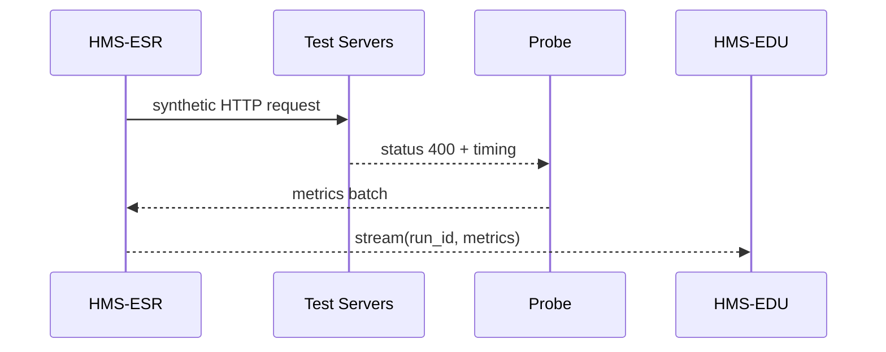

# Chapter 15: Simulation & Training Sandbox (HMS-ESR + HMS-EDU)

[← Back to Chapter&nbsp;14: AI Representative Agent (Gov/Admin Persona)](14_ai_representative_agent__gov_admin_persona__.md)

---

## 1. Why Do We Need a “Flight Simulator” for Government Software?

The U.S. Department of Agriculture (USDA) wants to tighten its **“Farm-Subsidy”** form:

* New rule: *“Applicants must upload last year’s IRS Schedule F.”*  
* Go-live date: **Next Monday**  
* Scary thought: What if 40 000 farmers hit the site at once and everyone gets a red error banner?

Instead of gambling on production, USDA spins up the **Simulation & Training Sandbox**:

1. **HMS-ESR** (Event-Script Runner) spawns **synthetic farmers** that click through the new form, upload fake PDFs, even rage-refresh when they hit an error.  
2. **HMS-EDU** (Education Suite) shows a live **“what-if” dashboard** and an **interactive tutorial** so staff can watch failures, tweak rules, and learn without risking real data.

Think of it as a **flight simulator**—pilots practise emergency landings 10 000 ft above a cornfield *inside the sim*, not over *real* cornfields.

---

## 2. Key Concepts (Plain English)

| Term (Sandbox) | Friendly Analogy | One-Sentence Definition |
|----------------|------------------|-------------------------|
| Scenario | Movie script | Describes who does what and when (“500 farmers submit forms in 10 min”). |
| Synthetic User | Stunt actor | Fake citizen account that behaves like a real one (login, click, upload). |
| Probe | Thermometer | Tiny sensor that records latency, error codes, memory usage. |
| EDU Tutorial | Instructor seat | Overlay that explains *why* an error happened and suggests a fix. |
| Snapshot | Saved game | Frozen copy of DB + services so you can rewind and try again. |

---

## 3. The 5-Minute “Hello-Simulation”

Below we rehearse the **Schedule F requirement** before Monday.

```python
# file: hello_simulation.py   (≤ 20 lines)
from hms_esr import Scenario, User, Step, Probe
from hms_edu import Dashboard

# 1) Describe the scenario
farmers = User.template(role="farmer").multiply(500)

scenario = (
    Scenario(name="schedule_f_trial")
      .given(farmers)
      .when(Step("open_form", path="/apply-subsidy"))
      .and_then(Step("upload", file="fake_schedule_f.pdf"))
      .and_then(Step("submit"))
      .probe(Probe.http( warn_ms=400 ))   # latency alert
      .duration("10m")
)

# 2) Run it & open the dashboard
run_id = scenario.start()          # ESR takes over
Dashboard.show(run_id)             # EDU pops a live view
```

What will happen?  
1. **500 virtual farmers** log in and act out the three steps.  
2. ESR records every HTTP code & load time.  
3. EDU opens a browser tab with gauges for **success rate**, **P95 latency**, and a running count of “Schedule F missing” errors.

---

## 4. Watching the Replay

After the run:

```python
from hms_edu import Tutorial

Tutorial.replay(run_id)
```

A YouTube-style scrub bar appears—pause when error spikes, click “Why?” and EDU highlights the new validation rule that threw 423 failures.

---

## 5. Under the Hood – What Actually Happens?



1. **ESR** plays each Step like a headless browser.  
2. **Probe** captures timing + status—no business data.  
3. **EDU** streams a WebSocket feed to your dashboard & tutorial overlay.

Five moving parts, zero risk to production.

---

## 6. Peek Inside the Codebase (Tiny Samples)

### 6.1 Mini Scenario Runner

```python
# file: esr/runner.py  (≤ 15 lines)
def run(scn):
    for user in scn.users:
        for step in scn.steps:
            resp = user.act(step)
            record(resp)              # write to Probe queue
```

Just a double-loop—hundreds of users *feel* concurrent because each runs in an async task.

### 6.2 Live Metrics Streamer

```python
# file: edu/live.py  (≤ 12 lines)
async def stream(run_id, queue):
    async for m in queue:
        ws = dashboards[run_id]
        await ws.send_json(m)         # push to browser chart
```

Under 12 lines and your team gets real-time graphs.

---

## 7. How the Sandbox Plays with Other HMS Layers

| Need | Happens Via | Linked Chapter |
|------|-------------|----------------|
| Uses the *real* form UI | Requests go through [HMS-GOV](01_hms_gov__government_interface_layer__.md) just like citizens would. | Chapter 1 |
| Validates new rule logic | Same rule engine in [HMS-SVC](04_hms_svc__core_backend_services__.md) catches “Schedule F missing.” | Chapter 4 |
| Logs land in Data Lake | Probe metrics autostream to [HMS-DTA](06_hms_dta__data_lake___governance__.md). | Chapter 6 |
| Trainees chat with a tutor bot | EDU embeds a helper built with [Gov/Admin Agent](14_ai_representative_agent__gov_admin_persona__.md). | Chapter 14 |
| Roll back & retry | Snapshots managed by [HMS-SYS](18_hms_sys__system_infrastructure__.md). | Chapter 18 |

---

## 8. FAQ & Troubleshooting

| Symptom | Likely Cause | Quick Fix |
|---------|--------------|-----------|
| Dashboard blank | Browser blocked WebSocket | Allow `wss://localhost:8765` in dev settings. |
| All synthetic users fail at login | Test DB snapshot missing accounts | Call `farmers.provision(auth_service)`. |
| Latency probe never warns | Threshold too high | Set `Probe.http(warn_ms=200)`. |
| Need to pause mid-run | `scenario.pause()` then `resume()` in Python shell. |

---

## 9. What You Learned

* **HMS-ESR** spawns realistic traffic so you can stress-test new rules.  
* **HMS-EDU** turns raw metrics into **live dashboards**, **tutorials**, and **playback replays**.  
* Together they let agencies rehearse dangerous changes—no farmers (or web servers) harmed.

Ready to publish your polished rule set and discover even more reusable tools?  
Jump to the next chapter: [HMS-MKT (Marketplace & Capability Discovery)](16_hms_mkt__marketplace___capability_discovery__.md)

---

Generated by [AI Codebase Knowledge Builder](https://github.com/The-Pocket/Tutorial-Codebase-Knowledge)