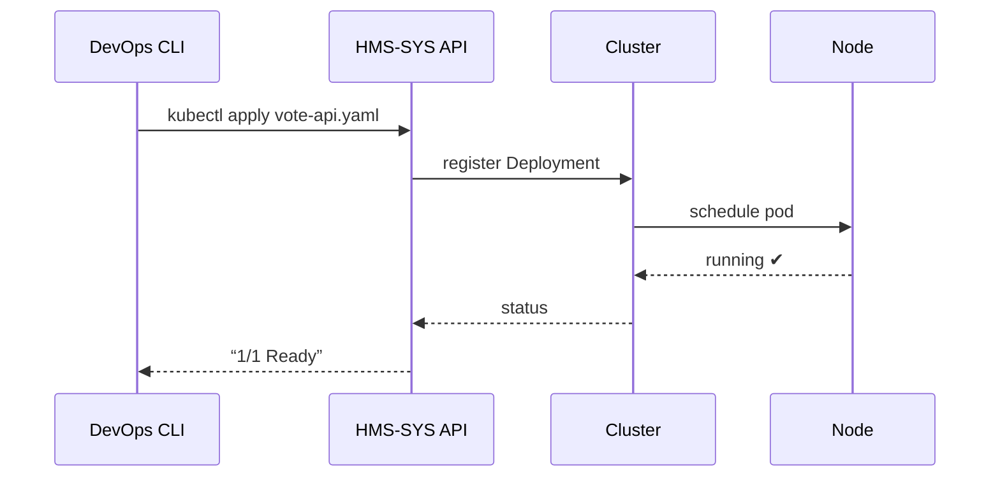

# Chapter 18: HMS-SYS (System Infrastructure)
*[← Back to Chapter&nbsp;17 – External System Sync Layer](17_external_system_sync_layer_.md)*  

---

## 1. Why Do We Need HMS-SYS?

It’s **8:02 pm on federal election night**.  
Every county website is funneling live vote counts through HMS-EHR so citizens, journalists, and officials can see real-time maps.

At 8:03 pm traffic spikes from **2 000 req/s → 120 000 req/s**.  
If the servers melt, the public trust melts with them.

HMS-SYS is the **“streets, pipes, and power grid”** that quietly:

1. Spawns hundreds of extra containers in seconds.  
2. Routes traffic to the least-busy node.  
3. Keeps security patches up-to-date while apps stay online.

Everyone else can **stand on the concrete** (write forms, models, dashboards) without worrying about kernels, firewalls, or disk I/O.

---

## 2. Key Concepts (Plain English)

| Term              | Friendly Analogy                 | One-Sentence Meaning |
|-------------------|----------------------------------|----------------------|
| Cluster           | City power grid                  | Group of servers managed as one big resource pool. |
| Node              | Individual power station         | Single VM or bare-metal box inside the cluster. |
| Pod (Container)   | Food truck                       | Self-contained app unit you can park anywhere. |
| Service Mesh      | Street signs                     | Auto-discovered network so pods find each other. |
| Ingress           | Highway on-ramp                  | Edge gateway that lets public traffic enter the mesh. |
| Secret Vault      | Locked bank vault                | Encrypted store for API keys, DB passwords, etc. |
| Auto-Scaler       | Smart thermostat                 | Adds/removes pods when load changes. |
| Patch Window      | Night construction crew          | Scheduled time to update kernels without outages. |

---

## 3. The 5-Minute “Hello-SYS”

Goal: add one **Vote-API** pod and set an auto-scaling rule that keeps CPU below 60 %.

### 3.1 Deploy a Pod (YAML ≤ 20 lines)

```yaml
# file: vote-api.yaml
apiVersion: apps/v1
kind: Deployment
metadata: { name: vote-api }
spec:
  replicas: 1
  selector: { matchLabels: { app: vote-api } }
  template:
    metadata: { labels: { app: vote-api } }
    spec:
      containers:
        - name: vote-api
          image: govregistry/vote:1.0
          ports: [ { containerPort: 8080 } ]
```

Run:

```bash
kubectl apply -f vote-api.yaml
```

**What happens?**  
The cluster schedules one `vote-api` container on any node with free CPU/RAM.

### 3.2 Add an Auto-Scaler (≤ 10 lines)

```bash
kubectl autoscale deployment vote-api \
    --cpu-percent=60 \
    --min=1 --max=50
```

Now HMS-SYS watches CPU every 15 s and scales **1 → 50 pods** automatically.

### 3.3 Verify

```bash
kubectl get hpa vote-api
```

Console:

```
NAME       CPU%   TARGET   MIN   MAX   CURRENT
vote-api   75%    60%      1     50    12
```

Auto-scaler created **12 pods** to push average CPU back under 60 %.

---

## 4. Quick “Security Patch” Example

```bash
# Schedule a 2 am rolling kernel patch
hms-sys patch schedule \
   --window="2024-04-05T02:00Z" \
   --kind="kernel" \
   --strategy="rolling"
```

Outcome: each node reboots **one-at-a-time**, pods migrate to healthy nodes, zero downtime to citizens.

---

## 5. How It Works (Step-by-Step)



1. CLI talks to HMS-SYS API.  
2. Scheduler picks a **Node** with room.  
3. Service Mesh advertises `vote-api` so other pods can call it.  
4. Auto-scaler monitors metrics → adds more pods if needed.

---

## 6. Peek Inside the Codebase

### 6.1 Tiny Scheduler Snippet

```python
# file: sys/scheduler.py
def pick_node(nodes, cpu_needed):
    for n in sorted(nodes, key=lambda x: x.cpu_free, reverse=True):
        if n.cpu_free >= cpu_needed:
            return n
    raise NoCapacity
```

Simple “pick the node with most free CPU.”

### 6.2 CPU Metric Collector (≤ 12 lines)

```python
# file: sys/metrics.py
def collect():
    for pod in all_pods():
        usage = cgroup_cpu(pod.pid)
        emit("cpu", pod.name, usage)
```

Runs every 15 s; outputs feed the auto-scaler.

### 6.3 Secret Vault Lookup

```python
# file: sys/vault.py
def get(name):
    cipher = open("/vault/" + name).read()
    return decrypt(cipher, key=os.getenv("VAULT_KEY"))
```

Pods call `vault.get("DB_PASSWORD")`; secrets **never** appear in plain text on disk.

---

## 7. How Other HMS Layers Rely on HMS-SYS

| Layer | What It Needs | How HMS-SYS Provides It |
|-------|---------------|-------------------------|
| [HMS-GOV](01_hms_gov__government_interface_layer__.md) | Public HTTPS endpoint | Ingress routes `/forms/*` to correct pod. |
| [HMS-OPS](19_hms_ops__observability___platform_operations__.md) | Cluster metrics & logs | Nodes stream data to OPS agent. |
| [HMS-ESQ](07_hms_esq__legal_compliance_intelligence__.md) | Secure secret storage | Secret Vault API shares no plaintext keys. |
| [HMS-ESR Sandbox](15_simulation___training_sandbox__hms_esr___hms_edu__.md) | On-demand test clusters | SYS spins up ephemeral namespaces. |

---

## 8. FAQ & Troubleshooting

| Symptom | Likely Cause | Quick Fix |
|---------|--------------|-----------|
| Pods crash-loop | bad image tag | `kubectl logs podname` → fix tag, re-deploy. |
| Auto-scaler stuck at max | real load spike | raise `--max`, add nodes, or throttle clients. |
| Secret not found in pod | env var typo | `echo $DB_PASSWORD` inside pod; check Vault key. |
| Patch window failed | node drained too slowly | extend `--drain-timeout`, ensure spare capacity. |

---

## 9. What You Learned

* HMS-SYS is the **foundation**—clusters, networks, secrets, scaling.  
* You deployed a pod, added an auto-scaler, and scheduled a rolling kernel patch in minutes.  
* Other HMS layers simply assume this plumbing works.

Next, we’ll learn **how to watch all those pods, metrics, and patch windows in real time** inside the **Observability & Platform Operations layer**.  

→ *Continue to* [HMS-OPS (Observability & Platform Operations)](19_hms_ops__observability___platform_operations__.md)

---

Generated by [AI Codebase Knowledge Builder](https://github.com/The-Pocket/Tutorial-Codebase-Knowledge)