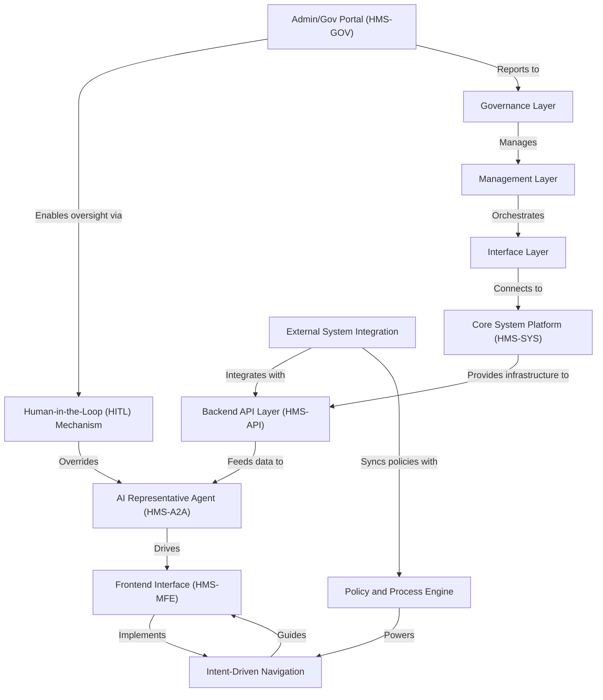

# Tutorial: HMS-EHR

**HMS-EHR** is an *AI-powered*, expert-led platform that automates multi-party workflows for government and citizen services.  
It provides a **central API**, modular **micro-frontends**, and smart **AI agents** to streamline policy management, program execution,  
and service delivery—while ensuring transparency, compliance, and *human oversight* in public-sector operations.

**Source Repository:** [None](None)

## Chapters

1. [Frontend Interface (HMS-MFE)
](01_frontend_interface__hms_mfe__.md)
2. [Admin/Gov Portal (HMS-GOV)
](02_admin_gov_portal__hms_gov__.md)
3. [Intent-Driven Navigation
](03_intent_driven_navigation_.md)
4. [AI Representative Agent (HMS-A2A)
](04_ai_representative_agent__hms_a2a__.md)
5. [Human-in-the-Loop (HITL) Mechanism
](05_human_in_the_loop__hitl__mechanism_.md)
6. [Policy and Process Engine
](06_policy_and_process_engine_.md)
7. [External System Integration
](07_external_system_integration_.md)
8. [Backend API Layer (HMS-API)
](08_backend_api_layer__hms_api__.md)
9. [Core System Platform (HMS-SYS)
](09_core_system_platform__hms_sys__.md)
10. [Interface Layer
](10_interface_layer_.md)
11. [Management Layer
](11_management_layer_.md)
12. [Governance Layer
](12_governance_layer_.md)

---

Generated by [AI Codebase Knowledge Builder](https://github.com/The-Pocket/Tutorial-Codebase-Knowledge)