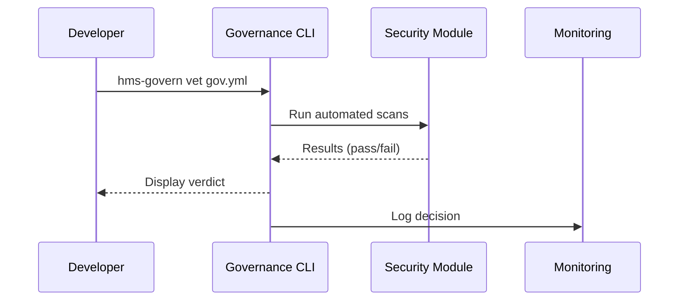

# Chapter 1: Governance Layer (AI Governance Values)

> “Every brick of a hospital must meet building code.  
> Every line of HMS-EMR code must meet Governance code.”

---

## 1 — Why do we need a Governance Layer?

Imagine the National Science Foundation (NSF) launches an online grant dashboard.  
Thousands of scientists upload proposals, budgets, and personal data.  
Without strong guardrails, one buggy update could:

* leak reviewers’ names, breaching privacy law;  
* display wrong scoring criteria, harming transparency;  
* use an un-vetted ML model, biasing awards.

The Governance Layer acts like a **digital constitution** that stops these issues **before** they reach citizens or agencies.  
It gives:

* Policymakers — a single place to encode new regulations.  
* Developers — a checklist that code *must* pass to deploy.  
* Auditors — a clear paper trail.

---

## 2 — Five Core Values

Think of them as “articles” in the constitution:

| # | Value | Plain-English Rule | Quick Analogy |
|---|-------|-------------------|---------------|
| 1 | Transparency | “Show your work.” | Like publishing meeting minutes. |
| 2 | Truthfulness | “Don’t hallucinate data.” | Like swearing an oath in court. |
| 3 | Safety | “Do no harm.” | Like FDA trials for medicine. |
| 4 | Ethics | “Follow public-interest ethics.” | Like conflict-of-interest forms. |
| 5 | Privacy | “Protect personal info.” | Like redacting SSNs from filings. |

---

## 3 — A 60-Second Tour (Hands-On)

Let’s protect that NSF dashboard with a **governance manifest**.  
Create a file called `gov.yml`:

```yaml
service: nsf-grant-dashboard
version: v1.2.0
checks:
  - transparency:  pass
  - truthfulness:  pass
  - safety:        pass
  - ethics:        pass
  - privacy:       pass
```

Now run the (hypothetical) CLI:

```bash
$ hms-govern vet gov.yml
All 5 checks pass ✔
Deployment allowed.
```

If a rule fails:

```bash
$ hms-govern vet gov.yml
Privacy check ❌  Personal data exposed in API /applicant/123
Deployment blocked.
```

That’s it! Even a beginner can see what broke and why the release halted.

---

## 4 — How does it work under the hood?

### 4.1 High-Level Flow



1. The developer triggers a vetting command.  
2. CLI calls the Security & Compliance Module ([Chapter 12](12_security___compliance_module__hms_esq___governance_hooks__.md)).  
3. Results come back; deployment proceeds or halts.  
4. Operations Suite ([Chapter 13](13_operations___monitoring_suite__hms_ops__.md)) stores an immutable audit log.

### 4.2 Mini Implementation Peek

_File: `hms_govern.py` (excerpt)_

```python
import esq   # wrapper to Security & Compliance Module
import yaml, sys

def vet(manifest_path: str) -> bool:
    doc = yaml.safe_load(open(manifest_path))
    results = esq.scan(doc["service"], doc["version"])
    for rule, ok in results.items():
        icon = "✔" if ok else "❌"
        print(f"{rule.capitalize()} check {icon}")
        if not ok:
            print("Deployment blocked."); return False
    print("All 5 checks pass ✔"); return True

if __name__ == "__main__":
    sys.exit(0 if vet(sys.argv[1]) else 1)
```

Explanations:

* We parse the YAML, ask the Security module to **scan**, then print simple icons.  
* Real scanning is hidden inside `esq.scan(...)` to keep this demo beginner-friendly.

---

## 5 — Connecting to Other HMS Layers

* When UI designers build micro-frontends, they must ship a `gov.yml` along with code. See [Micro-Frontend Interface (HMS-MFE)](03_micro_frontend_interface__hms_mfe__.md).  
* Incoming citizen intents will be routed by [Intent-Driven Navigation](02_intent_driven_navigation___ai_guided_journeys_.md) **only** if intents meet Governance policies.  
* Agent workflows in [HMS-ACT](06_agent_orchestration___workflow_engine__hms_act__.md) inherit the same values automatically.

---

## 6 — Frequently Asked Questions

**Q1: Does Governance slow teams down?**  
A: It replaces ad-hoc reviews with automated, <30-second checks—*faster* than manual approvals.

**Q2: What if a new law appears?**  
A: Policymakers update a single rule set in the Governance Layer. Every downstream service is re-evaluated automatically.

**Q3: Can small prototypes skip it?**  
A: No. Even a “toy” script touching real data must pass the constitution.

---

## 7 — Try it Yourself

1. Fork the repo.  
2. Add a trivial script `hello.py` that prints “Hi”.  
3. Create `gov.yml` with all checks set to `pass`.  
4. Run `hms-govern vet gov.yml`.  
5. Change one check to `fail` and see the gatekeeper in action.

---

## 8 — What you learned

* The Governance Layer is the **first and mandatory gate** for any HMS-EMR component.  
* Five simple values—transparency, truthfulness, safety, ethics, privacy—translate lofty policy into concrete pass/fail checks.  
* A minimal CLI and YAML manifest let beginners enforce governance in minutes.

Ready to build citizen-facing journeys that inherit these guarantees? Continue to [Intent-Driven Navigation & AI-Guided Journeys](02_intent_driven_navigation___ai_guided_journeys_.md).

---

Generated by [AI Codebase Knowledge Builder](https://github.com/The-Pocket/Tutorial-Codebase-Knowledge)