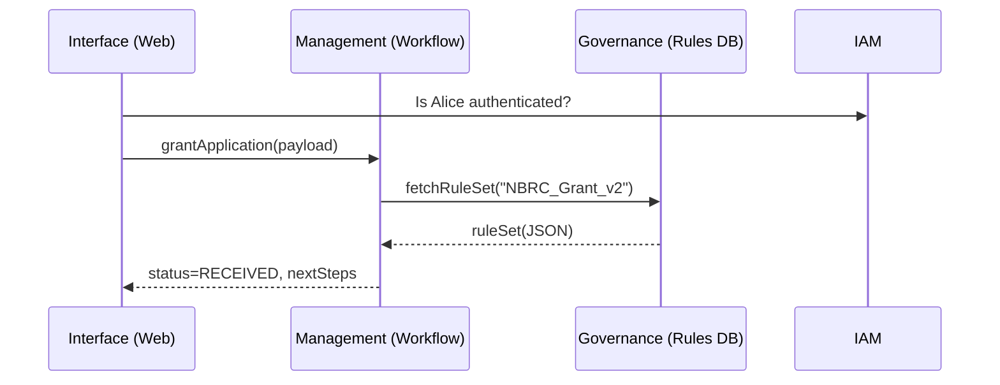

# Chapter 1: Three-Layer Architecture (Governance / Management / Interface)

> “Like a well-run public building, the HMS platform keeps decisions, daily work, and front-desk interactions neatly separated—so everyone always knows **who does what**.”

---

## 1. Why do we need layers?

Imagine you are a citizen applying online for a **Small Business Relief Grant** run by the *Northern Border Regional Commission*.  
When you click “Submit,” several things must happen:

1. The rules for eligibility (e.g., “business < 50 employees”) must be **defined** somewhere—and updated when Congress changes the law.  
2. The system has to **check** your application against those rules, store results, maybe trigger a human review.  
3. Finally, you need a **friendly web page** that shows “Application Received” and lets you track status.

If these three concerns lived in the same piece of code, a small policy change (“< 100 employees”) could break the whole site.  
The HMS-EMR platform prevents that by splitting work into **three independent floors**:

| Floor | Purpose | HMS Layer |
|-------|---------|-----------|
| Top | Make & update rules | **Governance** |
| Middle | Execute rules | **Management** |
| Ground | Interact with humans & other systems | **Interface** |

This is called the **Three-Layer Architecture**. Grasping it early will help you navigate the rest of this guide.

---

## 2. Meet the Floors

### 2.1 Governance Layer 🏛️  
*Analogy:* Congress & agency leadership deciding policy.

• Stores official policies, formulas, and permissions  
• Only a few trusted users can edit (e.g., policy analysts)  
• Outputs clean, versioned “rule sets” that others consume

_HMS Component Preview:_ [Governance Portal (HMS-GOV)](02_governance_portal__hms_gov__.md)

---

### 2.2 Management Layer ⚙️  
*Analogy:* Civil servants who turn policies into day-to-day processes.

• Invokes workflows (“verify SSN”, “calculate grant amount”)  
• Handles data storage, queues, audits  
• Must **never** change a rule—just follow it

_HMS Component Preview:_ [Process & Policy Engine](03_process___policy_engine_.md)

---

### 2.3 Interface Layer 🖥️  
*Analogy:* The help desk or public website.

• Web & mobile UIs, API endpoints, or even voice bots  
• Speaks plain language (“You’re eligible!”)  
• Calls the Management layer—never touches rules directly

_HMS Component Preview:_ [API Gateway & Policy Endpoints (HMS-API)](05_api_gateway___policy_endpoints__hms_api__.md)

---

## 3. A 60-Second Walk-Through

Below is **all** that happens when Alice clicks “Submit Application”:



*Only five actors, yet each knows its clear role.*

---

## 4. Tiny Code Taste

Let’s see a **toy** JavaScript snippet (< 20 lines) that the Interface layer might run:

```js
// interface/submitApplication.js
import { postApplication } from "./apiGateway.js";

async function submit(form) {
  const payload = {
    ...form,
    programCode: "NBRC_GRANT"
  };

  // call Management through API Gateway
  const res = await postApplication(payload);

  alert(`✅ ${res.status}. Track ID: ${res.id}`);
}

export default submit;
```

Explanation  
1. `submit()` collects form data (ground floor).  
2. It sends data to **API Gateway** (door to middle floor).  
3. No rule logic lives here—that’s upstairs!

---

### What happens in the Management layer?

```python
# management/grants.py (simplified)
def process(payload):
    rules = governance.fetch("NBRC_GRANT_v2")  # upstairs call
    if not rules.check_eligibility(payload):
        return {"status": "DENIED"}
    # ...store in DB, enqueue review...
    return {"status": "RECEIVED", "id": generate_id()}
```

• `governance.fetch` pulls the rule set—no hard-coding.  
• Only **interprets**, never **edits**.

---

### Peeking into Governance storage

```yaml
# governance/policies/NBRC_GRANT_v2.yaml
meta:
  program: "Northern Border Regional Commission Grant"
rules:
  maxEmployees: 50
  allowedStates: ["ME", "NH", "VT", "NY"]
version: 2
```

A policy analyst changes `maxEmployees` to 100, commits a new file, and—voilà—everything else adapts with zero code changes in UI or workflows.

---

## 5. How do the layers talk?

Communication patterns stay narrow:

1. **Interface ➜ Management**  
   REST/GraphQL calls via [API Gateway](05_api_gateway___policy_endpoints__hms_api__.md)

2. **Management ➜ Governance**  
   Internal SDK calls or gRPC (read-only)

3. **Governance ➜ Management**  
   Emits versioned artifacts (JSON, Rego, or SQL) for the others to pull

Keeping these pipes minimal allows each team to work—and deploy—independently.

---

## 6. Frequently Asked (Beginner) Questions

**Q: Can the Interface layer directly call Governance to show rules?**  
A: No. It should ask Management, which may choose to expose a safe slice of data.

**Q: What if Management needs a new check that's not in Governance?**  
A: Open a policy change request in the Governance Portal.  
Once approved and versioned, Management will pick it up automatically.

**Q: Does this add latency?**  
A: A tiny bit, but the clarity and safety far outweigh the cost—much like security checks in a federal building.

---

## 7. Summary & What’s Next

You now know:

• The **Three-Layer Architecture** keeps rule-making, execution, and interaction cleanly separated.  
• A small policy edit travels from **Governance** ➔ **Management** ➔ **Interface** without breaking the app.  
• This foundation powers everything else in HMS-EMR.

In the next chapter we will explore the **top floor** in detail—how policies are written, versioned, and approved inside the [Governance Portal (HMS-GOV)](02_governance_portal__hms_gov__.md).

*Ready to ride the elevator upstairs?* 🚀

---

Generated by [AI Codebase Knowledge Builder](https://github.com/The-Pocket/Tutorial-Codebase-Knowledge)