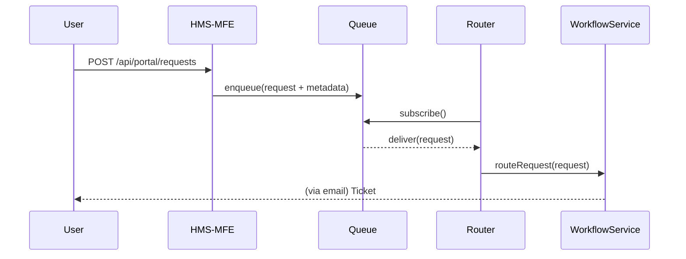

# Chapter 1: User Portal (HMS-MFE)

Welcome to the very first chapter of the HMS-EMR tutorial! In this chapter, we’ll explore the **User Portal (HMS-MFE)**—the public-facing gateway where citizens or employees submit requests, complaints, or service inquiries. Think of it as a digital town-hall kiosk: users tap in, fill out a quick form, and behind the scenes, we capture metadata, queue their request, and route it to the correct workflow.

---

## Why Do We Need the User Portal?

Imagine a rural utility customer notices a power outage. Instead of calling a hotline, they open a friendly web portal, select “Report Outage,” and hit **Submit**. Immediately:

1. Metadata (location, time, user ID) is captured.
2. A ticket is queued.
3. The ticket is routed to the outage-management workflow.

Without this portal, citizens might send emails, get lost in spam filters, or call in and wait on hold. The User Portal provides a consistent, trackable way to gather and process requests.

---

## Key Concepts

1. **User Interface (UI) Component**  
   A simple form or widget embedded on a government website.  

2. **Metadata Capture**  
   Automatically record details like timestamp, user geography, browser info.  

3. **Request Queue**  
   A message queue (e.g., Kafka or RabbitMQ) that buffers incoming tickets.  

4. **Router**  
   A service that reads from the queue and sends each request to the correct workflow (e.g., power outages → Outage Service).  

5. **Workflow Service**  
   Downstream microservice or process engine that takes action (send crews, follow up, close ticket).

---

## How to Use the User Portal

Below is a minimal JavaScript form component. When the user submits, it calls our portal API.

```jsx
// File: UserPortalForm.jsx
import React, { useState } from 'react';
import axios from 'axios';

export function UserPortalForm() {
  const [details, setDetails] = useState({ type: '', description: '' });

  const handleSubmit = async e => {
    e.preventDefault();
    await axios.post('/api/portal/requests', {
      ...details,
      userId: 'citizen-123',         // Example: captured or from auth
      timestamp: new Date().toISOString()
    });
    alert('Request submitted! A ticket has been created.');
  };

  return (
    <form onSubmit={handleSubmit}>
      <select onChange={e => setDetails({ ...details, type: e.target.value })}>
        <option value="">Select Request</option>
        <option value="power-outage">Power Outage</option>
        <option value="water-leak">Water Leak</option>
      </select>
      <textarea
        placeholder="Describe the issue"
        onChange={e => setDetails({ ...details, description: e.target.value })}
      />
      <button type="submit">Submit</button>
    </form>
  );
}
```

Explanation:
- The form captures **type** and **description**.
- On submit, it sends JSON to `/api/portal/requests`.
- The portal adds metadata (userId, timestamp) before queueing.

**Example Input**  
```json
{
  "type": "power-outage",
  "description": "No power since 3:00 AM.",
  "userId": "citizen-123",
  "timestamp": "2024-06-20T10:00:00Z"
}
```

**What Happens Next**  
- The request lands in the **Request Queue**.
- The **Router** picks it up.
- It forwards to the **Outage Workflow Service**, which dispatches crews.

---

## Under the Hood: Step-by-Step

Before we peek at code, here’s a sequence diagram of the flow:



1. **User** hits **Portal** with form data.  
2. **Portal** attaches metadata and enqueues.  
3. **Router** reads from the **Queue**.  
4. **Router** calls **WorkflowService** (power-outage handler).  
5. **WorkflowService** sends confirmation back to the user.

---

### Internal Implementation (Simplified)

File structure inside `hms-mfe`:
```
hms-mfe/
├── src/
│   ├── apiClient.js
│   ├── PortalHandler.js
│   └── queueClient.js
```

1. **apiClient.js**  
   Wraps HTTP details.
   ```js
   // apiClient.js
   import express from 'express';
   import { handleNewRequest } from './PortalHandler';

   const app = express();
   app.use(express.json());
   app.post('/api/portal/requests', handleNewRequest);

   app.listen(3000, () => console.log('HMS-MFE running on 3000'));
   ```

2. **PortalHandler.js**  
   Adds metadata and pushes to queue.
   ```js
   // PortalHandler.js
   import { enqueue } from './queueClient';

   export async function handleNewRequest(req, res) {
     const request = {
       ...req.body,
       metadata: {
         ip: req.ip,
         userAgent: req.headers['user-agent']
       }
     };
     await enqueue(request);
     res.status(202).send({ message: 'Queued', ticketId: 'TICK-001' });
   }
   ```

3. **queueClient.js**  
   Minimal stub for enqueuing.
   ```js
   // queueClient.js
   export async function enqueue(request) {
     // In real life: send to Kafka/RabbitMQ
     console.log('Enqueued:', request);
   }
   ```

---

## Summary

In this chapter, you learned:
- What the **User Portal (HMS-MFE)** is and why it matters.
- Key components: UI form, metadata capture, request queue, router, and workflow service.
- A minimal example of how to build and run the portal.
- The end-to-end flow from user click to workflow invocation.

Up next, we’ll flip roles and build the government-side interface: the **[Admin/Gov Portal (HMS-GOV)](02_admin_gov_portal__hms_gov__.md)**.

---

Generated by [AI Codebase Knowledge Builder](https://github.com/The-Pocket/Tutorial-Codebase-Knowledge)