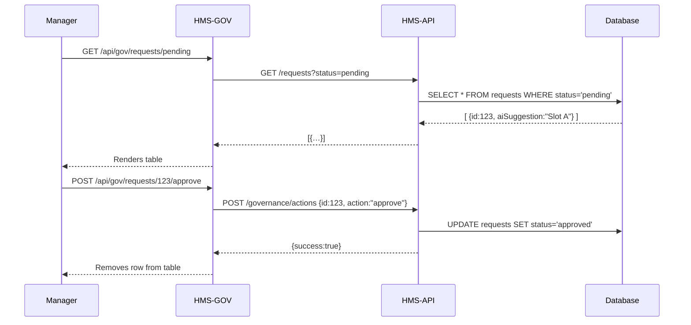

# Chapter 2: Admin/Gov Portal (HMS-GOV)

Welcome back! Now that you’ve seen how citizens submit requests via the [User Portal (HMS-MFE)](01_user_portal__hms_mfe__.md), it’s time to switch roles—from the user to the supervisor. In this chapter, we’ll build the **Admin/Gov Portal (HMS-GOV)**: a secure “control room” for officials to review, approve or override requests, and track AI proposals in real time.

---

## 2.1 Why an Admin/Gov Portal?

Imagine an FDA manager seeing an AI-generated schedule change for facility inspections. Before rolling it out, they need to:
1. Review incoming inspection update requests.
2. Examine the AI’s suggested schedule.
3. Add human context (e.g., staffing constraints).
4. Approve, reject, or modify the plan.

Without this portal, AI decisions would deploy unchecked—or managers would juggle spreadsheets and emails. HMS-GOV provides a locked-down dashboard where policy-makers and supervisors do all of this in one place.

---

## 2.2 Key Concepts

1. **Authentication & Roles**  
   Only authenticated officials (e.g., FDA manager, policy-maker) can log in and see specific data.

2. **Request Review Table**  
   A real-time list of all pending requests coming from HMS-MFE.

3. **AI Proposals Panel**  
   For each request, shows what the AI service suggests (e.g., new inspection slot).

4. **Override Actions**  
   Buttons to Approve, Reject, or Edit the AI suggestion before it goes live.

5. **Performance Widgets**  
   Charts and alerts showing departmental KPIs—how many requests processed, AI accuracy, etc.

---

## 2.3 Building the Dashboard: A Quick Example

Below is a minimal React component that:
1. Fetches pending requests.
2. Renders them in a table.
3. Lets a manager approve or reject.

```jsx
// File: GovDashboard.jsx
import React, { useEffect, useState } from 'react';
import axios from 'axios';

export function GovDashboard() {
  const [items, setItems] = useState([]);

  useEffect(() => {
    axios.get('/api/gov/requests/pending').then(res => setItems(res.data));
  }, []);

  const handleAction = (id, action) =>
    axios.post(`/api/gov/requests/${id}/${action}`).then(() => {
      setItems(items.filter(item => item.id !== id));
    });

  return (
    <table>
      <thead><tr><th>ID</th><th>AI Suggestion</th><th>Action</th></tr></thead>
      <tbody>
        {items.map(r => (
          <tr key={r.id}>
            <td>{r.id}</td>
            <td>{r.aiSuggestion}</td>
            <td>
              <button onClick={() => handleAction(r.id, 'approve')}>Approve</button>
              <button onClick={() => handleAction(r.id, 'reject')}>Reject</button>
            </td>
          </tr>
        ))}
      </tbody>
    </table>
  );
}
```

Explanation:
- On mount, we GET `/api/gov/requests/pending`.
- We show each request’s `aiSuggestion`.
- Approve/reject calls POST `/approve` or `/reject`.
- On success, we remove the item from the table.

---

## 2.4 Under the Hood: Sequence of Events

Let’s walk through a manager approving an AI proposal.



1. **Fetch** pending requests from HMS-API.  
2. **Render** them in the portal.  
3. **Approve/Reject** sends a governance action to HMS-API.  
4. **API** updates the database and returns success.  

---

## 2.5 Internal Implementation

### File Structure
```
hms-gov/
└── src/
    ├── server.js          # Express setup
    ├── GovHandler.js      # Handles HTTP routes
    └── govClient.js       # Talks to HMS-API
```

### 1. server.js
```js
import express from 'express';
import { listPending, takeAction } from './GovHandler';

const app = express();
app.use(express.json());

app.get('/api/gov/requests/pending', listPending);
app.post('/api/gov/requests/:id/:action', takeAction);

app.listen(4000, () => console.log('HMS-GOV on port 4000'));
```

### 2. GovHandler.js
```js
import { fetchPending, postAction } from './govClient';

export async function listPending(req, res) {
  const data = await fetchPending();
  res.send(data);
}

export async function takeAction(req, res) {
  const { id, action } = req.params;
  await postAction(id, action);
  res.send({ success: true });
}
```

### 3. govClient.js
```js
import axios from 'axios';

export function fetchPending() {
  // Call the backend API
  return axios.get('http://hms-api/requests?status=pending')
    .then(r => r.data);
}

export function postAction(id, action) {
  return axios.post(
    `http://hms-api/governance/actions`,
    { id, action }
  );
}
```

---

## 2.6 Summary

You’ve learned how to:
- Build a **secure dashboard** for officials to review and govern AI-driven requests.
- Display real-time data and perform **approve/reject** actions.
- Wire up the front end (`GovDashboard.jsx`) to the back end (`server.js`, `GovHandler.js`, `govClient.js`).

In the next chapter, we’ll pull out common UI elements into our **[Frontend Component Library](03_frontend_component_library_.md)** so both portals stay consistent and maintainable. Happy coding!

---

Generated by [AI Codebase Knowledge Builder](https://github.com/The-Pocket/Tutorial-Codebase-Knowledge)