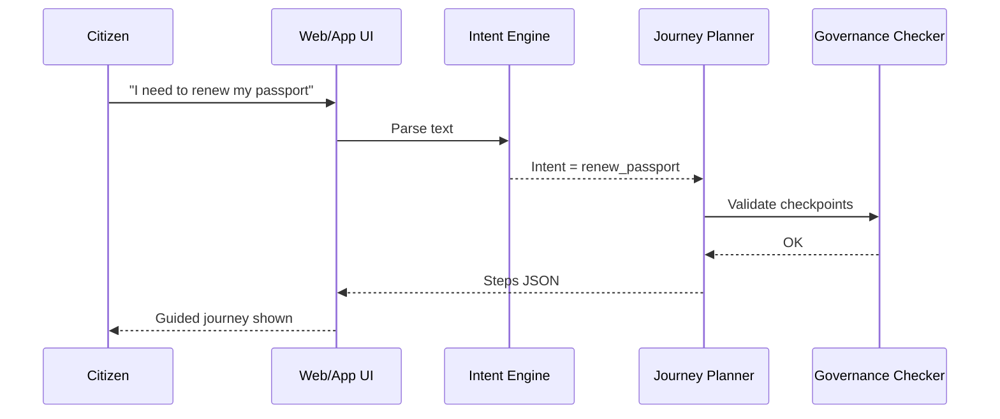

# Chapter 2: Intent-Driven Navigation & AI-Guided Journeys
*A concierge for every citizen request*

[← Back to Chapter 1: Governance Layer](01_governance_layer__ai_governance_values__.md)

---

## 1 — Why do we need it?

Picture Lisa, a U.S. researcher stationed overseas.  
She opens the State Department portal to renew her **diplomatic passport**.  
Five minutes later she is:

* 12 tabs deep,  
* staring at form **DS-82** (wrong form!),  
* and still has no idea where to upload her photo.

What she *really* wants is simple:

> “I need to renew my passport.”

Intent-Driven Navigation lets Lisa type (or say) exactly that.  
The platform then:

1. understands the **outcome** (`renew passport`),  
2. checks policy constraints from the Governance Layer,  
3. walks her step-by-step—surfacing the correct form, fee info, photo specs, and finally a “Submit” button,  
4. escalates to a live agent only if the flow stalls.

Like a federal building’s concierge, it carries her straight to the right window, paperwork in hand.

---

## 2 — Core Ideas (in plain English)

| Term | One-sentence definition | Analogy |
|------|------------------------|---------|
| Intent | What the user wants to accomplish. | “I’d like to file taxes.” |
| Journey Plan | Ordered list of screens, forms, or agents required to satisfy the intent. | A floor map from lobby to office #217. |
| AI Guide | Lightweight agent that monitors progress, answers questions, and auto-fills data when safe. | Helpful clerk who double-checks your forms. |
| Checkpoints | Mandatory policy gates (privacy, identity, payment). | Security desks in the hallway. |

---

## 3 — Hands-On: Your First Guided Journey

We’ll build a **toy CLI** that asks for an intent and prints a journey plan.  
(No real APIs, just enough to see the flow.)

### 3.1 Install the mini-SDK

```bash
pip install hms-intent-lite
```

### 3.2 Sample script (`demo_passport.py`, 17 lines)

```python
from hms_intent import JourneyBuilder

# 1) User expresses the outcome
user_intent = "I need to renew my passport"

# 2) Create a journey
jb = JourneyBuilder()
plan = jb.plan(user_intent)

# 3) Display the steps
for step in plan["steps"]:
    print(f"➡  {step['label']}")

# 4) Final confirmation
print("\nDone! Concierge route generated.")
```

**Expected output**

```
➡  Verify Identity with Login.gov
➡  Prefill DS-82 Renewal Form
➡  Upload Passport Photo (2×2 inch, JPEG)
➡  Calculate Fee ($130)
➡  Review & Submit to State Department
Done! Concierge route generated.
```

What just happened?

1. `JourneyBuilder.plan()` called a tiny NLU model to detect `renew_passport`.  
2. A template journey was fetched from the HMS library.  
3. Governance rules were checked (e.g., identity must be verified).  
4. The ordered list was returned.

---

## 4 — Peek Behind the Curtain

### 4.1 High-level flow



Only five moving parts, all reusable across agencies.

### 4.2 Files in play

```
hms-emr/
 └─ intent/
    ├─ nlu.py         # text → intent code
    ├─ templates.yml  # canned journeys
    └─ planner.py     # picks & tailors a template
```

---

## 5 — Mini Implementation Peek

Below are **simplified** excerpts (<20 lines each).

### 5.1 Intent detection (`nlu.py`)

```python
import re

PATTERNS = {
    "renew_passport": r"renew.*passport",
    "file_unemployment": r"file.*unemployment",
}

def detect(text: str) -> str:
    text = text.lower()
    for intent, pattern in PATTERNS.items():
        if re.search(pattern, text):
            return intent
    return "unknown"
```

Explanation:  
Very naive regex matching, but it proves the concept.  
Swap in a real ML model later.

### 5.2 Journey planner (`planner.py`)

```python
import yaml, nlu
from governance import vet_steps  # wraps Chapter 1 checks

TEMPLATES = yaml.safe_load(open("templates.yml"))

def plan(text: str) -> dict:
    intent = nlu.detect(text)
    template = TEMPLATES.get(intent, [])
    steps = vet_steps(template)     # remove anything disallowed
    return {"intent": intent, "steps": steps}
```

Key point: `vet_steps()` reuses the Governance Layer.  
No step bypasses policy.

### 5.3 Governance hook (`governance.py`)

```python
from chapter1_api import check

def vet_steps(steps):
    return [s for s in steps if check(s["label"])]
```

Even a three-liner keeps us constitution-compliant.

---

## 6 — Connecting to Other HMS Layers

* Micro-frontends rendered in [Micro-Frontend Interface (HMS-MFE)](03_micro_frontend_interface__hms_mfe__.md) consume the **steps JSON** to show cards, forms, or chat bubbles.
* Agent Framework ([HMS-AGT](05_agent_framework__hms_agt__.md)) can attach a smart helper at each checkpoint.
* All user actions are logged by [Operations & Monitoring Suite](13_operations___monitoring_suite__hms_ops__.md) for auditability.

---

## 7 — Frequently Asked Questions

**Q1. Does the user have to type perfect sentences?**  
No. Voice, text, or button shortcuts all route to the same intent engine.

**Q2. What if the intent is unclear (“I need help”)?**  
Return *clarifying questions* as the first step: “Are you filing taxes, renewing a passport, or something else?”

**Q3. Can agencies add custom journeys?**  
Absolutely—just drop a new YAML template in `templates.yml`. Governance checks run automatically.

---

## 8 — What you learned

* Menus are out; outcome-first journeys are in.  
* The system detects an **intent**, builds a **journey plan**, and enforces **policy checkpoints**.  
* A handful of <20-line Python files are enough to prototype the flow.

Ready to paint these journeys onto real user interfaces?  
Continue to [Chapter 3: Micro-Frontend Interface (HMS-MFE)](03_micro_frontend_interface__hms_mfe__.md).

---

Generated by [AI Codebase Knowledge Builder](https://github.com/The-Pocket/Tutorial-Codebase-Knowledge)