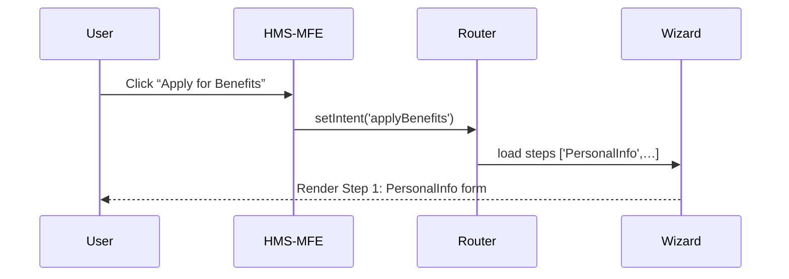

# Chapter 2: Intent-Driven Navigation

Welcome back! In [Chapter 1: Frontend Interfaces](01_frontend_interfaces_.md), we saw how users and clerks interact with HMS-EMR portals. Now, let’s make those portals smart—changing steps based on what a user actually wants to do.

---

## 1. Why Intent-Driven Navigation?

Imagine a citizen walks up to a DMV kiosk. If they want to **renew a driver’s license**, the kiosk asks for different information than if they want to **register a new vehicle**. We call this **Intent-Driven Navigation**: the interface flow adapts to a user’s goal (their “intent”). 

Common intents in government services:
- “Apply for benefits”  
- “File a civil rights complaint”  
- “Renew license”  

Intent-Driven Navigation helps users by guiding them only through the relevant steps.

---

## 2. Key Concepts

1. **Intent**  
   A high-level user goal (e.g., “Apply for benefits”).

2. **Flow**  
   A predefined sequence of screens or forms tied to each intent.

3. **Router**  
   Matches the chosen intent to its flow and renders the right steps.

---

## 3. Example Use Case: Apply for Benefits vs. File Complaint

### 3.1 Let the User Pick an Intent

```jsx
// src/components/IntentSelector.js
import React from 'react';

function IntentSelector({ onSelect }) {
  return (
    <div>
      <h2>What would you like to do?</h2>
      <button onClick={() => onSelect('applyBenefits')}>
        Apply for Benefits
      </button>
      <button onClick={() => onSelect('fileComplaint')}>
        File a Complaint
      </button>
    </div>
  );
}

export default IntentSelector;
```
> This simple component offers two buttons. When clicked, it tells the app which intent the user chose.

### 3.2 Define Flows for Each Intent

```js
// src/intentFlows.js
export const flows = {
  applyBenefits: [
    'PersonalInfo',
    'EligibilityQuestions',
    'ReviewAndSubmit'
  ],
  fileComplaint: [
    'ComplaintDetails',
    'AttachEvidence',
    'Confirmation'
  ]
};
```
> `flows` maps an intent key to the ordered list of step names.

### 3.3 Render the Right Steps

```jsx
// src/components/IntentRouter.js
import React, { useState } from 'react';
import { flows } from '../intentFlows';
import StepWizard from './StepWizard';

function IntentRouter() {
  const [intent, setIntent] = useState(null);

  if (!intent) {
    return <IntentSelector onSelect={setIntent} />;
  }
  return <StepWizard steps={flows[intent]} />;
}

export default IntentRouter;
```
> Once an intent is chosen, we pass the right `steps` array into a generic `StepWizard`.

---

## 4. Under the Hood: Step-by-Step Journey

Here’s what happens when a user picks “Apply for Benefits”:



1. **User** clicks their goal.  
2. **HMS-MFE** notifies the **Router**.  
3. **Router** looks up the flow in `intentFlows`.  
4. **StepWizard** shows each step in order.

---

## 5. Internal Implementation

Let’s peek at how `StepWizard` might work:

```jsx
// src/components/StepWizard.js
import React, { useState } from 'react';

function StepWizard({ steps }) {
  const [index, setIndex] = useState(0);
  const Step = steps[index];

  return (
    <div>
      <h3>Step {index + 1} of {steps.length}</h3>
      <Step />                    {/* Render the component by name */}
      {index < steps.length - 1 && (
        <button onClick={() => setIndex(i => i + 1)}>
          Next
        </button>
      )}
    </div>
  );
}

export default StepWizard;
```
> We store the current step index and render the corresponding component. Hitting “Next” advances to the next step.

If you wonder how we map string names like `'PersonalInfo'` to real React components, we might use a simple registry:

```js
// src/stepRegistry.js
import PersonalInfo from './steps/PersonalInfo';
import EligibilityQuestions from './steps/EligibilityQuestions';
// …

export const registry = {
  PersonalInfo,
  EligibilityQuestions,
  ReviewAndSubmit,
  ComplaintDetails,
  AttachEvidence,
  Confirmation
};
```

And modify `StepWizard` to use it:

```js
import { registry } from '../stepRegistry';
// …
const Step = registry[steps[index]];
```

---

## 6. Conclusion

In this chapter, you learned how to:

- Let users pick a high-level **intent**.  
- Define **flows** (step sequences) for each intent.  
- Use an **IntentRouter** + **StepWizard** to guide the user.  

Now your portal dynamically adapts to what citizens want to do—just like a smart DMV kiosk. Next, we’ll see how our AI component can assist during these journeys.  
[Chapter 3: AI Representative Agent](03_ai_representative_agent_.md)

---

Generated by [AI Codebase Knowledge Builder](https://github.com/The-Pocket/Tutorial-Codebase-Knowledge)