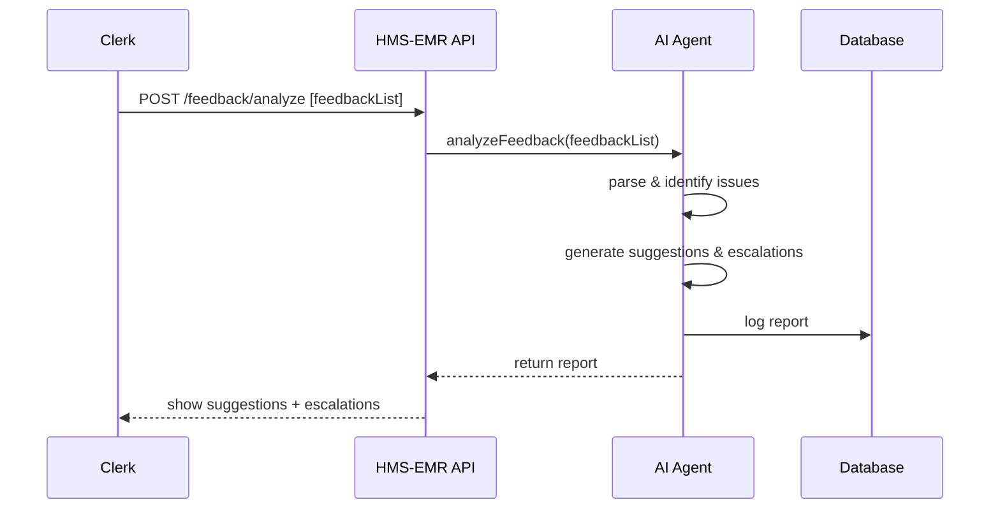

# Chapter 3: AI Representative Agent

Welcome back! In [Chapter 2: Intent-Driven Navigation](02_intent_driven_navigation_.md), we built a smart flow that adapts to what citizens want. Now let’s empower HMS-EMR with an **AI Representative Agent**—a virtual caseworker that reviews feedback, proposes process tweaks, and flags critical issues automatically.

---

## 1. Motivation & Central Use Case

Imagine the Department of Social Services collects free-form feedback from applicants:
- “The benefits form never tells me how many steps are left.”  
- “I tried uploading my ID photo twice—it kept failing.”

Instead of a clerk reading each comment one by one, our **AI Representative Agent** will:

1. Scan all feedback messages.  
2. Propose UI/process improvements (e.g., add a progress bar).  
3. Escalate urgent issues (e.g., upload failures) to the tech team.

This frees up staff time and speeds up service enhancements—just like a smart caseworker who reviews client notes and suggests policy tweaks.

---

## 2. Key Concepts

1. **Feedback Analysis**  
   The agent reads and parses text to identify issues (keywords like “upload” or “step”).  
2. **Suggestion Generation**  
   Based on detected issues, it proposes actionable improvements.  
3. **Escalation Routing**  
   High-priority problems (e.g., errors) are flagged and sent to the right team.  
4. **Autonomous Operation**  
   Runs on a schedule or on-demand without manual intervention.

---

## 3. Using the AI Agent

Here’s a minimal example showing how a clerk might call the agent via our backend API:

```js
import { aiAgent } from 'hms-emr-ai';

const feedbackList = [
  { id: 1, text: "No progress bar shows form completion." },
  { id: 2, text: "Upload keeps failing on proof of income." }
];

aiAgent.analyzeFeedback(feedbackList)
  .then(report => console.log(report));
```

After running, the console prints something like:

```
{
  summary: "2 items analyzed",
  suggestions: [
    "Add a progress indicator on multi-step forms",
    "Fix document upload endpoint to handle larger files"
  ],
  escalations: [
    { id: 2, issue: "Upload Failures", priority: "High" }
  ]
}
```

Explanation:
- **summary**: how many feedback entries were processed.  
- **suggestions**: a list of improvements.  
- **escalations**: critical issues with an ID and priority.

---

## 4. What Happens Under the Hood?

Below is a simplified sequence of events when a clerk submits feedback for analysis:



1. Clerk calls our **API** with feedback.  
2. The **AI Agent** parses each text entry.  
3. It generates suggestions and flags urgent issues.  
4. Results are logged and sent back to the clerk.

---

## 5. Internal Implementation Breakdown

Let’s peek at how the AI Agent is structured in code. All files live under `ai-agent/`.

### 5.1 Parsing Feedback

```js
// ai-agent/feedbackAnalyzer.js
export function parseFeedback(items) {
  return items.map(f => ({
    id: f.id,
    // Very simple keyword check
    issues: f.text.toLowerCase().includes('upload')
      ? ['upload']
      : ['ui']
  }));
}
```
This module tags each feedback as either an “upload” issue or a general “ui” issue.

### 5.2 Generating Suggestions

```js
// ai-agent/suggestionGenerator.js
export function generateSuggestions(parsed) {
  return parsed.map(item =>
    item.issues.includes('upload')
      ? "Fix document upload functionality"
      : "Add a form completion progress bar"
  );
}
```
Based on the issue type, we return a textual improvement.

### 5.3 Routing Escalations

```js
// ai-agent/escalationRouter.js
export function routeEscalations(parsed) {
  return parsed
    .filter(item => item.issues.includes('upload'))
    .map(item => ({
      id: item.id,
      issue: "Upload Failures",
      priority: "High"
    }));
}
```
Any feedback about uploads gets flagged as a high-priority escalation.

### 5.4 Putting It All Together

```js
// ai-agent/index.js
import { parseFeedback } from './feedbackAnalyzer';
import { generateSuggestions } from './suggestionGenerator';
import { routeEscalations } from './escalationRouter';

export async function analyzeFeedback(items) {
  const parsed       = parseFeedback(items);
  const suggestions  = generateSuggestions(parsed);
  const escalations  = routeEscalations(parsed);
  return {
    summary: `${items.length} items analyzed`,
    suggestions,
    escalations
  };
}
```
The `analyzeFeedback` function orchestrates parsing, suggestion creation, and escalation routing, then returns a consolidated report.

---

## 6. Conclusion

In this chapter, you learned how the **AI Representative Agent**:
- Analyzes citizen feedback automatically.  
- Generates actionable process or UI suggestions.  
- Flags urgent issues for immediate attention.  

Next up, we’ll introduce [Chapter 4: Human-in-the-Loop Oversight](04_human_in_the_loop_oversight_.md), where we ensure that humans can review and approve AI recommendations before they go live.

---

Generated by [AI Codebase Knowledge Builder](https://github.com/The-Pocket/Tutorial-Codebase-Knowledge)