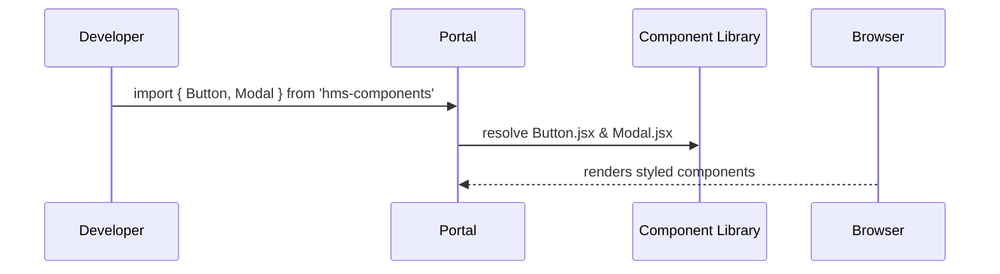

# Chapter 3: Frontend Component Library

In the previous chapter, you built the [Admin/Gov Portal (HMS-GOV)](02_admin_gov_portal__hms_gov__.md) with its own buttons, modals, and alerts. As you add more portals (like the User Portal), you’ll notice the same pieces repeated over and over. That’s where a **Frontend Component Library** comes in: a shared “Lego box” of UI pieces you can snap together in any portal, so everything looks consistent and you move faster.

---

## 3.1 Why a Component Library?

Imagine two different portals both need:
- A **policy‐approval modal** (in HMS-GOV)
- An **alert banner** (in HMS-MFE)

If each team builds their own, you end up with slightly different colors, padding, or button styles—a recipe for maintenance headaches. A component library solves this by providing:

- A single source of truth for styles and behavior
- Reusable UI “bricks” (buttons, forms, charts, modals)
- Faster development: just import & configure

---

## 3.2 Key Concepts

1. **Reusable Components**  
   Small, focused UI pieces (e.g., `Button`, `Modal`, `AlertBanner`) you can combine in many ways.

2. **Props & Configuration**  
   Each component takes simple settings (props) like `variant="primary"`, `title="Review Policy"`, or `message="System will be down"`.

3. **Theming/Styling**  
   A shared style guide (colors, fonts, spacing) lives in the library so all portals match.

4. **Documentation / Storybook**  
   A live catalog where developers can see and play with every component in isolation.

---

## 3.3 Using the Library: A Quick Example

Let’s say in the User Portal you need to show a warning banner about scheduled maintenance:

```jsx
// In src/OutageBanner.jsx of HMS-MFE
import React from 'react';
import { AlertBanner } from 'hms-components';

export function OutageBanner() {
  return (
    <AlertBanner
      type="warning"
      message="Scheduled maintenance at 10 PM. Services may be unavailable." />
  );
}
```

Explanation:
- `type="warning"` picks the yellow background.
- `message="..."` is the text the banner displays.

In HMS-GOV you might show a policy‐approval modal:

```jsx
// In src/PolicyModal.jsx of HMS-GOV
import React from 'react';
import { Modal, Button } from 'hms-components';

export function PolicyModal({ onClose, onApprove }) {
  return (
    <Modal title="Approve New Policy" onClose={onClose}>
      <p>Do you confirm the updated data-sharing policy?</p>
      <Button onClick={onApprove}>Approve</Button>
      <Button variant="secondary" onClick={onClose}>Cancel</Button>
    </Modal>
  );
}
```

Explanation:
- `Modal` provides a centered dialog with backdrop.
- Two `Button`s share the same padding, font, and hover effects.

---

## 3.4 Under the Hood: Sequence of Events

Here’s what happens when a developer uses components from the library:



1. **Developer** writes `import` statements in a portal.  
2. The portal build tool fetches code from **hms-components**.  
3. **Browser** renders the final HTML/CSS with consistent styling.

---

## 3.5 Library Structure & Implementation

Here’s a minimal file layout for `hms-components`:

```
hms-components/
├── src/
│   ├── Button.jsx
│   ├── Modal.jsx
│   └── AlertBanner.jsx
└── index.js
```

### src/Button.jsx

```jsx
import React from 'react';

export function Button({ children, onClick, variant = 'primary' }) {
  const style = variant === 'primary'
    ? { background: '#007bff', color: '#fff' }
    : { background: '#6c757d', color: '#fff' };

  return (
    <button
      style={{ padding: '8px 12px', border: 'none', borderRadius: '4px', ...style }}
      onClick={onClick}
    >
      {children}
    </button>
  );
}
```

This simple component:
- Chooses a color based on `variant`.
- Applies consistent padding and border radius.
- Renders any child text or elements inside the button.

### src/Modal.jsx

```jsx
import React from 'react';
import { Button } from './Button';

export function Modal({ title, children, onClose }) {
  return (
    <div style={{
      position: 'fixed', top:0, left:0, right:0, bottom:0,
      background: 'rgba(0,0,0,0.5)'
    }}>
      <div style={{
        background: '#fff', padding: '16px', margin: '80px auto',
        maxWidth: '400px', borderRadius: '6px'
      }}>
        <h2>{title}</h2>
        <div>{children}</div>
        <Button variant="secondary" onClick={onClose}>Close</Button>
      </div>
    </div>
  );
}
```

Key points:
- A semi-transparent backdrop covers the screen.
- Content is centered in a white box with padding.
- A built-in `Close` button uses the shared `Button` component.

### src/AlertBanner.jsx

```jsx
import React from 'react';

export function AlertBanner({ type = 'info', message }) {
  const colors = {
    info: '#17a2b8', warning: '#ffc107', error: '#dc3545'
  };
  return (
    <div style={{
      background: colors[type],
      color: '#000',
      padding: '10px',
      borderRadius: '4px'
    }}>
      {message}
    </div>
  );
}
```

This banner:
- Chooses a background color based on `type`.
- Wraps your text in a styled `<div>`.

### index.js

```js
export { Button } from './src/Button';
export { Modal } from './src/Modal';
export { AlertBanner } from './src/AlertBanner';
```

This file makes it easy to import everything from `hms-components`.

---

## 3.6 Summary

In this chapter you learned:
- **What** a Frontend Component Library is and **why** it speeds up development.
- **How** to use shared components (`Button`, `Modal`, `AlertBanner`) in both portals.
- **What’s under the hood**: file structure, props, and simple styling.

Up next, we’ll see how portals talk to backend services through our **[Interface Layer](04_interface_layer_.md)**.

---

Generated by [AI Codebase Knowledge Builder](https://github.com/The-Pocket/Tutorial-Codebase-Knowledge)