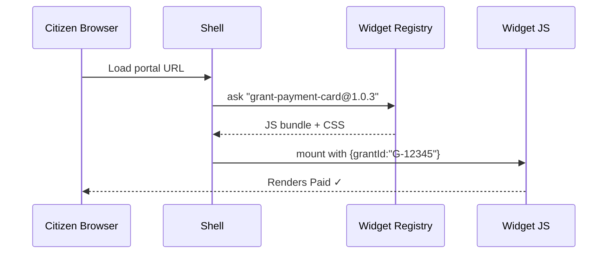

# Chapter 3: Micro-Frontend Interface (HMS-MFE)

[← Back to Chapter 2: Intent-Driven Navigation & AI-Guided Journeys](02_intent_driven_navigation___ai_guided_journeys_.md)

---

## 1 — Why split the screen into “Lego” blocks?

Picture two agencies:

* **NSF** wants a “Grant Payment Status” card.  
* **HUD** wants *the exact same* card for housing grants.

In a traditional (“monolithic”) site each team would:

1. Design a new page.  
2. Re-write the same card logic.  
3. Re-do accessibility & governance checks.

That’s like re-building an entire Lego castle every time you need one new window!

**Micro-Frontends** let agencies **snap in** a ready-made “payment-status” brick:

```
<grant-payment-card grantId="G-12345"></grant-payment-card>
```

*One widget, many portals, zero duplicated work.*

---

## 2 — Key Concepts (plain English)

| Term | What it means | Analogy |
|------|---------------|---------|
| Widget | A self-contained UI block (HTML, JS, CSS). | One Lego brick. |
| Shell | The host page that arranges widgets. | The Lego baseplate. |
| Registry | A catalog of approved widgets. | The Lego instruction booklet. |
| Contract | Inputs/outputs a widget agrees to. | Studs & holes that must match to snap. |
| Governance Manifest | `gov.yml` every widget ships with. | Safety certificate for each brick. |

---

## 3 — A 5-Minute Hands-On

We will embed the **“Grant Payment Card”** widget in a hypothetical NSF portal.

### 3.1 Add the widget to the Shell (HTML, 4 lines)

```html
<!-- public/index.html -->
<body>
  <script src="https://registry.hms.gov/mfe-loader.js"></script>
  <div id="root"></div>
</body>
```

*Explanation:*  
`mfe-loader.js` is a tiny script that knows how to fetch and mount widgets into `#root`.

### 3.2 Tell the loader *which* widget you want (JS, 13 lines)

```javascript
// app.js
MFE.load({
  target:  "#root",
  name:    "grant-payment-card",
  version: "1.0.3",
  props:   { grantId: "G-12345" }
});
```

What will happen on screen?

1. The loader contacts the Registry.  
2. It downloads the `grant-payment-card@1.0.3`.  
3. The card renders a green “Paid” badge (or red “Pending”) for grant G-12345.

### 3.3 The widget’s own “contract” (metadata, 10 lines)

```yaml
# grant-payment-card/mfe.yml
name: grant-payment-card
inputs:
  - grantId: string
outputs:
  - statusChanged: { newStatus: string }
```

Beginner takeaway:  
If you pass a `grantId`, you **must** listen for a `statusChanged` event.  
Clear, enforceable, and agency-agnostic.

---

## 4 — Under the Hood (non-code walkthrough)



Five actors, <10 network calls—fast enough for 3G connections.

---

## 5 — Internal Code Peek (tiny & friendly)

### 5.1 Loader excerpt (7 lines)

```javascript
// mfe-loader.js  (abbreviated)
export function load({target,name,version,props}){
  const url = `https://registry.hms.gov/${name}/${version}/index.js`;
  import(url).then(mod => {
    const node = document.querySelector(target);
    mod.mount(node, props);          // each widget exposes mount()
  });
}
```

Explanation:  
Uses native `import()`—no fancy bundler required.  
Every widget simply exports `mount()`.

### 5.2 Widget skeleton (React flavoured, 17 lines)

```javascript
// grant-payment-card/index.js
import ReactDOM from "react-dom";
export function mount(node, {grantId}){
  fetch(`/api/grants/${grantId}/status`)
    .then(r => r.json())
    .then(({status}) => {
      ReactDOM.render(<Badge status={status}/>, node);
    });
}
const Badge = ({status}) =>
  <span className={status}>{status}</span>;
```

Explanation:  
1. Fetches status from the agency API.  
2. Renders a colored badge.  
3. All under **20 lines**, yet reusable anywhere.

---

## 6 — Governance & Safety Hooks (why Chapter 1 still matters)

Every widget folder must include `gov.yml`:

```yaml
service: grant-payment-card
version: 1.0.3
checks:
  - transparency: pass
  - privacy:      pass
```

During CI the command below **blocks** any widget failing Chapter 1 rules:

```bash
$ hms-govern vet gov.yml
```

*One enforcement path, many widgets.*

---

## 7 — Talking to Other HMS Layers

* Intent steps produced by [Intent-Driven Navigation](02_intent_driven_navigation___ai_guided_journeys_.md) are rendered **as widgets** inside the shell.  
* Widget state (e.g., “status = paid”) is shared with agents through [Model Context Protocol (HMS-MCP)](04_model_context_protocol__hms_mcp__.md).  
* Logs automatically flow to [Operations & Monitoring Suite](13_operations___monitoring_suite__hms_ops__.md).

---

## 8 — Frequently Asked Questions

**Q1: Do I need React?**  
No. Any framework (or vanilla JS) works as long as you export `mount()` and `unmount()`.

**Q2: Can HUD override the CSS?**  
Widgets ship with **Shadow DOM** isolation by default, so HUD themes *wrap* rather than override.

**Q3: What about performance?**  
The Registry bundles common libs (React, Vue) as *externals*; browsers cache them once.

---

## 9 — Try it Yourself (2-step exercise)

1. Fork the repo and scaffold a widget:

```bash
$ hms-mfe create "hello-card"
```

This generates `hello-card/mfe.yml`, `index.js`, and `gov.yml`.

2. Add the loader call:

```javascript
MFE.load({target:"#root", name:"hello-card", version:"0.1.0"});
```

Open `index.html`—you should see “Hello, HMS!” in under 60 seconds.

---

## 10 — What you learned

* Micro-Frontends = Lego bricks for government UIs.  
* A **loader**, a **registry**, and a tiny **contract file** are all you need to share widgets across agencies.  
* Governance manifests keep every brick safe and compliant.

Ready to see how widget data travels to AI agents and back?  
Continue to [Chapter 4: Model Context Protocol (HMS-MCP)](04_model_context_protocol__hms_mcp__.md).

---

Generated by [AI Codebase Knowledge Builder](https://github.com/The-Pocket/Tutorial-Codebase-Knowledge)