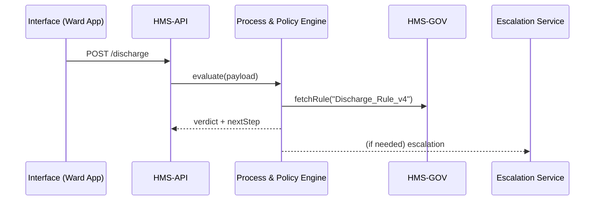

# Chapter 3: Process & Policy Engine

*(continuing from [Chapter 2: Governance Portal (HMS-GOV)](02_governance_portal__hms_gov__.md))*  

---

## 1. Why Do We Need a “Software Legislature”?

Picture the **Veterans Health Administration (VHA)** on a busy Friday afternoon:

1. A doctor clicks **“Request Discharge”** for Sgt. Kelly.  
2. The request must follow federal rules (minimum observation hours, medication checklist) **and** local hospital policy (COVID-19 screening).  
3. If something looks off—say, pending lab results—the request must escalate to a senior nurse within 15 minutes.  
4. Policies change *often*: yesterday the CDC shortened isolation from 10 to 5 days.

Hard-coding all that logic into dozens of micro-services is a recipe for chaos.  
Enter the **Process & Policy Engine (PPE)**—our legislative chamber in code. It:

• Stores the *current* “laws.”  
• Executes them in real time.  
• Publishes changes instantly when the *humans upstairs* in [HMS-GOV](02_governance_portal__hms_gov__.md) approve an amendment.

One place to rule them all. 🏛️⚙️

---

## 2. Key Concepts—One Brick at a Time

| Concept | Plain-English Analogy | What It Does |
|---------|----------------------|--------------|
| Policy Repository | Filing cabinet of laws | Holds JSON/YAML rule sets versioned by HMS-GOV |
| Workflow Orchestrator | Traffic cop | Moves each request through the right steps |
| Escalation Matrix | Fire alarm panel | Knows *who* to notify and *how fast* |
| Hot Reload | Breaking news ticker | Loads new rules without redeploying |
| Audit Log | Capitol stenographer | Records every decision for inspectors |

Keep these five bricks in mind; we’ll build on them shortly.

---

## 3. Our Running Example: VHA Patient Discharge

Goal: Approve or deny a discharge request within seconds, following **Discharge_Rule_v4**.

### 3.1 The Rule (Saved by HMS-GOV)

```yaml
# rules/Discharge_Rule_v4.yaml
checklist:
  minObservationHours: 24
  requiredForms: ["DD-2648", "COVID_Screen"]
escalation:
  ifLabPending: "NurseSupervisor"
  ifObservationShort: "AttendingPhysician"
version: 4
```

*A policy analyst updated `minObservationHours` from 48 → 24 yesterday.*

---

## 4. How to Use the Engine (as a Developer)

### 4.1 Submitting a Request

```python
# client/send_discharge.py
import hms_sdk as hms

payload = {
    "patientId": "VET-9143",
    "observationHours": 26,
    "formsAttached": ["DD-2648", "COVID_Screen"]
}

result = hms.process("DischargeRequest", payload)
print(result)
```

Expected output (simplified):

```text
{
  'status': 'APPROVED',
  'next': 'NotifyBilling',
  'ruleVersion': '4'
}
```

What happened?  
1. `hms.process()` forwards the payload to PPE.  
2. PPE loads *exactly* **Discharge_Rule_v4** and evaluates compliance.  
3. Returns a structured verdict.

### 4.2 A Failing Case

```python
payload["observationHours"] = 10   # too short
print(hms.process("DischargeRequest", payload))
```

Returns:

```text
{
  'status': 'PENDING_REVIEW',
  'escalateTo': 'AttendingPhysician',
  'reason': 'Observation hours below 24',
  'ruleVersion': '4'
}
```

No guessing, no hidden logic—everything traceable to the rule file.

---

## 5. What Happens Under the Hood?



Five actors, one clear path.

---

## 6. Internals in Bite-Sized Code

### 6.1 Entry Point (engine/handler.js)

```js
// <= 20 lines
export async function evaluate(type, payload) {
  const rule = await rules.load(`${type}_Rule_v4`);
  const ok = rule.checklist.every(field => passes(field, payload));

  if (!ok) return escalate(rule, payload);

  await db.saveDecision(payload.patientId, "APPROVED", rule.version);
  return { status: "APPROVED", next: "NotifyBilling", ruleVersion: rule.version };
}
```

Explanation  
• `rules.load` pulls the YAML from Governance storage.  
• `passes()` is a tiny helper that validates each checklist item.  
• On failure it calls `escalate()`; on success it logs & returns.

### 6.2 Escalation (engine/escalate.js)

```js
export function escalate(rule, payload) {
  const reason = findReason(rule, payload);     // e.g., "Observation hours below 24"
  const target = rule.escalation[reason.key];   // AttendingPhysician

  queue.send("Escalations", { payload, target, reason });

  return {
    status: "PENDING_REVIEW",
    escalateTo: target,
    reason: reason.msg,
    ruleVersion: rule.version
  };
}
```

*Under 15 lines, yet it covers the alarm-bell path.*

---

## 7. Hot Reload Magic (Zero Downtime)

The PPE subscribes to a **rule-update stream** emitted by HMS-GOV.

```python
# engine/hot_reload.py
for event in stream("RulePublished"):
    cache.invalidate(event.ruleName)
```

Whenever **Discharge_Rule_v5** appears, the cache drops v4, and the very next request uses v5—no redeploy, no restart.

---

## 8. Where Does PPE Live in the Bigger Picture?

• It sits in the **Management Layer** (see [Chapter 1](01_three_layer_architecture__governance___management___interface__.md)).  
• Reads *only* from Governance, never writes back.  
• Presents safe, versioned endpoints via [HMS-API](05_api_gateway___policy_endpoints__hms_api__.md).  
• Emits metrics to the [Observability Pipeline](14_observability___metrics_pipeline_.md).  

Think of it as the **faithful civil servant**—strictly following the handbook.

---

## 9. Frequently Asked Beginner Questions

**Q1. Can I store my own private rules inside PPE?**  
No. All authoritative rules come from HMS-GOV to guarantee auditability.

**Q2. How fast is it?**  
A typical rule evaluation is < 20 ms; escalations add only network latency.

**Q3. What languages does PPE support for rules?**  
Out of the box: YAML, JSON, or Rego. You can add adapters, but keep them under 1 MB to pass security scans.

---

## 10. Summary & What’s Next

You learned:

• PPE is the *execution house* for policies—no more buried `if` statements scattered across services.  
• A simple `hms.process()` call evaluates a request, returns a verdict, and triggers escalations.  
• Rules change upstairs; PPE adapts instantly via hot reload.

In the next chapter we’ll explore **Domain Packs**—pre-built rule libraries for Health, Finance, Education, and more. Ready to grab some plug-and-play policies? ➜ [Chapter 4: Domain Packs (Health, Finance, Education, etc.)](04_domain_packs__health__finance__education__etc__.md)

---

---

Generated by [AI Codebase Knowledge Builder](https://github.com/The-Pocket/Tutorial-Codebase-Knowledge)