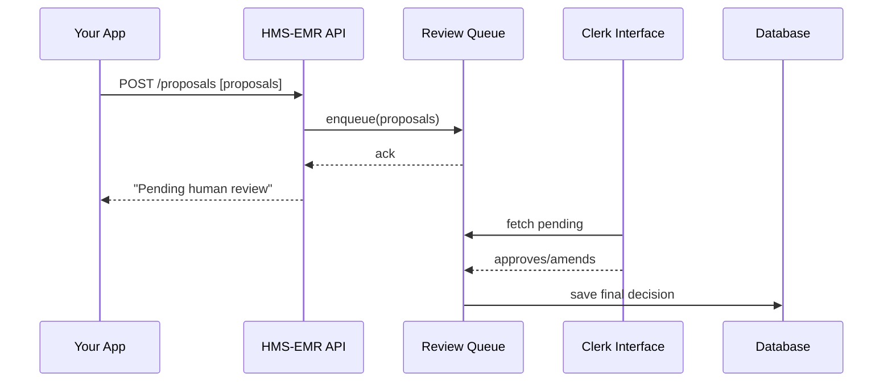

# Chapter 4: Human-in-the-Loop Oversight

In [Chapter 3: AI Representative Agent](03_ai_representative_agent_.md), we saw how AI can scan feedback and propose improvements automatically. Now, let’s make sure a real person checks those AI suggestions before anything goes live. This is called **Human-in-the-Loop Oversight**—think of it like a ticket inspector who reviews every automated traffic fine before mailing it to a driver, to make sure it’s fair.

---

## 1. Why Human-in-the-Loop Oversight?

Imagine the U.S. Department of Education uses an AI to approve or deny grant applications. The AI might catch obvious mistakes, but we still want a clerk to confirm each decision, tweak details, or catch edge cases. If we send every AI decision straight to citizens, we risk unfair denials or incorrect approvals.

**Central Use Case**  
1. AI suggests that Alice’s scholarship application should be approved.  
2. A human reviewer sees the suggestion, checks Alice’s grades, and maybe adjusts the award amount.  
3. Only after the human signs off does the system send the approval letter to Alice.

This pattern guards against errors, bias, or unfairness in fully automated decisions.

---

## 2. Key Concepts

1. **Proposal**  
   An AI-generated recommendation (e.g., “Approve scholarship for Alice with $1,000 award”).  
2. **Review Queue**  
   A list of AI proposals waiting for a human to inspect.  
3. **Approve / Amend / Reject**  
   The three possible human actions on each proposal.  
4. **Deployment**  
   Once the human acts, the proposal is finalized and recorded (or sent back to AI for rework).

---

## 3. Using Human-in-the-Loop Oversight

Here’s a tiny example of how you might call the oversight module after getting proposals from our AI agent:

```js
// src/oversightClient.js
import { aiAgent } from 'hms-emr-ai';
import { oversight } from 'hms-emr-oversight';

async function processApplications(apps) {
  // 1. Let AI draft decisions
  const proposals = await aiAgent.reviewApplications(apps);

  // 2. Send proposals for human review
  const reviewed = await oversight.reviewProposals(proposals);

  // 3. reviewed = [{ id, status: 'approved'|'amended'|'rejected', finalText }]
  console.log('Final decisions:', reviewed);
}
```
> We ask the AI for draft decisions, then call our oversight client to pause for a human sign-off. The result includes any edits or final status.

---

## 4. Under the Hood: Step-by-Step

Below is what happens when `oversight.reviewProposals(...)` is called:



1. **Your App** sends AI proposals to the API.  
2. **API** stores them in a **Review Queue**.  
3. A human clerk logs into a dashboard, fetches pending proposals, and clicks “Approve,” “Amend,” or “Reject.”  
4. The queue records the final decision in the database.

---

## 5. Internal Implementation Breakdown

All code lives under `src/oversight/`. Let’s look at three small modules.

### 5.1 reviewManager.js  
Handles enqueueing and finalizing proposals.
```js
// src/oversight/reviewManager.js
const queue = [];                // In-memory for simplicity

export function enqueue(proposals) {
  proposals.forEach(p => queue.push({ ...p, status: 'pending' }));
  return queue;
}

export function finalize(id, decision) {
  const item = queue.find(p => p.id === id);
  if (item) Object.assign(item, decision);
  return item;
}
```
> We push new proposals with status “pending,” and later update them when a human decides.

### 5.2 humanInterface.js  
A minimal API layer for the clerk’s dashboard.
```js
// src/oversight/humanInterface.js
import { enqueue, finalize } from './reviewManager';

// Called by your frontend dashboard:
export function submitProposals(proposals) {
  return enqueue(proposals);     // Returns all pending items
}

export function reviewProposal(id, status, finalText) {
  return finalize(id, { status, finalText });
}
```
> `submitProposals` queues work; `reviewProposal` records the human’s decision.

### 5.3 serverRoutes.js  
Exposes HTTP endpoints.
```js
// src/oversight/serverRoutes.js
import express from 'express';
import { submitProposals, reviewProposal } from './humanInterface';
const router = express.Router();

// Endpoint for AI to send proposals
router.post('/proposals', (req,res) => {
  const pending = submitProposals(req.body);
  res.json({ message: 'Queued', pending });
});

// Endpoint for clerk to finalize one proposal
router.post('/proposals/:id/review', (req,res) => {
  const result = reviewProposal(req.params.id, req.body.status, req.body.text);
  res.json(result);
});

export default router;
```
> The AI or your application calls `/proposals`; clerks call `/proposals/:id/review` after checking each one.

---

## 6. Conclusion

In this chapter, you learned how to:
- Capture AI-generated proposals in a **Review Queue**.  
- Let a human **Approve**, **Amend**, or **Reject** each proposal.  
- Deploy only those decisions that have been **signed off** by a person.

This ensures fairness and correctness before any action touches a citizen’s record. Next up, we’ll see how HMS-EMR keeps in sync with outside systems in [Chapter 5: External System Synchronization](05_external_system_synchronization_.md).

---

Generated by [AI Codebase Knowledge Builder](https://github.com/The-Pocket/Tutorial-Codebase-Knowledge)