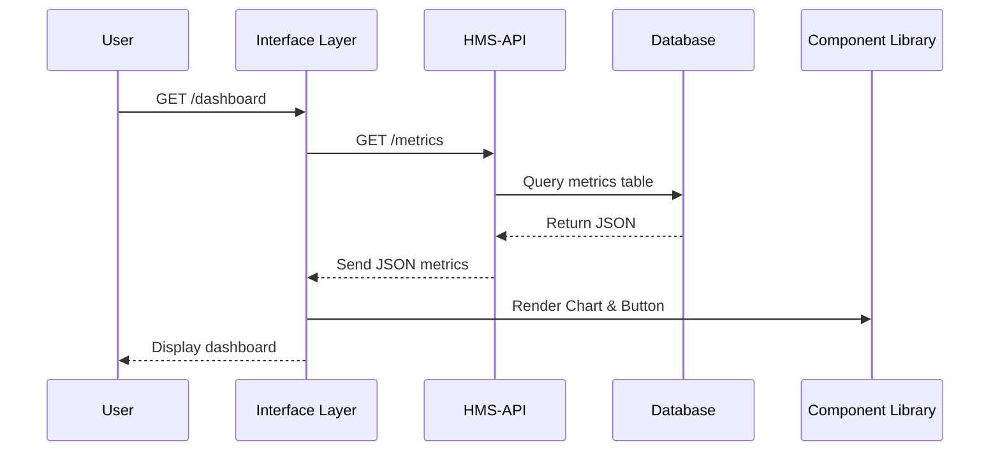

# Chapter 4: Interface Layer

In the previous chapter, we pulled common UI pieces into our [Frontend Component Library](03_frontend_component_library_.md). Now we’ll assemble those pieces into the **Interface Layer**—the storefront windows of HMS-EMR that render portals, visualizations, and interactive elements for end users.

---

## Why an Interface Layer?

Imagine the **National Park Service** wants a live dashboard showing:
- Number of new permit applications this week
- Average review time per ranger station
- Citizen satisfaction feedback

The Interface Layer gathers data from backend services, presents it attractively (charts, tables, banners), and captures user input (buttons, forms). It’s like the bright window displays in a store—drawing people in, showing them what’s on offer, and inviting them to interact.

---

## Key Concepts

1. **Presentation Tier**  
   Renders HTML and UI components (charts, tables, banners) in the browser.

2. **Data Aggregator**  
   Calls one or more backend services (e.g., HMS-API) to fetch JSON data.

3. **Visual Components**  
   Uses our shared components (`Chart`, `AlertBanner`, `Button`) from [Frontend Component Library](03_frontend_component_library_.md).

4. **Event Handlers**  
   React to user actions (clicks, form submits) and may send data back to backend APIs.

---

## Building a Simple Dashboard

Let’s write a tiny React component that:
1. Fetches policy-deployment metrics.
2. Displays a bar chart.
3. Shows a feedback button.

```jsx
import React, { useState, useEffect } from 'react';
import { Chart, Button, AlertBanner } from 'hms-components';

export function PolicyDashboard() {
  const [metrics, setMetrics] = useState(null);

  useEffect(() => {
    fetch('/api/interface/metrics')
      .then(res => res.json())
      .then(data => setMetrics(data));
  }, []);

  if (!metrics) {
    return <AlertBanner type="info" message="Loading policy metrics..." />;
  }

  return (
    <>
      <Chart type="bar" data={metrics.proposalsPerDay} />
      <Button onClick={() => alert('Feedback form coming soon')}>
        Give Feedback
      </Button>
    </>
  );
}
```

Explanation:
- We import `Chart`, `Button`, and `AlertBanner` from our component library.
- On mount, we call `/api/interface/metrics`.
- While loading, we show an info banner.
- Once data arrives, we render a bar chart and a feedback button.

---

## What Happens Behind the Scenes



1. **User** opens the dashboard page.
2. **Interface Layer** calls HMS-API for metrics.
3. **HMS-API** queries the database and returns JSON.
4. **Interface Layer** uses our component library to render UI.
5. The **browser** displays an interactive dashboard.

---

## Directory Structure & Code Walkthrough

```
interface-layer/
└── src/
    ├── server.js
    ├── handlers/
    │   └── metricsHandler.js
    └── clients/
        └── apiClient.js
```

### src/server.js

```js
import express from 'express';
import { getMetrics } from './handlers/metricsHandler';

const app = express();
app.get('/api/interface/metrics', getMetrics);

app.listen(5000, () =>
  console.log('Interface Layer running on http://localhost:5000')
);
```
This sets up an HTTP endpoint that our React app will call.

### src/handlers/metricsHandler.js

```js
import { fetchMetrics } from '../clients/apiClient';

export async function getMetrics(req, res) {
  const metrics = await fetchMetrics();
  res.json(metrics);
}
```
The handler delegates to a client module and returns JSON.

### src/clients/apiClient.js

```js
import fetch from 'node-fetch';

export function fetchMetrics() {
  // Call the backend API to gather policy data
  return fetch('http://hms-api/metrics')
    .then(r => r.json());
}
```
This small client hides the details of talking to `hms-api`.

---

## Summary

In this chapter, you learned:
- What the **Interface Layer** does: aggregates data, renders UI, handles events.
- How to build a simple React dashboard using shared components.
- What happens under the hood, from HTTP request to chart render.
- A minimal code structure for your interface service.

Next up, we’ll dive into the engines behind these endpoints: the [Backend API (HMS-API / HMS-MKT)](05_backend_api__hms_api___hms_mkt__.md).

---

Generated by [AI Codebase Knowledge Builder](https://github.com/The-Pocket/Tutorial-Codebase-Knowledge)