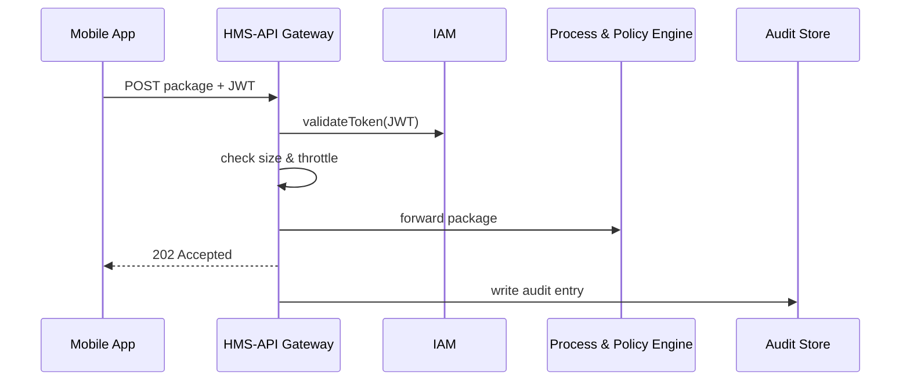

# Chapter 5: API Gateway & Policy Endpoints (HMS-API)

*(continuing from [Chapter 4: Domain Packs (Health, Finance, Education, etc.)](04_domain_packs__health__finance__education__etc__.md))*  

---

## 1. Why Do We Need a “Front Door”?

Picture the **Small Business Administration (SBA)** on tax-day-eve.  
Thousands of small-business owners are rushing to upload loan-forgiveness documents:

1. Everyone hits **`/uploadDocument`** at once—​we must avoid a stampede.  
2. Legacy apps still use **v1** of the API; new mobile apps need **v2**.  
3. Uploads must be screened for viruses **before** they reach internal services.  
4. Each request must carry a valid SBA token or be kicked out politely.  
5. Every byte must be logged for auditors from the **Government Accountability Office (GAO)**.

Enter **HMS-API**—the guarded front door that enforces these rules so downstream micro-services can relax and just do their job.

---

## 2. Core Concepts—One Friendly Brick at a Time

| Concept | Analogy | “Beginner” Meaning |
|---------|---------|--------------------|
| API Gateway | Security desk in a federal building | Checks your badge, logs your visit, then shows you the right elevator |
| Policy Endpoint | A special doorway with extra rules | “Form 1040” door vs. “Disaster Relief” door—each enforces its own checklist |
| Versioning | Color-coded passes | v1 (blue) & v2 (green) badges route to different hallways |
| Throttling | Crowd control ropes | Lets 100 people per minute, not 1,000 |
| Rate Plan | Visitor quota sheet | “Developers get 10,000 calls/day, public users get 500” |
| Request Audit | Sign-in logbook | Who came, when, and what they asked for |

Keep these six bricks in mind; we’ll build the chapter on them.

---

## 3. Running Example: “Submit Loan Forgiveness Package”

Goal: A mobile app posts a package through **`/v2/loans/forgiveness`**.  
The API Gateway must:

1. Validate the caller’s JWT (digital badge).  
2. Check the payload size ≤ 10 MB.  
3. Apply rate-limit **200 requests/min** per organization.  
4. Forward the request to **Process & Policy Engine (PPE)** only if checks pass.  
5. Log the request and response time for GAO auditors.

---

## 4. How *You* Use HMS-API (as a Client)

### 4.1 One-Liner JavaScript Call

```js
// client/submitPackage.js
async function submitLoanPackage(pkg) {
  const res = await fetch(
    "https://api.sba.gov/v2/loans/forgiveness",
    {
      method: "POST",
      headers: { 
        "Authorization": "Bearer "+ getJWT(),
        "Content-Type": "application/json" 
      },
      body: JSON.stringify(pkg)
    }
  );
  return res.json();
}
```

Explanation  
1. Add your JWT in the `Authorization` header.  
2. Send JSON ≤ 10 MB; anything bigger is rejected *at the door*.  
3. If the gateway returns `202 Accepted`, the package is now in PPE’s hands.

### 4.2 Typical Success Response

```json
{
  "trackingId": "LGN-445912",
  "status": "RECEIVED",
  "policyVersion": "v2.3"
}
```

### 4.3 What Happens If You Exceed Throttle?

```json
{
  "error": "RATE_LIMIT_EXCEEDED",
  "retryAfterSeconds": 54
}
```

Beginner takeaway: **HMS-API protects you from hurting yourself or the server.**

---

## 5. What Really Happens Under the Hood?



Only five participants—​easy to keep in your mental map.

---

## 6. Inside the Gateway: Tiny Configs, Big Power

### 6.1 Declarative Route File (`routes.yaml`)

```yaml
# <= 20 lines
- path: /v2/loans/forgiveness
  methods: [POST]
  auth: "required"
  maxPayloadMB: 10
  rateLimit:
    quotaPerMinute: 200
    key: "orgId"
  upstream: "svc://ppl/loanForgiveness"
  policyTags: ["finance", "loan"]
```

Explanation  
• Each route block is short and declarative—​no coding.  
• `policyTags` let the gateway auto-attach Domain Pack rules (see Chapter 4).  
• `upstream` is the address of the internal service, hidden from the outside world.

### 6.2 Minimal Middleware (Node.js, 14 lines)

```js
// gateway/middleware/auth.js
export async function auth(req, res, next) {
  try {
    const token = req.headers.authorization?.split(" ")[1];
    const user  = await iam.verify(token);   // async call
    req.user = user;                         // stash for later
    next();
  } catch {
    res.status(401).json({ error: "UNAUTHORIZED" });
  }
}
```

Beginner notes  
• `iam.verify()` is a helper from [Chapter 6: Identity & Access Management (IAM)](06_identity___access_management__iam__.md).  
• If the token is bad, the request stops here—​PPE never sees it.

### 6.3 Dynamic Throttle (Python, 16 lines)

```python
# gateway/throttle.py
bucket = {}

def allow(org_id):
    now = time.time()
    window = int(now // 60)          # minute window
    key = f"{org_id}:{window}"
    bucket[key] = bucket.get(key, 0) + 1

    if bucket[key] > 200:            # from routes.yaml
        return False, 60 - (now % 60)
    return True, None
```

No Redis here—​just logic a beginner can read. Real deployments swap in Redis for scale.

---

## 7. Surfacing “Policy Endpoints”

A **Policy Endpoint** is a regular route **plus** an automatic policy check.  
Example: `/v2/health/claims` must verify PHI red-flags (HIPAA) **before** forwarding.

### 7.1 Enable with One Flag

```yaml
- path: /v2/health/claims
  policyEndpoint: true          # 👈 magic
  policyTags: ["health"]
```

Setting `policyEndpoint: true` tells HMS-API to:

1. Attach the *health* Domain Pack validator (from Chapter 4).  
2. Reject the request with `400 POLICY_VIOLATION` if checks fail.

### 7.2 Sample Rejection Response

```json
{
  "error": "POLICY_VIOLATION",
  "details": ["field 'ssn' must be masked"]
}
```

Beginners: you get compliance “for free” no matter which downstream service handles the data.

---

## 8. Observability & Auditing—Why Your Future Self Will Thank You

Each API call writes a short JSON line to the **Audit Store**:

```json
{
  "time": "2024-06-10T14:23:08Z",
  "userId": "USR-8172",
  "route": "/v2/loans/forgiveness",
  "status": 202,
  "latencyMs": 132,
  "policyVersion": "v2.3"
}
```

These logs feed straight into the [Observability & Metrics Pipeline](14_observability___metrics_pipeline_.md) so auditors can replay exactly what happened.

---

## 9. Frequently Asked Beginner Questions

**Q: I accidentally shipped a buggy mobile app that still calls `/v1/loans`—​will users break?**  
A: No. HMS-API keeps `/v1` alive as long as you specify in `routes.yaml`. You can even set a graceful sunset date.

**Q: Do I need to write code to enable HTTPS?**  
A: Zero lines. The gateway terminates TLS by default and auto-renews certificates.

**Q: Where do I define custom error messages?**  
A: Add `errorTemplates` in `routes.yaml`. The gateway will handle the rest.

---

## 10. Summary & What’s Next

You learned:

• **HMS-API** is the guarded front door—​handling auth, throttling, versioning, and policy checks *before* traffic hits micro-services.  
• A simple route file plus tiny middleware gives you industrial-grade security and auditability.  
• Policy Endpoints let you bolt compliance checks onto any route with one flag.

Next we’ll see the engine behind those JWT badges and role checks: [Chapter 6: Identity & Access Management (IAM)](06_identity___access_management__iam__.md). Get ready to meet the badge-printer! 🚪🔐

---

---

Generated by [AI Codebase Knowledge Builder](https://github.com/The-Pocket/Tutorial-Codebase-Knowledge)