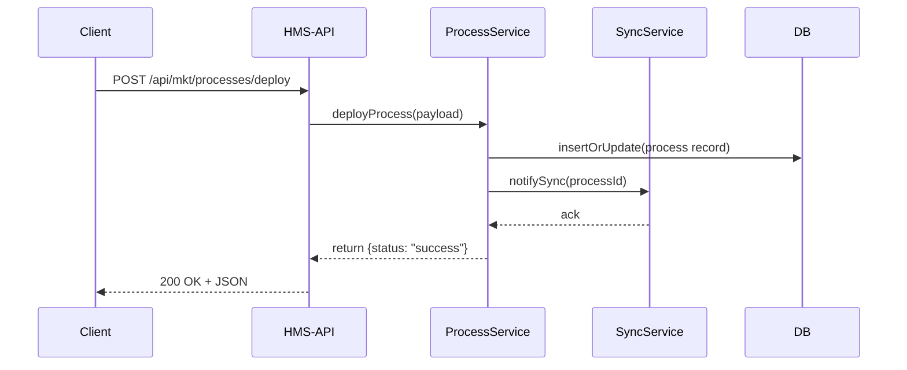

# Chapter 5: Backend API (HMS-API / HMS-MKT)

In the previous chapter, we saw how the [Interface Layer](04_interface_layer_.md) gathers data and renders it for users. Now we'll dive into the **Backend API (HMS-API / HMS-MKT)**—the programmatic “post office” that receives structured requests (letters), sends them to the correct department (services), and replies with confirmations or errors.

---

## 5.1 Why a Backend API?

Imagine the Food Safety and Inspection Service (FSIS) needs to update its inspection **process definition** (for a new poultry safety workflow). An AI agent proposes a new inspection schedule and calls our API:

- It sends a “deploy process update” request.
- The backend validates the update, stores it, and notifies downstream systems (e.g., monitoring or synchronization services).
- It replies with success or error details.

Without a clean API, every consumer (UI, agents, external partners) would have to write custom logic, leading to inconsistencies and bugs. HMS-API centralizes these rules and endpoints in one place.

---

## 5.2 Key Concepts

1. **Endpoints**  
   HTTP URLs like `/api/mkt/processes` that accept CRUD calls.

2. **Controllers / Routes**  
   Map each endpoint to a handler function.

3. **Services**  
   Business logic layers that validate input and coordinate actions.

4. **Clients**  
   Helpers to call other subsystems (e.g., a Sync Service or database).

5. **Responses & Errors**  
   Standard JSON replies with status codes (200 OK, 400 Bad Request, 500 Internal).

---

## 5.3 Using the API: A Simple Example

Let’s deploy a new process definition. The client (an AI agent or UI) calls:

```bash
POST /api/mkt/processes/deploy
Content-Type: application/json

{
  "processId": "poultry-inspection-v2",
  "definition": { /* JSON schema here */ }
}
```

And our backend responds:

```json
{
  "status": "success",
  "deployedAt": "2024-06-25T12:34:56Z"
}
```

Explanation:
- We POST to `/deploy`.
- Backend validates that `definition` matches our schema.
- On success, it stores it and triggers a downstream sync.
- On failure, it might return `400` with `{ "status": "error", "message": "Invalid JSON schema" }`.

---

## 5.4 What Happens Under the Hood



1. **Client** calls the API endpoint.  
2. **API** route forwards to a Service.  
3. **Service** updates the database.  
4. **Service** calls a SyncService client to push changes.  
5. **API** returns a JSON response to the client.

---

## 5.5 Internal Implementation

Below is a minimal file structure for `hms-api`:

```
hms-api/
└── src/
    ├── server.js
    ├── routes/
    │   └── mktRoutes.js
    ├── services/
    │   └── processService.js
    └── clients/
        └── syncClient.js
```

### src/server.js

```js
import express from 'express';
import mktRoutes from './routes/mktRoutes';

const app = express();
app.use(express.json());
app.use('/api/mkt/processes', mktRoutes);

app.listen(6000, () => console.log('HMS-API running on 6000'));
```

This sets up Express, JSON parsing, and mounts our market routes.

---

### src/routes/mktRoutes.js

```js
import { Router } from 'express';
import { deployProcess } from '../services/processService';

const router = Router();

// POST /api/mkt/processes/deploy
router.post('/deploy', async (req, res) => {
  try {
    const result = await deployProcess(req.body);
    res.json(result);
  } catch (err) {
    res.status(err.code || 500).json({ status: 'error', message: err.message });
  }
});

export default router;
```

- We define a single **deploy** endpoint.
- Errors bubble up with proper status codes and messages.

---

### src/services/processService.js

```js
import { saveProcess } from './processRepository';  // imagine a DB layer
import syncClient from '../clients/syncClient';

export async function deployProcess({ processId, definition }) {
  if (!processId || typeof definition !== 'object') {
    throw { code: 400, message: 'processId and definition are required' };
  }
  // Save or update in our database
  await saveProcess(processId, definition);

  // Notify downstream systems
  await syncClient.notify(processId);

  return { status: 'success', deployedAt: new Date().toISOString() };
}
```

- Validates input, throws `400` for bad requests.  
- Calls a repository to persist.  
- Calls a Sync client to propagate changes.

---

### src/clients/syncClient.js

```js
import fetch from 'node-fetch';

export default {
  async notify(processId) {
    // In real life: call an external service
    await fetch('http://sync-service/sync', {
      method: 'POST',
      body: JSON.stringify({ processId }),
      headers: { 'Content-Type': 'application/json' }
    });
  }
};
```

- A tiny wrapper around `fetch` to post to a Sync Service.  
- Abstracts HTTP details.

---

## 5.6 Summary

In this chapter you learned how the **Backend API (HMS-API / HMS-MKT)**:

- Acts like a **post office**, routing calls to the right handlers.  
- Provides clear **endpoints** for CRUD operations on policies or processes.  
- Uses **services** and **clients** to keep code organized and testable.  
- Returns **standard JSON responses** and handles errors gracefully.

Next up, we’ll see how these APIs fit into a larger picture in our [Multi-Layer Microservices Architecture](06_multi_layer_microservices_architecture_.md).

---

Generated by [AI Codebase Knowledge Builder](https://github.com/The-Pocket/Tutorial-Codebase-Knowledge)