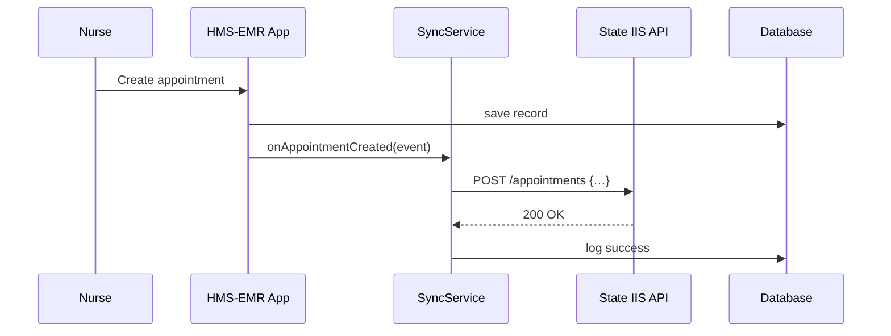

# Chapter 5: External System Synchronization

In [Chapter 4: Human-in-the-Loop Oversight](04_human_in_the_loop_oversight_.md) we learned how a human reviews AI proposals before they go live. Now, let’s make sure HMS-EMR stays in lockstep with outside systems—like scheduling portals or records registries—so data and processes are aligned in real time.

---

## 1. Motivation & Central Use Case

Imagine a county health clinic that books vaccine appointments in HMS-EMR. The State Immunization Information System (IIS) also needs those appointments to be up to date. If a nurse cancels a slot in HMS-EMR, that cancellation should instantly appear in the IIS so no one double-books.

Without synchronization, two calendars drift apart:

- A citizen thinks a slot is free (because IIS wasn’t updated)  
- But the clinic’s portal already marked it booked in HMS-EMR  

**External System Synchronization** solves this by automatically pushing and pulling changes in real time.

---

## 2. Key Concepts

1. **Connector / Adapter**  
   A small module that “speaks” the external system’s protocol (REST, SOAP, GraphQL).

2. **Outbound Sync (Push)**  
   When HMS-EMR sends updates (e.g., new appointment) to the external API.

3. **Inbound Sync (Webhooks or Polling)**  
   When the external system notifies HMS-EMR of changes (e.g., a rescheduled slot).

4. **Data Mapping**  
   Converting between HMS-EMR’s data model and the external system’s schema.

5. **Idempotency & Retry**  
   Ensuring the same message can be sent multiple times without creating duplicates, and retrying on failures.

---

## 3. How to Use External Sync

Let’s walk through a minimal example of sending a new appointment to the state IIS.

### 3.1 Configure the Connector

```js
// src/sync/connector.js
export const IIS_API_BASE = 'https://state-iis.gov/api';
export const API_KEY        = process.env.IIS_API_KEY;

// A simple function to call the external API
export async function pushAppointment(appointment) {
  return fetch(`${IIS_API_BASE}/appointments`, {
    method: 'POST',
    headers: {
      'Content-Type': 'application/json',
      'Authorization': `Bearer ${API_KEY}`
    },
    body: JSON.stringify(appointment)
  });
}
```

> This module knows the base URL and key, then sends JSON to create a slot.

### 3.2 Trigger a Push on New Booking

```js
// src/sync/syncManager.js
import { pushAppointment } from './connector';

export async function onAppointmentCreated(appointment) {
  // Map HMS-EMR fields to IIS schema
  const payload = {
    patientId:   appointment.patientId,
    slotTime:    appointment.datetime,
    clinicCode:  appointment.locationId
  };
  // Send to IIS; retry on failure
  await pushAppointment(payload);
}
```

> When HMS-EMR emits an “appointment created” event, we map and push it.

---

## 4. Under the Hood: Step-by-Step

Here’s a simplified flow when a nurse books a slot:



1. **Nurse** books an appointment in HMS-EMR.  
2. HMS-EMR saves to its **Database**.  
3. It notifies the **SyncService** (our adapter).  
4. **SyncService** calls the **State IIS API**.  
5. On success, we log the sync in our DB.

---

## 5. Internal Implementation Breakdown

All sync code lives under `src/sync/`. Let’s peek at two core files.

### 5.1 connector.js  
Handles low-level HTTP calls.

```js
// src/sync/connector.js
export const IIS_API_BASE = 'https://state-iis.gov/api';
export const API_KEY = process.env.IIS_API_KEY;

export async function callIIS(path, options) {
  // merge base URL, headers, and retry logic
  // …implementation details…
}
```

> `callIIS` centralizes headers, retries, and error handling so other modules stay clean.

### 5.2 syncManager.js  
Coordinates mapping and event handling.

```js
// src/sync/syncManager.js
import { callIIS } from './connector';

export async function onAppointmentCreated(app) {
  const payload = {
    patientId:  app.patientId,
    slotTime:   app.datetime,
    clinicCode: app.locationId
  };
  await callIIS('/appointments', {
    method: 'POST',
    body: JSON.stringify(payload)
  });
}
```

> We take the HMS-EMR appointment object, transform it, and forward it to IIS.

---

## 6. Conclusion

In this chapter, you learned how to:

- Build a **Connector/Adapter** to an external API.  
- Push HMS-EMR events (like appointment creation) in real time.  
- Map internal data structures to external schemas.  
- Safely retry and log sync calls.  

Just like a traffic control center updates signals across city borders, HMS-EMR can now keep third-party systems in sync. Next up, we’ll explore how to design the core [Backend API Layer](06_backend_api_layer_.md) that serves all our modules.

---

Generated by [AI Codebase Knowledge Builder](https://github.com/The-Pocket/Tutorial-Codebase-Knowledge)