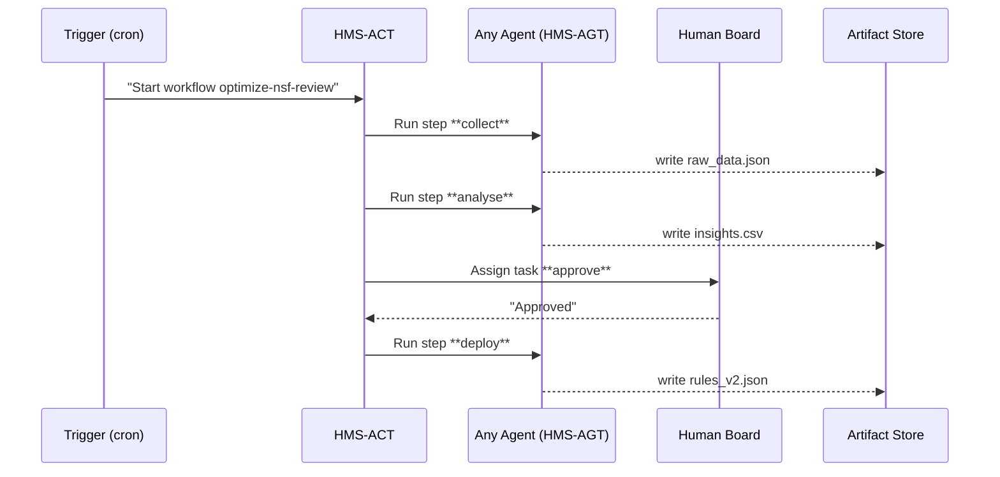

# Chapter 6: Agent Orchestration & Workflow Engine (HMS-ACT)

*A control tower that makes sure every digital “plane” takes off, lands, and never collides.*

[← Back to Chapter 5: Agent Framework (HMS-AGT)](05_agent_framework__hms_agt__.md)

---

## 1 — Why do we need an Orchestration Engine?

Picture the National Science Foundation (NSF) launching an **AI-Facilitated Process Optimization** pilot:

1. **Research Groups** upload grant-review feedback.  
2. An **Analysis-Bot** crunches the data.  
3. A **Human Board** signs off on changes.  
4. A **Policy-Deployer** rolls new scoring rules to production.

If any step runs out of order—analysis before data is ready, or deployment before the board approves—public trust plummets.

**HMS-ACT** acts like an FAA tower:

* Schedules *who* (agent or human) should act *when*.  
* Prevents “air collisions” (two agents writing to the same record).  
* Records a black-box log for auditors.

---

## 2 — Key Concepts (Plain-English Cheat-sheet)

| Term | What it really means | Analogy |
|------|---------------------|---------|
| Workflow | A named recipe of ordered steps. | Flight plan. |
| Step | One unit of work (agent run or human task). | A single take-off/landing. |
| Needs | IDs of steps that **must finish first**. | “Wait until runway is clear.” |
| Trigger | Event that starts a workflow. | Control tower’s “go” signal. |
| Artifact Store | Where outputs are written. | The airport’s luggage belt. |

Keep these five words—you’ll use them in every workflow.

---

## 3 — Hands-On: Build Your First Workflow (≤20 lines total 🎉)

### 3.1 Describe the flight plan (YAML, 17 lines)

```yaml
# optimize_nsf.yml
workflow: optimize-nsf-review
trigger:  cron( "0 1 * * *" )     # nightly at 1 AM
steps:
  - id: collect
    agent: data-collector-bot          # HMS-AGT bot
  - id: analyse
    agent: analysis-bot
    needs: [collect]
  - id: approve
    human: "NSF Review Board"          # will go to HITL
    needs: [analyse]
  - id: deploy
    agent: policy-deployer-bot
    needs: [approve]
artifact_store: s3://nsf-ops-bucket/
```

Beginner takeaways  
• **`workflow`** gives the recipe a name.  
• **`trigger`** tells ACT to run nightly.  
• **`needs`** enforces order.  
• Last line says *where* outputs land.

### 3.2 Run it once (CLI, 1 command)

```bash
$ hms-act run optimize_nsf.yml --once
```

Expected console log (trimmed):

```
[collect]      ✅ finished (23 s)
[analyse]      ✅ finished (12 s)
[approve]      ⏳ waiting for human…
```

The moment a board member clicks “Approve” in the HITL UI (next chapter), ACT automatically starts `deploy`.

---

## 4 — What Happens Under the Hood?



Only **five actors**; ACT is the traffic controller in the middle.

---

## 5 — Tiny Code Peeks (all <20 lines)

### 5.1 Parse the YAML (7 lines)

```python
# hms_act/parser.py
import yaml
def load(path):
    with open(path) as f:
        doc = yaml.safe_load(f)
    return doc["steps"], doc.get("needs", {}), doc["artifact_store"]
```

Simply reads the recipe—nothing fancy.

### 5.2 Minimal Scheduler Loop (14 lines)

```python
# hms_act/scheduler.py
from hms_agt import run_agent
from hitl import request_human

def run(steps):
    done = set()
    while len(done) < len(steps):
        for s in steps:
            if s["id"] in done: continue
            if all(n in done for n in s.get("needs", [])):
                if "agent" in s:
                    run_agent(s["agent"])
                else:                    # human step
                    request_human(s["human"], s["id"])
                done.add(s["id"])
```

Checks “needs” dependencies before take-off.

### 5.3 What *run_agent* really does (10 lines excerpt)

```python
# hms_act/agents.py
def run_agent(name):
    env = {"trigger":"ACT"}                 # MCP context
    result = subprocess.run(["hms-agt","run",name,"--json",env])
    log(result.stdout)                      # feed OPS suite
```

Uses the exact CLI you learned in [Chapter 5](05_agent_framework__hms_agt__.md).

---

## 6 — Governance & Safety—always in play

Before *any* step launches, ACT calls:

```python
from hms_govern import vet
if not vet(step):
    raise Exception("Governance block")
```

So every flight plan still obeys the constitution defined in [Chapter 1](01_governance_layer__ai_governance_values__.md).

---

## 7 — How HMS-ACT Connects to Other Layers

* **Agents (HMS-AGT)** run each automated step.  
* **Model Context Protocol (HMS-MCP)** passes context into those agents.  
* **Human-in-the-Loop Oversight (HITL)** handles `human:` steps (next chapter!).  
* **Operations Suite (HMS-OPS)** receives ACT’s black-box logs for monitoring.  
* **Governance Layer** checks every step before execution.

---

## 8 — Frequently Asked Questions

**Q1 — Can two steps run in parallel?**  
Yes. Omit `needs`, or give different dependency sets. ACT will launch all eligible steps simultaneously.

**Q2 — What if a step fails?**  
Add an optional field:

```yaml
retry: {max: 3, backoff_sec: 60}
```

ACT handles retries automatically; after exhaustion it flags HITL.

**Q3 — Can a workflow trigger on an *event*, not a cron?**  
Absolutely: `trigger: event("grant_submitted")`.

---

## 9 — Try It Yourself (3-minute exercise)

1. Duplicate the YAML:

```bash
cp optimize_nsf.yml optimize_dod.yml
```

2. Rename the workflow to `optimize-dod-contracts` and swap in:

```yaml
agent: dcaa-audit-bot   # Defense Contract Audit Agency
```

3. Run `hms-act run optimize_dod.yml --once`.  
Congratulations—one control tower, many airlines.

---

## 10 — What You Learned

* HMS-ACT is the **air-traffic controller** that sequences agents and people.  
* Workflows are plain YAML: `steps`, `needs`, `trigger`, `artifact_store`.  
* Under 30 lines of Python power the core scheduler—easy to grok.  
* Governance, HITL, OPS, and AGT integrate seamlessly.

Next we’ll zoom into those **human approval steps** you just saw:  
[Chapter 7: Human-in-the-Loop Oversight (HITL)](07_human_in_the_loop_oversight__hitl__.md)

---

Generated by [AI Codebase Knowledge Builder](https://github.com/The-Pocket/Tutorial-Codebase-Knowledge)