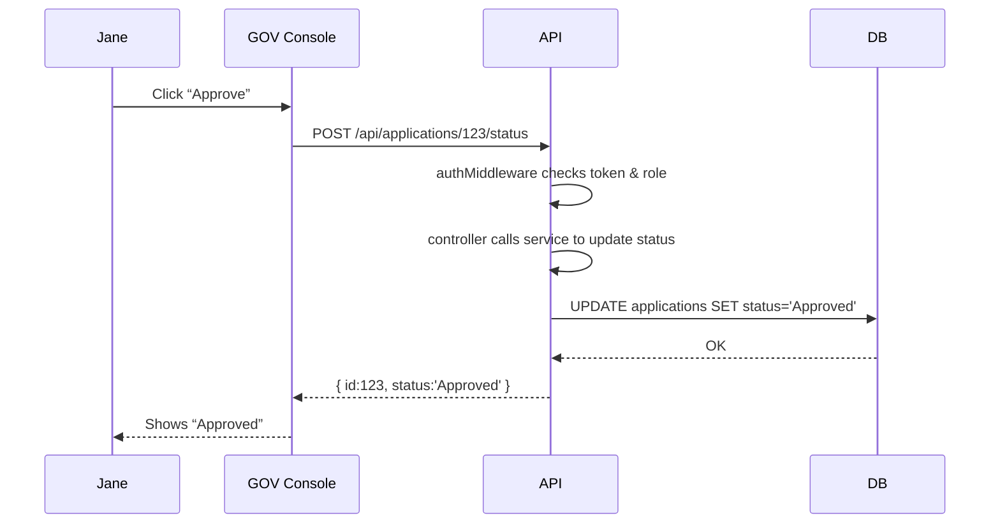

# Chapter 6: Backend API Layer

Welcome back! In [Chapter 5: External System Synchronization](05_external_system_synchronization_.md) we saw how HMS-EMR pushes and pulls data with outside systems. Now we’ll build the **Backend API Layer**—our secure programmatic interface (think “HMS-API” or “HMS-MKT”) where all parts of the system read, update, and manage policies, records, and processes under strict access rules.

---

## 1. Why a Backend API Layer?

Imagine the Bureau of Consular Affairs needs to update a passport application status after a field officer logs a new document. Instead of directly touching the database, every department calls a set of well-defined API endpoints. This:

- Centralizes business logic  
- Enforces security and audit rules  
- Makes integration uniform for frontend, AI agents, or external systems  

**Central Use Case**  
Officer Jane needs to change application #123’s status from “Pending Review” to “Approved” via a secure HTTP call:

  1. Jane’s console sends `POST /api/applications/123/status`  
  2. The API checks her role, applies business rules, updates the database  
  3. A log entry is created for audit  

---

## 2. Key Concepts

1. **Endpoints**  
   URL paths like `/api/applications` that accept HTTP methods (GET, POST).  

2. **Authentication & Authorization**  
   Verifying who you are (token, API key) and what you can do (roles/permissions).  

3. **Controllers & Services**  
   Controllers parse requests; Services run business logic (e.g., “can Jane approve?”).  

4. **Data Models**  
   Schemas defining how policies, applications, and users look in code.  

5. **Error Handling & Logging**  
   Consistent responses for failures and audit logs for every change.

---

## 3. Using the Backend API

Below is a minimal Express.js example showing two key endpoints:

### 3.1 src/api/server.js

```js
import express from 'express';
import appRoutes from './routes';

const app = express();
app.use(express.json());
app.use('/api', appRoutes);
app.listen(3000, () => console.log('API running on port 3000'));
```
This starts our server and mounts all API routes under `/api`.

### 3.2 src/api/routes.js

```js
import { listApps, updateStatus } from './controllers';
import { authMiddleware } from './auth';

const router = require('express').Router();

// List all applications
router.get('/applications', authMiddleware, listApps);

// Update one application's status
router.post(
  '/applications/:id/status',
  authMiddleware,
  updateStatus
);

export default router;
```
We protect each route with `authMiddleware` and forward calls to our controllers.

### 3.3 Example Requests & Responses

1. List applications  
   Request: `GET /api/applications` with header `Authorization: Bearer TOKEN`  
   Response:  
   ```json
   [
     { "id": 123, "type": "Passport", "status": "Pending" },
     { "id": 124, "type": "Visa",     "status": "Approved" }
   ]
   ```

2. Update status  
   Request: `POST /api/applications/123/status`
   ```json
   { "status": "Approved" }
   ```
   Response:
   ```json
   { "id": 123, "status": "Approved", "updatedBy": "jane.doe" }
   ```

---

## 4. What Happens Step-by-Step?



1. **authMiddleware** verifies Jane’s token and role.  
2. Controller parses **application ID** and **new status**.  
3. Service applies business rules and updates the database.  
4. API returns the updated record for the console to display.

---

## 5. Internal Implementation Breakdown

Let’s peek at two core files under `src/api/`:

### 5.1 src/api/auth.js

```js
// Very simple token check
export function authMiddleware(req, res, next) {
  const token = req.headers.authorization?.split(' ')[1];
  if (token === process.env.API_TOKEN) {
    req.user = { name: 'jane.doe', role: 'officer' };
    return next();
  }
  res.status(401).json({ error: 'Unauthorized' });
}
```
We extract a token, compare to an expected value, and attach a `req.user`.

### 5.2 src/api/controllers.js

```js
import db from '../db';

// List all applications
export async function listApps(req, res) {
  const apps = await db.query('SELECT id,type,status FROM applications');
  res.json(apps);
}

// Update status with a simple role check
export async function updateStatus(req, res) {
  const { id }    = req.params;
  const { status }= req.body;
  if (req.user.role !== 'officer') {
    return res.status(403).json({ error: 'Forbidden' });
  }
  await db.query('UPDATE applications SET status=? WHERE id=?', [status, id]);
  res.json({ id, status, updatedBy: req.user.name });
}
```
Controllers call a `db` module to run SQL. They also enforce that only an “officer” can approve.

---

## 6. Conclusion

In this chapter you learned how to build a beginner-friendly **Backend API Layer**:

- Define **endpoints**, secure them with **auth**, and parse requests.  
- Separate concerns into **controllers** and **services**.  
- See a full **request-response** flow with a mermaid diagram.  

Next up, we’ll break our API into focused pieces in [Chapter 7: Microservices Components](07_microservices_components_.md).

---

Generated by [AI Codebase Knowledge Builder](https://github.com/The-Pocket/Tutorial-Codebase-Knowledge)