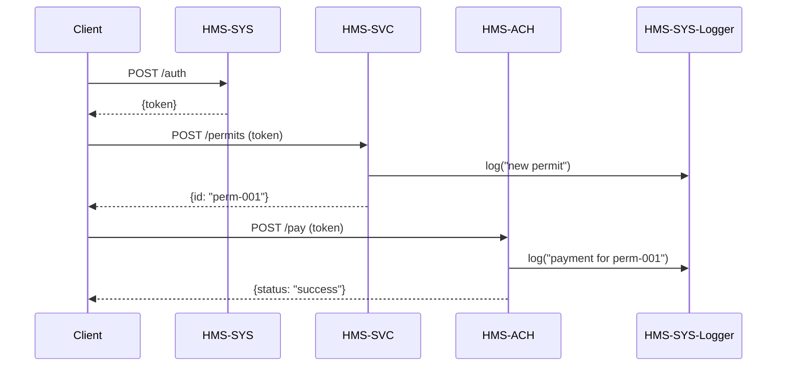

# Chapter 6: Multi-Layer Microservices Architecture

In the last chapter you saw how the [Backend API (HMS-API / HMS-MKT)](05_backend_api__hms_api___hms_mkt__.md) centralizes business logic and data. Now we’ll zoom out and see how all parts of HMS-EMR fit together in a **Multi-Layer Microservices Architecture**—like a modular power grid, with independent nodes working together under standard protocols.

## 6.1 Why Multi-Layer Microservices?

Imagine the **Department of Building Safety** needs to let citizens:

1. Authenticate securely  
2. Submit a permit application  
3. Pay a fee  
4. Log every action for audit  

Instead of one giant codebase, we split these duties into specialized services:

- **HMS-SYS**: Authentication, security, shared logging  
- **HMS-SVC**: Domain logic (permit validation, workflow rules)  
- **HMS-ACH**: Payments (credit cards, ACH transfers)  
- **HMS-A2A**: AI agents (auto-review suggestions)  

Each “node” stands alone, can be tested and scaled independently, yet plugs into the same “grid” of HTTP or messaging protocols.

## 6.2 Key Concepts

1. **Domain Grouping**  
   Services are grouped by function: core infrastructure (HMS-SYS), business logic (HMS-SVC), financial (HMS-ACH), AI (HMS-A2A), interfaces ([Interface Layer](04_interface_layer_.md)).

2. **Independence & Composability**  
   Each service has its own code, data store, and deployment. They communicate via APIs or message queues.

3. **Standard Protocols**  
   We use HTTP/REST or a message broker (e.g., RabbitMQ) so every service “speaks the same language.”

4. **Shared Utilities**  
   Common concerns—security, tracing, metrics—live in a small core service (HMS-SYS) or shared library.

## 6.3 Example: Building Permit Workflow

Let’s walk through a citizen submitting a permit, paying fees, and getting audit logs.

### 6.3.1 Client Code (submit.js)

```js
// submit.js (a one-off script)
import axios from 'axios';

async function submitPermit() {
  // 1. Authenticate
  const { token } = await axios.post('http://sys/auth', {
    user: 'citizen123', pass: 'secret'
  }).then(r => r.data);

  // 2. Submit application to HMS-SVC
  const app = await axios.post(
    'http://svc/permits',
    { type: 'building', data: {/* ... */} },
    { headers: { Authorization: token } }
  );

  // 3. Pay fee via HMS-ACH
  const payment = await axios.post(
    'http://ach/pay',
    { permitId: app.data.id, amount: 50 },
    { headers: { Authorization: token } }
  );

  console.log('Permit submitted:', app.data.id, 'Payment status:', payment.data.status);
}

submitPermit();
```

Explanation:  
- We call **HMS-SYS** to get a token.  
- We post the permit to **HMS-SVC**.  
- We charge the fee via **HMS-ACH**.  
- Each service runs its own logic and returns JSON.

### 6.3.2 What Happens Under the Hood



1. **SYS** authenticates and issues a token.  
2. **SVC** validates permit, logs action, returns an ID.  
3. **ACH** processes payment, logs it, and replies.  
4. **LOG** (a shared logging endpoint in HMS-SYS) captures audit trails.

## 6.4 Internal Implementation

Here’s a minimal directory layout; each service is a tiny Express app.

```
hms-microservices/
├─ docker-compose.yml
├─ hms-sys/
│  └─ server.js
├─ hms-svc/
│  └─ server.js
└─ hms-ach/
   └─ server.js
```

### docker-compose.yml (snippet)

```yaml
version: '3'
services:
  hms-sys:
    build: ./hms-sys
    ports: ["7000:7000"]
  hms-svc:
    build: ./hms-svc
    ports: ["7001:7001"]
  hms-ach:
    build: ./hms-ach
    ports: ["7002:7002"]
```

### hms-svc/server.js

```js
// Only  lines to show structure
import express from 'express';
import axios from 'axios';
const app = express();
app.use(express.json());

app.post('/permits', async (req, res) => {
  // validate req.body...
  const id = 'perm-' + Date.now();
  // call shared logger
  await axios.post('http://hms-sys:7000/log', { event: 'new-permit', id });
  res.json({ id });
});

app.listen(7001, () => console.log('HMS-SVC on 7001'));
```

Explanation:  
- We accept a POST, generate an ID, log to HMS-SYS, and return JSON.

### hms-ach/server.js

```js
import express from 'express';
import axios from 'axios';
const app = express();
app.use(express.json());

app.post('/pay', async (req, res) => {
  // pretend to charge card...
  await axios.post('http://hms-sys:7000/log', { event: 'payment', details: req.body });
  res.json({ status: 'success' });
});

app.listen(7002, () => console.log('HMS-ACH on 7002'));
```

## 6.5 Summary

You’ve learned how HMS-EMR uses a **Multi-Layer Microservices Architecture** to:

- Break features into domain-specific services (core, business, payments, AI).  
- Let each service run, test, and scale independently.  
- Tie them together with standardized APIs and shared logging/security in **HMS-SYS**.  

Next, we’ll show how to encode business rules and workflows in our [Policy/Process Module](07_policy_process_module_.md).

---

Generated by [AI Codebase Knowledge Builder](https://github.com/The-Pocket/Tutorial-Codebase-Knowledge)