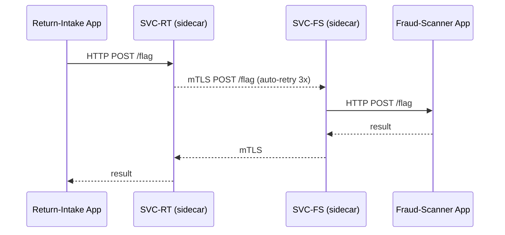

# Chapter 7: Backend Service Mesh (HMS-SVC / HMS-SYS)
*(continuing from [Chapter 6: Identity & Access Management (IAM)](06_identity___access_management__iam__.md))*  

---

## 1. Why Do We Need an “Underground Subway” for Services?

Imagine the *Internal Revenue Service (IRS)* on **Tax Day**:

1. “**Return-Intake**” micro-service ingests 2 M PDFs/hour.  
2. “**Fraud-Scanner**” micro-service flags suspicious filings.  
3. “**Refund-Payout**” micro-service triggers ACH payments.  

All three must talk to each other **securely**, **reliably**, and **audibly**—while auditors from GAO watch.  
Hard-coding IP addresses, TLS certificates, retries, and logs inside every service would be a nightmare.

Enter **Backend Service Mesh**—think of it as an **underground subway network**:

* trains = micro-services  
* tracks = encrypted connections  
* control room = mesh controller that knows every train’s schedule  

With HMS-SVC (data-plane) and HMS-SYS (control-plane), every service gets:

1. **Automatic discovery** – “Where is Fraud-Scanner today?”  
2. **Zero-trust security** – mutual TLS, no shared secrets.  
3. **Traffic policies** – retries, circuit-breakers, A/B routes.  
4. **Observability** – built-in metrics & traces.

---

## 2. Key Concepts—5 Mini Bricks

| Brick | Subway Analogy | Plain-English Purpose |
|-------|----------------|-----------------------|
| Sidecar Proxy (HMS-SVC) | Train car conductor | Handles tickets (certs) & speed (retries) for one train |
| Control Plane (HMS-SYS) | Central signal tower | Knows every track & sends new schedules |
| Service Discovery | Station map | Finds the next stop without hard-coding IPs |
| Mutual TLS (mTLS) | Locked train doors | Only trains with the right key can dock |
| Telemetry | Station cameras | Real-time view of delays & crowds |

Keep these five in mind; the rest of the chapter simply connects the dots.

---

## 3. Quick-Start Walk-Through: “Return-Intake ➜ Fraud-Scanner”

Goal: *Return-Intake* calls *Fraud-Scanner* safely, with **no** code changes for security or discovery.

### 3.1 Deploy the Services (Kubernetes Style)

```yaml
# return-intake.yaml   (≤ 20 lines)
apiVersion: v1
kind: Pod
metadata:
  name: return-intake
  labels: { app: return-intake, hms/mesh: enabled }   # 👈 auto-inject sidecar
spec:
  containers:
  - name: app
    image: irs/return-intake:1.2
```

Explanation  
`hms/mesh: enabled` tells HMS-SYS to **inject a sidecar proxy** (HMS-SVC) next to the app container.

Same again for *Fraud-Scanner*:

```yaml
metadata:
  name: fraud-scanner
  labels: { app: fraud-scanner, hms/mesh: enabled }
```

### 3.2 Application Code *Stays Vanilla*

```python
# return_intake/send_for_scan.py  (8 lines)
import requests, os
SCAN_URL = "http://fraud-scanner.scan/flag"   # plain HTTP, easy!
def send(pdf_bytes):
    res = requests.post(SCAN_URL, files={'file': pdf_bytes})
    return res.json()     # e.g., {"risk": "LOW"}
```

No TLS, no retry logic—sidecars handle it.

### 3.3 Behind the Curtain



Four actors, zero hard-coded addresses—the proxies discovered each other via HMS-SYS.

---

## 4. Writing a Traffic Policy (Human-Readable YAML)

```yaml
# policies/irs-fraud.yml   (≤ 20 lines)
apiVersion: hms/v1
kind: TrafficPolicy
metadata:
  name: fraud-scan-policy
spec:
  source: return-intake
  destination: fraud-scanner
  retries: 3
  timeoutMs: 800
  circuitBreaker:
    maxConnections: 1000
    errorPercent: 20
```

Save → **HMS-SYS** pushes the policy to both proxies in < 5 s—no redeploy needed.

---

## 5. Peeking Inside a Sidecar (Go, 18 lines)

```go
// svc/main.go  – simplified envoy-like proxy
func handle(req *http.Request) {
    // 1. mTLS handshake (auto cert from HMS-SYS)
    conn := dialMTLS(req.Host)
    // 2. Retry loop
    for i := 0; i < cfg.Retries; i++ {
        resp, err := conn.Do(req)
        if err == nil && resp.StatusCode < 500 {
            logMetrics(resp)     // latency, status
            return forward(resp)
        }
    }
    tripCircuit()                // > errorPercent
    failFast()
}
```

Explanation  
• `dialMTLS` fetches certs from local cache (rotated every 24 h).  
• `cfg.Retries` comes from the **TrafficPolicy** we just wrote.  
• `logMetrics` emits Prometheus counters automatically.

---

## 6. Observability—One Command Demo

```bash
hms mesh top return-intake --last 5m
```

Sample output:

```
DESTINATION      SUCCESS %   P50 LAT  ERR/S
fraud-scanner    98.7        120ms    1.2
```

Beginner takeaway: You get live stats **without** instrumenting your app.

---

## 7. How Certificates & Discovery Work (Step-By-Step)

1. Pod with `hms/mesh: enabled` starts.  
2. **Sidecar** requests a short-lived cert from HMS-SYS using its **Service Token** (see IAM).  
3. HMS-SYS records pod IP in the **Service Registry**.  
4. When *Return-Intake* calls `fraud-scanner.scan`, its sidecar looks up the destination in the registry.  
5. Both proxies establish **mutual TLS**—identity proven!  
6. Metrics stream to the [Observability Pipeline](14_observability___metrics_pipeline_.md).

---

## 8. Minimal Control-Plane API Call

```bash
# Block traffic for maintenance (shy of 20 lines)
curl -X POST https://sys.hms.gov/policies/pause \
  -d '{"service":"fraud-scanner","durationMin":30}'
```

HMS-SYS updates all proxies; calls now return **503 Service Paused**—no restarts.

---

## 9. Frequently Asked Beginner Questions

**Q1. Do I have to change my application ports?**  
No. Sidecars intercept transparently on the same pod network.

**Q2. Is this the same as an API Gateway?**  
Gateway = **front door** (external).  
Service Mesh = **hallways** (internal). They complement each other.

**Q3. What if I already use Envoy or Istio?**  
HMS-SVC wraps vanilla Envoy, so existing config snippets mostly work.

**Q4. Does this slow my traffic?**  
mTLS + proxy adds ~2 ms inside the data center—usually unnoticeable.

---

## 10. Summary & What’s Next

You learned:

• HMS-SVC / HMS-SYS form a **secure subway** connecting every micro-service.  
• Sidecar proxies add discovery, mTLS, retries, and metrics **without touching your code**.  
• Traffic policies are just small YAML files; HMS-SYS rolls them out live.  
• Observability is built-in, letting agencies trace issues in seconds.

Now that services can chat safely inside the data center, the next step is to **talk to the outside world**—legacy databases, SaaS providers, or state systems.  
Hop over to [Chapter 8: External System Adapters & Sync Layer](08_external_system_adapters___sync_layer_.md) to see how HMS bridges that gap.

---

Generated by [AI Codebase Knowledge Builder](https://github.com/The-Pocket/Tutorial-Codebase-Knowledge)