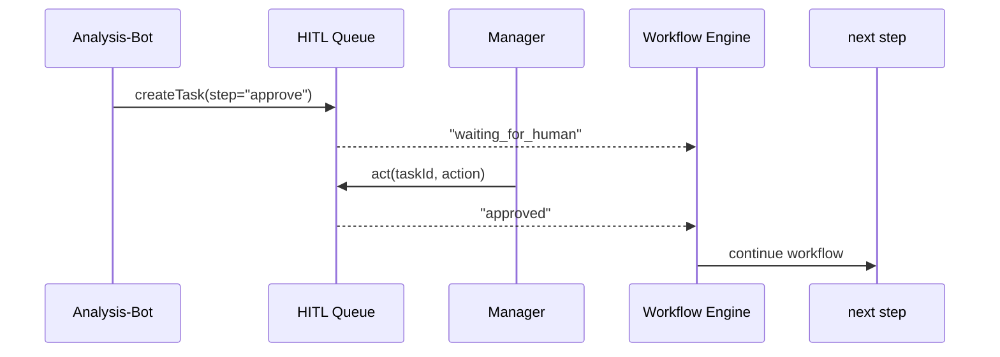

# Chapter 7: Human-in-the-Loop Oversight (HITL)

[← Back to Chapter 6: Agent Orchestration & Workflow Engine](06_agent_orchestration___workflow_engine__hms_act__.md)

---

## 1 — Why do we need it?

Imagine an **Analysis-Bot** discovers that reducing the page-length of NSF grant forms could save reviewers 2,000 hours per year.  
Sounds great—until someone notices the shorter form no longer collects *conflict-of-interest* data!

We need a **human checkpoint** where an NSF manager can:

1. Inspect the AI proposal.  
2. Tweak or veto it.  
3. Sign their name so auditors know *who* took responsibility.

That checkpoint is called **Human-in-the-Loop Oversight (HITL)**.

---

## 2 — Core Ideas (plain-English cheat-sheet)

| Term | Beginner-friendly meaning | Quick analogy |
|------|--------------------------|---------------|
| Review Task | A to-do card the AI puts in a human inbox. | Sticky note on your desk. |
| Action | What a human can do: **approve**, **tweak**, or **veto**. | Thumbs-up, pencil edit, or red X. |
| Checkpoint | Place in a workflow where AI must wait for a human action. | Airport security desk. |
| Responsibility Log | Record of who did what & when. | Digital signature sheet. |
| Escalation | Auto-forward if a task stalls (e.g., 48 h). | “Manager, please see me.” |

Keep these five words; HITL is just a smart to-do list with signatures.

---

## 3 — Hands-On: Your first HITL checkpoint (≤30 seconds)

We’ll add a human review step to the **optimize-nsf-review** workflow from Chapter 6.

### 3.1 Add a “human” step in YAML (5 lines)

```yaml
# optimize_nsf.yml   (delta only)
  - id: approve
    human: "NSF Program Manager"   # 👤 hits the HITL inbox
    needs: [analyse]
```

Nothing else changes—the **HMS-ACT** engine automatically pauses until a manager acts.

### 3.2 See the task appear (CLI demo)

```bash
$ hms-hitl inbox
┌─────────┬──────────────────────────┬──────────────┐
│ Task ID │ From (workflow/step)     │ Status       │
├─────────┼──────────────────────────┼──────────────┤
│ T-91A   │ optimize-nsf/approve     │ WAITING      │
└─────────┴──────────────────────────┴──────────────┘
```

### 3.3 A human approves (1-line CLI or UI click)

```bash
$ hms-hitl act T-91A approve --comment "Looks good."
```

Result:

```
Task T-91A → APPROVED by alice@nsf.gov ✔
```

HMS-ACT is instantly notified and resumes the workflow. ✅

---

## 4 — Under the hood: what just happened?



Four actors—simple and auditable.

---

## 5 — Tiny internal code peeks (all <20 lines)

### 5.1 Enqueue a task (called by an agent)

```python
# hms_hitl/api.py
import uuid, time, json, pathlib
QUEUE = pathlib.Path("/var/hitl/tasks")

def create(step_id, payload):
    tid = f"T-{uuid.uuid4().hex[:4].upper()}"
    task = {"id": tid, "step": step_id,
            "payload": payload, "status": "WAITING",
            "log": [], "created": time.time()}
    (QUEUE / f"{tid}.json").write_text(json.dumps(task))
    return tid
```

• Writes a tiny JSON file—easy to inspect or back-up.  
• `payload` can hold the AI proposal, diff, metrics, etc.

### 5.2 Act on a task (run by a human UI/CLI)

```python
def act(tid, action, comment, user):
    path = QUEUE / f"{tid}.json"
    task = json.loads(path.read_text())
    task["status"] = action.upper()   # APPROVED / TWEAKED / VETOED
    task["log"].append({"who": user,
                        "action": action,
                        "comment": comment,
                        "ts": time.time()})
    path.write_text(json.dumps(task))
```

• Updates `status` and appends a **responsibility log** entry.  
• Comment is optional but encouraged.

### 5.3 Workflow engine polls for results (excerpt)

```python
def wait_for_human(tid, timeout=172800):     # 48 h
    while time.time() - start < timeout:
        status = json.loads(open(f"{tid}.json").read())["status"]
        if status != "WAITING":
            return status
        time.sleep(10)
    raise Timeout("Escalate to senior reviewer")
```

• If 48 h passes, ACT auto-escalates—no silent dead-ends.

---

## 6 — Where HITL plugs into other layers

* Agents flag reviews with `env.flag_for_review()` from [Agent Framework (HMS-AGT)](05_agent_framework__hms_agt__.md).  
* Workflow steps that list `human:` are paused by [HMS-ACT](06_agent_orchestration___workflow_engine__hms_act__.md) until HITL resolves them.  
* All actions are stamped with governance metadata from [Chapter 1](01_governance_layer__ai_governance_values__.md).  
* The **Operations Suite** (Chapter 13) ingests HITL logs for dashboards & alerts.

---

## 7 — Frequently Asked Questions

**Q1: Is CLI the only UI?**  
No. A default React widget (`<hitl-inbox>`) ships in the [Micro-Frontend Registry](03_micro_frontend_interface__hms_mfe__.md). Drop it in any portal.

**Q2: Can a human *edit* the AI output?**  
Yes. Choose the **tweak** action. The UI pops a diff editor; the edited version is stored next to the original in the artifact store.

**Q3: What if reviewers disagree?**  
HITL supports multi-signoff rules (e.g., *2 of 3 must approve*). Configure in the YAML:

```yaml
human: {group: "NSF Board", quorum: 2}
```

---

## 8 — Try it yourself (3-minute exercise)

1. Flag a review task from any agent:

   ```python
   env.flag_for_review("Please approve new scoring weights.")
   ```

2. Open the inbox widget or run:

   ```bash
   hms-hitl inbox
   hms-hitl act <TASK_ID> veto --comment "Conflicts with law 45.12."
   ```

3. Observe how the workflow halts and logs the veto.

---

## 9 — What you learned

* **HITL turns AI suggestions into human-signed decisions.**  
* A task queue, three actions, and a log file are enough for robust oversight.  
* Everything integrates with Governance, Agents, Workflows, and Ops out-of-the-box.

Ready to let *different agencies* talk about these human-approved changes?  
Jump to [Chapter 8: Inter-Agency Communication Protocol (HMS-A2A)](08_inter_agency_communication_protocol__hms_a2a__.md).

---

Generated by [AI Codebase Knowledge Builder](https://github.com/The-Pocket/Tutorial-Codebase-Knowledge)