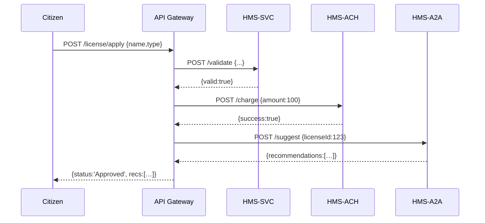

# Chapter 7: Microservices Components

In [Chapter 6: Backend API Layer](06_backend_api_layer_.md) we built a single, monolithic API. Now we’ll split that API into **independent, specialized services**—just like separate agency divisions (Tax, Payroll, Licensing) each run their own office yet exchange memos through standardized mail.

---

## 1. Why Microservices Components?

Imagine a citizen applies for a new business license. Behind the scenes, three “offices” must work together:

- **HMS-SVC** (business logic) validates the application  
- **HMS-ACH** (financials) computes fees and processes payment  
- **HMS-A2A** (AI coordination) suggests any extra permits needed  

If each “division” lives in its own service, teams can work, deploy, and scale them independently—just like a tax office doesn’t have to wait on payroll to open.

### Central Use Case: Business License Application

1. A citizen submits an application.  
2. HMS-SVC checks required fields (e.g., name, business type).  
3. If valid, HMS-ACH charges the fee.  
4. Once paid, HMS-A2A recommends additional licenses (e.g., health inspection).  
5. The citizen receives a final “Approved” response with next steps.

---

## 2. Key Concepts

1. **Service Boundary**  
   Each microservice owns its data and logic (e.g., HMS-SVC only cares about validation).  

2. **API Contracts**  
   Services communicate over well-defined HTTP or gRPC endpoints (“Validate”, “Charge”, “Suggest”).  

3. **Independent Deployment**  
   Each service runs in its own process (or container), so you can update one without touching the others.  

4. **Fault Isolation**  
   If HMS-ACH is down, HMS-SVC still validates applications—it just queues the payment step.  

5. **Inter-Service Communication**  
   Services talk via REST calls or messaging. We’ll show REST examples here.

---

## 3. How to Use Microservices

Below is a **minimal** example showing:

1. An **API Gateway** that a citizen talks to.  
2. Two tiny microservices: **HMS-SVC** and **HMS-ACH**.  

### 3.1 API Gateway (gateway/index.js)

```js
import express from 'express';
import fetch from 'node-fetch';
const app = express();
app.use(express.json());

// Forward validate requests to HMS-SVC
app.post('/license/apply', async (req, res) => {
  const svc = await fetch('http://localhost:3001/validate', {
    method: 'POST',
    body: JSON.stringify(req.body),
    headers: {'Content-Type':'application/json'}
  });
  const validation = await svc.json();
  res.json(validation);
});

app.listen(3000, () => console.log('Gateway on :3000'));
```
This gateway simply forwards a “apply” request to HMS-SVC and returns whatever it replies.

### 3.2 Business Logic Service: HMS-SVC (svc/index.js)

```js
import express from 'express';
const app = express();
app.use(express.json());

app.post('/validate', (req, res) => {
  // Check required fields
  const valid = !!(req.body.name && req.body.type);
  res.json({ valid, message: valid ? 'OK' : 'Missing name/type' });
});

app.listen(3001, () => console.log('HMS-SVC on :3001'));
```
HMS-SVC validates the input and returns a simple response.

### 3.3 Financial Service: HMS-ACH (ach/index.js)

```js
import express from 'express';
const app = express();
app.use(express.json());

app.post('/charge', (req, res) => {
  // Pretend we charge $100
  res.json({ success: true, transactionId: 'TX-100' });
});

app.listen(3002, () => console.log('HMS-ACH on :3002'));
```
HMS-ACH charges a fee and responds with a transaction ID.

---

## 4. Under the Hood: Step-by-Step

Here’s what happens when a citizen applies:



1. **Gateway** receives the initial request.  
2. It calls **HMS-SVC** to validate.  
3. If valid, it calls **HMS-ACH** to charge fees.  
4. Afterwards, it asks **HMS-A2A** for AI-driven suggestions.  
5. Finally, the gateway aggregates responses and returns them.

---

## 5. Inside Each Microservice

Each service has its own folder, minimal dependencies, and listens on its own port:

```
services/
├─ gateway/  # citizen-facing
├─ svc/      # HMS-SVC business logic
├─ ach/      # HMS-ACH financials
└─ a2a/      # HMS-A2A AI coordination
```

Key points:
- Each service uses its **own database** or schema.  
- Logging and errors are handled locally.  
- You can restart or scale **svc** without touching **ach**.

---

## 6. Conclusion

In this chapter you learned how to:
- Break a monolithic API into **microservices**  
- Define clear **API contracts** for each service  
- Route requests through an **API Gateway**  
- See a complete **sequence diagram** of the collaboration  

Next up, we’ll layer in the rules and workflows that govern each service in the [Policy & Process Module](08_policy___process_module_.md).

---

Generated by [AI Codebase Knowledge Builder](https://github.com/The-Pocket/Tutorial-Codebase-Knowledge)