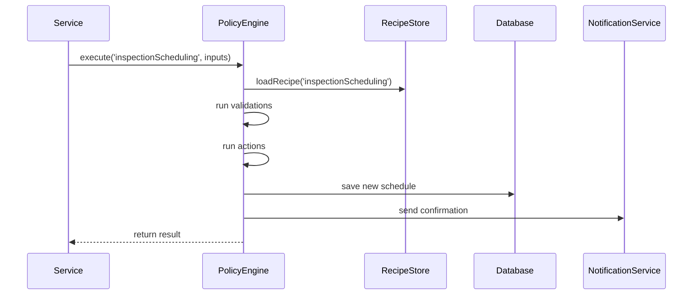

# Chapter 7: Policy/Process Module

In the last chapter we saw how all our microservices talk to each other in a [Multi-Layer Microservices Architecture](06_multi_layer_microservices_architecture_.md). Now we’ll dive into the **Policy/Process Module**, where we encode the actual “recipe cards” of government workflows—everything from permit application steps to inspection scheduling rules.

---

## Why Do We Need the Policy/Process Module?

Imagine the FDA has to decide **when** and **how** to schedule plant inspections. The rules might say:

1. Check if the facility has a certified auditor.  
2. Calculate the next available inspection slots starting from a given date.  
3. Reserve one of those slots and notify the facility.

These rules change over time, and we don’t want them buried in random code. The **Policy/Process Module** keeps them in one place, in a clear format:

- **Inputs** (ingredients): what you need to start (facility ID, date).  
- **Actions** (steps): things you do (compute slots, save to database).  
- **Validations** (checks): guards that must pass (auditor availability).  

Think of it like a recipe card in your kitchen: all ingredients, step-by-step instructions, and safety checks in one neat package.

---

## Key Concepts

1. **Recipe Definition**  
   A JSON file that lists inputs, actions, and validations for a workflow.

2. **Inputs**  
   The data you feed into the recipe (e.g., `facilityId`, `earliestDate`).

3. **Actions**  
   The steps the system performs (e.g., `calculateNextSlots`, `saveSchedule`).

4. **Validations**  
   Pre- or post-conditions that must pass (e.g., `hasQualifiedAuditor`).

5. **Policy Engine**  
   A small runtime that reads a recipe, runs validations and actions in order.

---

## Using the Policy/Process Module

Below is a minimal example of how you might schedule an inspection.

### 1. Define the Recipe

File: `recipes/inspectionScheduling.json`
```json
{
  "name": "inspectionScheduling",
  "inputs": ["facilityId", "earliestDate"],
  "validations": [
    { "type": "hasQualifiedAuditor", "params": ["facilityId"] }
  ],
  "actions": [
    { "type": "calculateNextSlots", "params": ["facilityId", "earliestDate"] },
    { "type": "saveSchedule", "params": ["slots"] }
  ]
}
```
Explanation:
- We list the **inputs** we expect.
- We check `hasQualifiedAuditor` before doing anything.
- We run two actions in order.

### 2. Call the Policy Engine

```js
import { PolicyEngine } from './PolicyEngine';

async function scheduleInspection() {
  const engine = new PolicyEngine();
  const result = await engine.execute('inspectionScheduling', {
    facilityId: 'FDA-123',
    earliestDate: '2024-07-01'
  });
  console.log(result);
}

scheduleInspection();
```
Explanation:
- We create a `PolicyEngine` instance.
- We call `execute` with the recipe name and a simple inputs object.
- On success, `result` might contain the reserved slot details.

### Example Output
```json
{
  "status": "success",
  "schedule": {
    "facilityId": "FDA-123",
    "date": "2024-07-10",
    "auditor": "auditor-42"
  }
}
```
If a validation fails, you’d get:
```json
{ "status": "error", "message": "No qualified auditor found" }
```

---

## Under the Hood: Step-by-Step Flow


1. **Service** calls `execute` with recipe name and inputs.  
2. **PolicyEngine** loads the JSON recipe.  
3. It runs each **validation** in order.  
4. It runs each **action**, passing results as needed.  
5. It persists the outcome and notifies downstream systems.  
6. Finally, it returns a success or error response.

---

## Internal Implementation

Here’s a minimal file layout inside `hms-api`:

```
src/
└── policyModule/
    ├── recipes/
    │   └── inspectionScheduling.json
    ├── handlers/
    │   └── actions.js
    │   └── validations.js
    └── PolicyEngine.js
```

### File: handlers/validations.js
```js
export async function hasQualifiedAuditor(facilityId) {
  // Imagine a DB lookup here
  const auditors = await db.query('SELECT * FROM auditors WHERE facility=?', facilityId);
  if (!auditors.length) throw new Error('No qualified auditor found');
}
```

### File: handlers/actions.js
```js
export async function calculateNextSlots(facilityId, earliestDate) {
  // Simple stub: always return two dates
  return ['2024-07-10', '2024-07-17'];
}

export async function saveSchedule(slots) {
  // Persist to database (pseudo)
  return db.insert('schedules', { slots });
}
```

### File: PolicyEngine.js
```js
import recipes from './recipes/index.js';
import * as validations from './handlers/validations.js';
import * as actions from './handlers/actions.js';

export class PolicyEngine {
  async execute(name, inputs) {
    const recipe = recipes[name];
    // run validations
    for (const v of recipe.validations) {
      await validations[v.type](...v.params.map(p => inputs[p]));
    }
    // run actions in sequence
    let lastResult;
    for (const a of recipe.actions) {
      const args = a.params.map(p => inputs[p] || lastResult);
      lastResult = await actions[a.type](...args);
    }
    return { status: 'success', schedule: lastResult };
  }
}
```
Explanation:
- We load a recipe by name.
- We loop through **validations**, calling each handler.
- We loop through **actions**, passing either original inputs or the previous action’s result.
- We return the final result.

---

## Summary

In this chapter you learned how to:

- Encapsulate business rules in clear JSON **recipes**.  
- Build a small **PolicyEngine** that loads recipes, runs validations, and executes actions.  
- Keep your workflow logic in one place, easy to update and test.  

Next up: we’ll see how policies get reviewed, approved, and audited in the [Governance Layer](08_governance_layer_.md).

---

Generated by [AI Codebase Knowledge Builder](https://github.com/The-Pocket/Tutorial-Codebase-Knowledge)