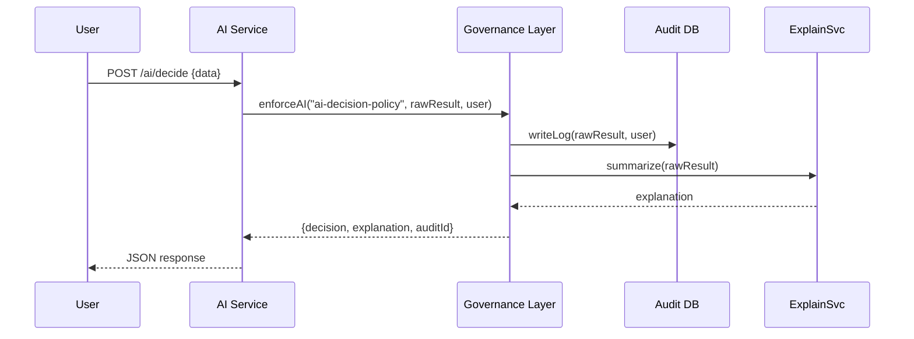

# Chapter 8: Governance Layer

Welcome back! In the last chapter, you learned how to encode workflows in the [Policy/Process Module](07_policy_process_module_.md). Now we’ll climb to the top tier—our **Governance Layer**—where we set system-wide guardrails for transparency, ethics, privacy, and safety.

---

## 8.1 Motivation: Why a Governance Layer?

Imagine a city council passing an ordinance that every new AI tool in municipal services must:
1. Record an audit trail of its decisions  
2. Provide an “explainable summary” for each decision  

Without one central body enforcing this, each team might forget a log, skip privacy checks, or hide how the AI reached its conclusion. The Governance Layer acts like that city council: non-negotiable rules that every microservice or interface must obey.

**Use case example:**  
A public-sector AI schedules building-inspection slots. Before sending the slot to a citizen, it must log details for auditors and attach a human-readable rationale (“We chose July 5th because….”).

---

## 8.2 Key Concepts

1. **Policy Repository**  
   A store of JSON “ordinances” (e.g., `ai-decision-policy.json`) that describe what must happen.

2. **Enforcement Middleware**  
   Code that wraps service logic, loads the right policy, and applies it on every request/response.

3. **Audit Trail**  
   A permanent log (database or file) where the system writes every decision, timestamp, and user ID.

4. **Explainability Service**  
   A small helper that turns a raw AI result into a plain-English summary.

5. **Violation Handler**  
   If a policy check fails (e.g., missing privacy consent), this component rejects the operation and records the violation.

---

## 8.3 Using the Governance Layer

Below is a minimal example showing how an AI microservice calls into the Governance Layer before returning a response.

### 1. Define a Policy

File: `gov-layer/policies/ai-decision-policy.json`
```json
{
  "id": "ai-decision-policy",
  "requirements": ["auditLog", "explainDecision"]
}
```
This JSON says: every time this policy is applied, run two steps—`auditLog` and `explainDecision`.

### 2. Enforce in Your Service

File: `src/aiService.js`
```js
import { enforceAI } from '../gov-layer/src/enforcer';

async function handleDecision(req, res) {
  const raw = await aiModel.predict(req.body.data);
  // Apply governance: logs + summary
  const governed = await enforceAI('ai-decision-policy', raw, req.user);
  res.json(governed);
}
```
Explanation:
- We import `enforceAI` from the Governance Layer.
- After the AI model returns `raw`, we call `enforceAI(policyId, result, user)`.
- The response now includes both the original decision and an explainable summary, and an audit record is created.

### 3. What the Client Sees

```json
{
  "decision": { /* AI output */ },
  "explanation": "Chose slot on 2024-07-05 to meet regulation X.",
  "auditId": "audit-789"
}
```
The client gets:
- The original AI output (`decision`)
- A human-friendly `explanation`
- An `auditId` to trace this decision in the audit store

---

## 8.4 Under the Hood: Sequence Diagram



1. **AI Service** calls `enforceAI`.  
2. **Governance Layer** writes an audit record.  
3. It calls the **Explainability Service** to get a summary.  
4. It returns a package of `decision`, `explanation`, and `auditId` back to the AI Service.  
5. Finally, the AI Service sends that JSON to the user.

---

## 8.5 Internal Implementation

Here’s a minimal file layout for `gov-layer`:

```
gov-layer/
├── policies/
│   └─ ai-decision-policy.json
└── src/
    ├─ policyStore.js
    ├─ enforcer.js
    └─ explainService.js
```

### File: src/policyStore.js
```js
export function loadPolicy(id) {
  // Load the JSON policy by ID
  return require(`../policies/${id}.json`);
}
```
This helper fetches the policy file from disk.

### File: src/enforcer.js
```js
import { loadPolicy } from './policyStore';
import { auditLog } from './auditService';
import { summarize } from './explainService';

export async function enforceAI(policyId, decision, user) {
  const policy = loadPolicy(policyId);
  // 1) Audit step
  const auditId = await auditLog(decision, user);
  // 2) Explain step
  const explanation = await summarize(decision);
  return { decision, explanation, auditId };
}
```
- We `loadPolicy` (so it matches the JSON requirements).
- We call `auditLog` to record the decision and user.
- We call `summarize` to produce a human-friendly explanation.
- We return an object containing all pieces.

### File: src/explainService.js
```js
export function summarize(decision) {
  // Stub: turn the decision into text
  return Promise.resolve(
    `Based on rules X and Y, chose option ${decision.optionId}.`
  );
}
```
A simple stand-in for a more complex explainability engine.

---

## 8.6 Summary

In this chapter you learned how the **Governance Layer** acts like a city council:
- It enforces system-wide policies (audit, explainability)  
- It provides reusable code (`enforceAI`) to wrap every microservice  
- It guarantees every AI decision is logged and comes with a clear rationale  

Up next: we’ll move to the [Management Layer](09_management_layer_.md), where admins fine-tune settings and view global dashboards.

---

Generated by [AI Codebase Knowledge Builder](https://github.com/The-Pocket/Tutorial-Codebase-Knowledge)