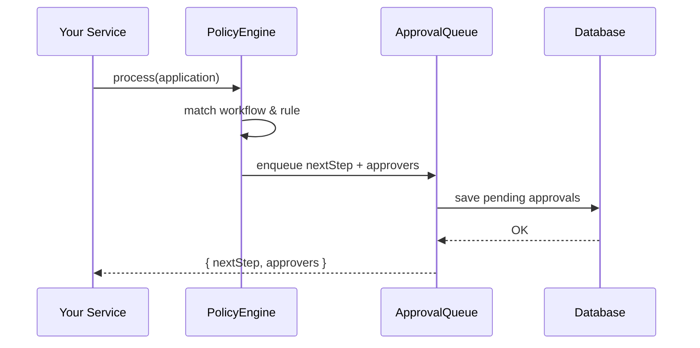

# Chapter 8: Policy & Process Module

Welcome! In [Chapter 7: Microservices Components](07_microservices_components_.md) we split our monolith into focused services. Now we’ll build the **Policy & Process Module**—a configurable engine where business rules, workflows, and approval chains live. Think of it like a city charter: it defines exactly how a building permit moves from review to final sign-off.

---

## 1. Motivation & Central Use Case

Imagine a citizen files a **building permit** application:

1. If the project value is under \$50,000, one inspector can approve.  
2. If over \$50,000, it needs two levels of sign-off (inspector → zoning officer).  
3. All permit types must record the approval chain and timestamps for audit.

Without a flexible engine, every service hardcodes these rules. The **Policy & Process Module** lets administrators tweak rules, add steps, or change approvers—without touching service code.

---

## 2. Key Concepts

1. **Rule**  
   A condition plus metadata (e.g., “value > \$50k → require zoning review”).  
2. **Workflow**  
   An ordered list of steps an application follows (e.g., `["Review", "Inspect", "Issue"]`).  
3. **Approval Chain**  
   Who signs off at each step (e.g., inspectors, officers).  
4. **Configuration**  
   A simple JSON or JS file where administrators declare rules, workflows, and chains.

---

## 3. Using the Policy & Process Module

Below is a minimal example of configuring and running our engine:

```js
// config/policyConfig.js
module.exports = {
  rules: [
    { name: "smallPermit",  condition: app => app.value <= 50000, approvalChain: ["Inspector"] },
    { name: "largePermit",  condition: app => app.value >  50000, approvalChain: ["Inspector","ZoningOfficer"] }
  ],
  workflows: [
    { type: "buildingPermit", rule: "smallPermit", steps: ["Review","Issue"] },
    { type: "buildingPermit", rule: "largePermit", steps: ["Review","Inspect","Issue"] }
  ]
};
```

```js
// src/index.js
import { PolicyEngine } from './policy/engine';
import config from '../config/policyConfig';

const engine = new PolicyEngine(config);
const application = { type: "buildingPermit", value: 75000 };

const result = engine.process(application);
console.log(result);
// → { nextStep: "Review", approvers: ["Inspector","ZoningOfficer"] }
```

Explanation:
- We load `policyConfig`, instantiate `PolicyEngine`, and call `process()`.  
- The engine picks the right workflow and rule, then returns the first step plus who must approve.

---

## 4. What Happens Step-by-Step?



1. Your service calls **PolicyEngine.process()**.  
2. The engine finds the matching **workflow** and **rule**.  
3. It builds a pending approval entry and stores it in the **ApprovalQueue**.  
4. The queue saves to the database and returns the step and approvers.

---

## 5. Internal Implementation Breakdown

Below are the core files under `src/policy/`—simplified for clarity.

### 5.1 policy/engine.js

```js
// src/policy/engine.js
export class PolicyEngine {
  constructor(config) {
    this.rules     = config.rules;
    this.workflows = config.workflows;
  }

  process(app) {
    const wf   = this.workflows.find(w => w.type === app.type);
    const rule = this.rules.find(r => r.name === wf.rule && r.condition(app));
    return {
      nextStep: wf.steps[0],
      approvers: rule.approvalChain
    };
  }
}
```

Explanation:
- **Constructor** stores rules and workflows.  
- **process()** finds the right workflow by `app.type`, then the rule whose `condition(app)` is true.  
- Returns the first step and its approvers.

### 5.2 policy/workflowManager.js

```js
// src/policy/workflowManager.js
export function defineWorkflow(type, steps, rule) {
  return { type, steps, rule };
}
```

Explanation:
- Simple helper to build workflow objects when loading or editing configurations.

### 5.3 policy/approvalChain.js

```js
// src/policy/approvalChain.js
export function defineApprovalChain(name, approvers) {
  return { name, approvalChain: approvers };
}
```

Explanation:
- Names an approval chain and lists roles (e.g., inspectors, officers). Useful for config tools.

---

## 6. Conclusion

You’ve seen how the **Policy & Process Module**:

- Lets you declare **rules**, **workflows**, and **approval chains** in simple config files.  
- Exposes a `PolicyEngine` that picks the right path and approvers for each application.  
- Enqueues pending approvals for downstream services or human dashboards.

Next up, we’ll build guardrails around our AI recommendations in [Chapter 9: AI Governance Model](09_ai_governance_model_.md).

---

Generated by [AI Codebase Knowledge Builder](https://github.com/The-Pocket/Tutorial-Codebase-Knowledge)