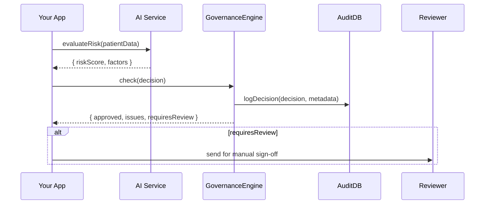

# Chapter 9: AI Governance Model

Welcome back! In [Chapter 8: Policy & Process Module](08_policy___process_module_.md) we built a flexible workflow engine. Now we’ll add guardrails around our AI: the **AI Governance Model**. This ensures every machine-made decision is transparent, ethical, and follows the law—just like how Congress writes and enforces legislation.

---

## 1. Motivation & Central Use Case

Imagine the Department of Health builds an AI to flag patients at risk of complications. Before we send any alert, we must:

1. Log why the AI made that call (transparency).  
2. Check patient data privacy rules (privacy).  
3. Ensure no bias against age, gender, or race (fairness).  
4. Have an audit trail in case regulators ask (compliance).

Without a governance layer, we’d risk unfair treatments, legal fines, or losing public trust. The **AI Governance Model** defines policies, oversight boards, and logging so every AI decision is accountable.

---

## 2. Key Concepts

1. **Governance Framework**  
   A structured set of policies, like a city charter for AI.  

2. **Transparency Policy**  
   Rules requiring explainability and logging of each decision.  

3. **Ethical Guidelines**  
   Definitions of privacy, fairness, and bias checks.  

4. **Compliance Rules**  
   Law-driven mandates (e.g., HIPAA for patient data).  

5. **Oversight Mechanisms**  
   Audit logs, review committees, and human sign-off points.

---

## 3. Using the AI Governance Model

Below is a minimal example showing how to configure and run a governance check when the AI proposes an at-risk alert.

### 3.1 Define Governance Configuration

```js
// config/governanceConfig.js
module.exports = {
  transparency: true,          // always record explainability
  ethicalChecks: ['noBias'],   // run bias detection
  compliance: ['HIPAA'],       // enforce patient privacy
  oversight: ['humanReview']   // flag for manual sign-off if needed
};
```
> Here we say: log every decision, check for bias, apply HIPAA rules, and send some decisions for human review.

### 3.2 Call the Governance Engine

```js
// src/app.js
import { GovernanceEngine } from './governance/engine';
import config from '../config/governanceConfig';
import { aiService } from './ai/service';

async function flagPatient(patient) {
  const governance = new GovernanceEngine(config);
  const decision  = await aiService.evaluateRisk(patient);
  const result    = governance.check(decision);
  console.log('Governance result:', result);
}
```
> We ask the AI for a decision, then run `governance.check()`. The result tells us if it’s approved, needs review, or must be blocked.

### 3.3 Example Output

```json
{
  "approved": false,
  "issues": ["privacy:consentMissing"],
  "explanation": "Consent form not signed",
  "requiresReview": true
}
```
> The engine found a missing consent form (HIPAA violation) and flags it for a human to inspect.

---

## 4. What Happens Step-by-Step?



1. **Your App** calls the **AI Service**.  
2. AI returns a raw decision.  
3. **GovernanceEngine** logs everything to **AuditDB**.  
4. It enforces transparency, ethical, and compliance rules.  
5. If human review is needed, the decision goes to a **Reviewer**.

---

## 5. Internal Implementation Breakdown

Let’s peek at how the governance layer is wired under the hood. Code lives in `src/governance/`.

### 5.1 engine.js

```js
// src/governance/engine.js
import { logDecision } from './logger';
import { checkEthics }    from './ethics';
import { checkCompliance }from './compliance';

export class GovernanceEngine {
  constructor(cfg) { this.cfg = cfg; }

  check(decision) {
    logDecision(decision, this.cfg);                   // transparency
    const eth = this.cfg.ethicalChecks.map(c => checkEthics(c, decision));
    const cmp = this.cfg.compliance.map(c => checkCompliance(c, decision));
    const issues = [...eth, ...cmp].filter(x => x);
    const approved = issues.length === 0;
    return { approved, issues, requiresReview: !approved && this.cfg.oversight.length };
  }
}
```
> We log first, run ethics and compliance checks, collect any issues, and decide if the AI flag is approved or needs human review.

### 5.2 logger.js

```js
// src/governance/logger.js
export function logDecision(decision, cfg) {
  // Append decision + timestamp to AuditDB (skipped here)
  console.log('Logged for transparency:', { decision, cfg });
}
```
> A placeholder that would write to an audit database or file.

### 5.3 ethics.js & compliance.js

```js
// src/governance/ethics.js
export function checkEthics(rule, decision) {
  if (rule === 'noBias' && decision.factors.includes('ageBias'))
    return 'ethical:ageBiasDetected';
  return null;
}

// src/governance/compliance.js
export function checkCompliance(rule, decision) {
  if (rule === 'HIPAA' && !decision.patientConsent)
    return 'privacy:consentMissing';
  return null;
}
```
> Each function applies one rule and returns an issue code or null.

---

## 6. Conclusion

In this chapter you learned how to:

- Configure an **AI Governance Model** for transparency, ethics, compliance, and oversight.  
- Use a **GovernanceEngine** to vet every AI decision before acting.  
- Log decisions and flag issues for human review.  

Next up, we’ll lock down our system with a [Chapter 10: Security & Compliance Framework](10_security___compliance_framework_.md).

---

Generated by [AI Codebase Knowledge Builder](https://github.com/The-Pocket/Tutorial-Codebase-Knowledge)