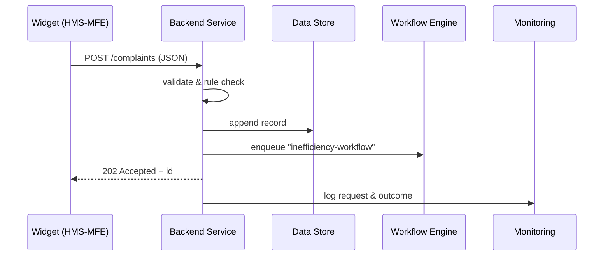

# Chapter 9: Backend Service Layer (HMS-SVC)  
*A public-works department that keeps every screen running smoothly*

[← Back to Chapter 8: Inter-Agency Communication Protocol (HMS-A2A)](08_inter_agency_communication_protocol__hms_a2a__.md)

---

## 1 — Why do we need a Backend Service Layer?

Imagine a citizen opens the **U.S. Department of Energy** portal and files an  
“Inefficient-Streetlight” complaint:

1. The web page (built with micro-frontends) collects the form.  
2. We must check the user really lives on that street.  
3. The complaint must land in the right city engineer’s queue,  
   while also notifying the Environmental Protection Agency if carbon goals are affected.  
4. All actions must be logged for auditors.

Without a central “brains” layer, every UI widget or AI agent would need to:

* know the database schema,  
* re-write permission checks,  
* juggle 3rd-party APIs,  
* reinvent error handling.

**HMS-SVC** is the **city’s public-works department** that hides this complexity behind
clean, versioned endpoints such as:

```
POST /complaints/inefficiency
GET  /patients/{id}/medications
PATCH /permits/{id}/status
```

One place to encode **business logic, validations, routing, and queueing**—so every screen, agent, and workflow can stay blissfully simple.

---

## 2 — Key Concepts (Plain-English Cheatsheet)

| Term | What it means | Government Analogy |
|------|---------------|--------------------|
| Service | A bundle of related endpoints (e.g., `complaint-svc`). | One public-works sub-department. |
| Endpoint | A single callable URL + method. | A counter window (“Window 3: Parking Permits”). |
| Business Logic | The rules the endpoint enforces. | Clerk checking form completeness. |
| Validation | Data type & permission checks. | Guard verifying your ID badge. |
| Queue Manager | Places long jobs in the background. | Drop-box for after-hours requests. |
| Adapter | Wrapper that talks to an external system (DB, A2A channel). | Translator between agencies. |

Keep these six terms in mind; the rest of SVC is surfacing them nicely.

---

## 3 — Hands-On: Build a Mini “Inefficiency Complaint” Service  
*(< 40 lines total!)*
We’ll create one endpoint that:

1. Receives a complaint from HMS-MFE.  
2. Validates that the citizen lives in the reported ZIP code.  
3. Stores the record.  
4. Pushes a job to the workflow engine (HMS-ACT).

### 3.1 Minimal FastAPI service (18 lines)

```python
# file: complaint_svc.py
from fastapi import FastAPI, HTTPException
from pydantic import BaseModel
import uuid, json, subprocess

app = FastAPI()

class Complaint(BaseModel):
    citizen_id: str
    zip_code:   str
    description:str

DB = "complaints.jsonl"          # flat-file for demo

def owns_zip(citizen_id, zip_code) -> bool:
    # TODO: real lookup; hard-code demo
    return zip_code.startswith("97")

@app.post("/complaints/inefficiency")
def submit(c: Complaint):
    if not owns_zip(c.citizen_id, c.zip_code):
        raise HTTPException(403, "ZIP mismatch")
    rec = c.dict() | {"id": str(uuid.uuid4())}
    open(DB,"a").write(json.dumps(rec)+"\n")
    subprocess.run(["hms-act","enqueue","inefficiency-workflow",rec["id"]])
    return {"status":"accepted", "id":rec["id"]}
```

Explanation for beginners  
• We use **FastAPI** because it’s readable and async-ready.  
• `Pydantic` auto-validates JSON fields.  
• `owns_zip()` is our simple *business rule*.  
• Records are appended to a newline-JSON file—fine for a demo.  
• The last line fires a workflow in [HMS-ACT](06_agent_orchestration___workflow_engine__hms_act__.md).

### 3.2 Call it from a micro-frontend (8 lines)

```javascript
// widget.js
async function fileComplaint(data){
  const res = await fetch("/api/complaints/inefficiency",{
    method:"POST",
    headers:{ "Content-Type":"application/json" },
    body: JSON.stringify(data)
  });
  return await res.json();
}
```

What will happen?  
1. User fills the form.  
2. Browser POSTs JSON.  
3. Service validates & returns `{"status":"accepted", "id":"C-123"}`.

---

## 4 — Step-by-Step: What happens under the hood?



Only five actors—notice how SVC alone “fans out” to DB, ACT, and OPS, shielding the front-end from all those details.

---

## 5 — Peeking Inside HMS-SVC  
*(super-simple internal utilities)*

### 5.1 Validation helper (10 lines)

```python
# svc_core/validators.py
def require_fields(data, fields):
    missing = [f for f in fields if f not in data]
    if missing:
        raise ValueError(f"Missing: {missing}")
```

Every endpoint can call `require_fields()` before doing anything else.

### 5.2 Queue adapter (12 lines)

```python
# svc_core/queue.py
import subprocess, json
def push(workflow, payload):
    subprocess.run(["hms-act","enqueue",workflow,
                    json.dumps(payload)])
```

One-liner wrapper so we never hard-code CLI calls in endpoints.

### 5.3 Database adapter (15 lines)

```python
# svc_core/db.py
import json, pathlib
PATH = pathlib.Path("/var/data/complaints.jsonl")
def insert(record):
    PATH.write_text(json.dumps(record)+"\n", append=True)
```

Swap this for PostgreSQL later—endpoints won’t notice.

---

## 6 — How HMS-SVC Talks to Other Layers

* Front-ends send HTTP calls from [Micro-Frontend Interface (HMS-MFE)](03_micro_frontend_interface__hms_mfe__.md).  
* Agents created with [HMS-AGT](05_agent_framework__hms_agt__.md) hit the same endpoints instead of raw DBs.  
* Long-running jobs are pushed to [Agent Orchestration & Workflow Engine (HMS-ACT)](06_agent_orchestration___workflow_engine__hms_act__.md).  
* Cross-agency data fetches go through adapters that use [Inter-Agency Protocol (HMS-A2A)](08_inter_agency_communication_protocol__hms_a2a__.md).  
* All requests automatically pass through **Governance middleware** introduced in [Chapter 1](01_governance_layer__ai_governance_values__.md).  
* Logs and metrics stream to [Operations & Monitoring Suite (HMS-OPS)](13_operations___monitoring_suite__hms_ops__.md).

---

## 7 — Frequently Asked Questions

**Q1: Do I need a huge framework?**  
No. The 18-line FastAPI file above is production-ready once you swap flat-files for a real DB.

**Q2: Where do validations live—UI or SVC?**  
Both. Light UX checks in the UI, **authoritative** checks in SVC (never trust the client).

**Q3: How do I version endpoints?**  
Prefix routes: `/v1/complaints`, `/v2/complaints`. HMS-SVC can mount multiple FastAPI apps side-by-side.

**Q4: Can agents bypass SVC and talk straight to the DB?**  
Never. Agents must respect service boundaries; this keeps policy, caching, and auditing consistent.

---

## 8 — Try It Yourself (3-minute exercise)

1. Install FastAPI & Uvicorn:

   ```bash
   pip install fastapi uvicorn
   ```

2. Save `complaint_svc.py` from Section 3.1.  
3. Run the server:

   ```bash
   uvicorn complaint_svc:app --reload
   ```

4. POST a test complaint:

   ```bash
   curl -X POST http://localhost:8000/complaints/inefficiency \
     -H "Content-Type: application/json" \
     -d '{"citizen_id":"C-77","zip_code":"97201","description":"Broken sensor"}'
   ```

5. Open `complaints.jsonl`—your record is there, and HMS-ACT has a new job.

---

## 9 — What you learned

* HMS-SVC is the **central workhorse** that implements business logic, validations, and integrations.  
* A tiny FastAPI file + helper adapters already delivers serious value.  
* UIs, agents, workflows, and inter-agency calls all rely on SVC to keep rules consistent and data safe.

Ready to see how *laws themselves* become executable rules inside HMS?  
Continue to [Chapter 10: Policy & Legislative Engine (HMS-CDF)](10_policy___legislative_engine__hms_cdf__.md)

---

---

Generated by [AI Codebase Knowledge Builder](https://github.com/The-Pocket/Tutorial-Codebase-Knowledge)