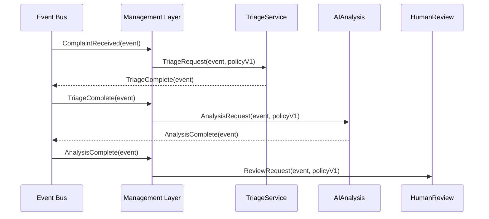

# Chapter 9: Management Layer

In the previous chapter, you saw how the [Governance Layer](08_governance_layer_.md) enforces audit and explainability rules. Now we’ll dive into the **Management Layer**—the “transit dispatcher” of HMS-EMR that coordinates microservices, routes events, and manages versions of policies or processes.

## Why Do We Need a Management Layer?

Imagine a citizen files a pothole complaint online. That single request needs to go through:

1. A **triage service** that classifies the issue (road damage, signage, drainage).  
2. An **AI analysis** service that suggests priority and crew size.  
3. A **human review** step to confirm or override the AI’s suggestion.  

Without a central orchestrator, each microservice would have to know where to send requests next—an error-prone, tangled network. The **Management Layer** acts like a dispatcher at a busy train station: it listens for incoming events (trains), reads the routing plan (policy version), and sends each event down the correct track (microservice).

## Key Concepts

1. **Orchestrator**  
   Listens for events and applies routing logic.  

2. **Event Router**  
   Subscribes to a message bus (e.g., Kafka, RabbitMQ), and re-publishes events to downstream services.  

3. **Version Manager**  
   Keeps track of current versions of workflows or policies so you can roll out updates safely.

## Example: Routing a Pothole Complaint

Here’s how a complaint flows through the Management Layer:



1. **Event Bus** publishes `ComplaintReceived`.  
2. **Management Layer** looks up the workflow version and sends `TriageRequest`.  
3. As each stage completes, new events flow back through the bus, and the orchestrator sends the next step.

## How to Use the Management Layer

Below is a minimal Node.js example showing how to subscribe to events and route them.

### 1. Subscribe to an Event

File: `src/router.js`
```js
import bus from './eventBus'
import { versionManager } from './versionManager'

// Start listening and routing
export function startRouter() {
  bus.subscribe('ComplaintReceived', async event => {
    const policy = versionManager.get('complaintWorkflow')
    // Send the event to TriageService
    bus.publish('TriageRequest', { event, policy })
  })
}
```
This code:
- Subscribes to the `ComplaintReceived` channel.
- Fetches the current workflow policy.
- Publishes a `TriageRequest` with the event data and policy.

### 2. Manage Versions

File: `src/versionManager.js`
```js
const policies = {
  complaintWorkflow: { version: 1, steps: ['triage', 'aiAnalysis', 'humanReview'] }
}

export const versionManager = {
  get(name) { return policies[name] },
  set(name, policy) { policies[name] = policy }
}
```
Here we keep an in-memory map of workflow definitions. In real life, you’d store these in a database or Git repo.

### 3. Boot the Router

File: `src/server.js`
```js
import { startRouter } from './router'

startRouter()
console.log('Management Layer is running')
```
Just call `startRouter()` when your service starts.

## What Happens Behind the Scenes

1. **Management Layer** subscribes to one or more event channels.  
2. On each event, it fetches the appropriate policy version.  
3. It routes the event to the next microservice by publishing a new event.  
4. Services process their step and emit completion events back to the bus, looping through until the workflow ends.

## Internal Implementation

Here’s a simple directory layout for the Management Layer service:

```
hms-management/
└── src/
    ├── server.js         # Boot file
    ├── router.js         # Subscribes & routes events
    ├── versionManager.js # Tracks policy versions
    └── eventBus.js       # Abstraction over your message broker
```

### src/eventBus.js (stub)
```js
// A minimal in-memory event bus for demo
const handlers = {}

export default {
  subscribe(channel, fn) {
    handlers[channel] = handlers[channel] || []
    handlers[channel].push(fn)
  },
  publish(channel, data) {
    (handlers[channel] || []).forEach(fn => fn(data))
  }
}
```
This mock lets you demo routing without an external broker.

## Summary

In this chapter you learned how the **Management Layer**:

- Acts as an **orchestrator**, listening for events and dispatching them.  
- Uses an **event router** to decouple services via a message bus.  
- Manages **policy versions** so you can update workflows safely.

Up next, we’ll see how to track system health and performance in the [Monitoring & Metrics Service](10_monitoring___metrics_service_.md).

---

Generated by [AI Codebase Knowledge Builder](https://github.com/The-Pocket/Tutorial-Codebase-Knowledge)