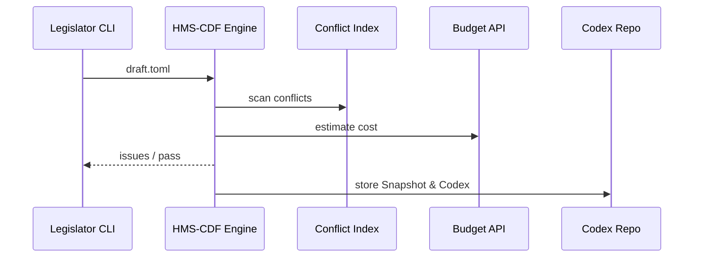

# Chapter 10: Policy & Legislative Engine (HMS-CDF)

[← Back to Chapter 9: Backend Service Layer (HMS-SVC)](09_backend_service_layer__hms_svc__.md)

---

## 1 — Why turn *laws* into *code*?

Imagine Congress passes a short bill:

> “By July 1 all National Parks must offer **plastic-straw‐free** concessions.”

Simple sentence, right?  
Behind the curtain it must:

1. Check it does **not** clash with ADA accessibility rules.  
2. Estimate budget impact on concessionaires.  
3. Collect & publish 60 days of public comments.  
4. Appear in every park’s POS system as a **machine-readable rule**.

If each agency wrote its own scripts the process would take months (or break things).  
**HMS-CDF** is the Rust-based “bill-to-law conveyor belt” that does it *once* for everyone:

```
Draft Bill ─→ Conflict Check ─→ Budget Score ─→ Comment Tracker ─→ Codified Rule
```

---

## 2 — Core Concepts (plain-English cheatsheet)

| Term | What it really means | Analogy |
|------|---------------------|---------|
| Draft | Markdown/TOML blob describing a rule. | First paper copy of a bill. |
| Conveyor Step | Automated check (conflict, budget, comments). | Committee hearing. |
| Amendment | Change file created by a reviewer. | “Strike line 3…” sticky note. |
| Snapshot | Immutable bundle of a draft + all amendments at time T. | Bill edition printed for the floor. |
| Codex | Final, machine-readable JSON that services consume. | The U.S. Code volume on a shelf. |

Remember these five words—everything in CDF flows through them.

---

## 3 — Hands-On: Pass a tiny bill through the conveyor

### 3.1 Write the draft (10 lines)

```toml
# bill_prk-001.toml
title = "Plastic Straw Phase-Out in National Parks"
agency = "NPS"
effective = "2025-07-01"
text = """
All concession stands must eliminate single-use plastic straws.
"""
```

### 3.2 Run it through CDF (one command)

```bash
$ hms-cdf vet bill_prk-001.toml
```

Possible console output:

```
✓ Conflict-of-Law  : no clashes found
✓ Budget Impact    : $0.13 per visitor (within threshold)
✓ Comment Tracker  : open for 60-day period
Snapshot ID        : SNAP-a13f
```

### 3.3 Auto-generated Codex (trimmed to 8 lines)

```json
{
  "id": "RULE-NPS-2025-07",
  "scope": "NationalParks.Concessions",
  "action": "BAN_PLASTIC_STRAWS",
  "starts": "2025-07-01",
  "exceptions": ["ADA_DRINKING_TUBE_ON_REQUEST"]
}
```

Any HMS service—UI widgets, agents, workflows—can now just load `Codex` instead of parsing legal prose!

---

## 4 — What happens under the hood?



Five actors, <10 network calls—fast enough for nightly regulatory cycles.

---

## 5 — Peek inside the Rust core (all ≤ 20 lines)

### 5.1 Main conveyor loop (`conveyor.rs`, 18 lines)

```rust
fn conveyor(draft: Draft) -> Result<Snapshot> {
    let mut snap = Snapshot::new(draft);
    conflict::run(&mut snap)?;    // step 1
    budget::score(&mut snap)?;    // step 2
    comments::open(&mut snap)?;   // step 3
    codex::emit(&snap)?;          // step 4
    Ok(snap)
}
```

Beginner takeaway: one function calls four modules—easy to read, easy to swap.

### 5.2 Tiny conflict check (`conflict.rs`, 12 lines)

```rust
pub fn run(s: &mut Snapshot) -> Result<()> {
    for law in index::all() {
        if law.scope.overlaps(&s.draft.scope) &&
           law.action.conflicts(&s.draft.action) {
            return Err(anyhow!("Conflict with {}", law.id));
        }
    }
    Ok(())
}
```

Reads every existing law; errors if scope & action collide.

### 5.3 Emit codex (`codex.rs`, 8 lines)

```rust
pub fn emit(s: &Snapshot) -> Result<()> {
    let file = format!("codex/{}.json", s.id);
    std::fs::write(&file, serde_json::to_string(&s.to_rule())?)?;
    Ok(())
}
```

Turns the snapshot into one JSON file in `codex/`. Done.

---

## 6 — How other HMS layers use CDF

* **Front-end widgets** show “Pending Rules” or “Effective Today” cards by reading Codex files via [Backend Service Layer](09_backend_service_layer__hms_svc__.md).  
* **Agents** in [HMS-AGT](05_agent_framework__hms_agt__.md) query `codex.lookup(scope, date)` instead of free-text laws.  
* **Workflows** in [HMS-ACT](06_agent_orchestration___workflow_engine__hms_act__.md) can include a `type: cdf.publish` step to auto-promulgate freshly passed rules.  
* **Governance Layer** (Chapter 1) treats each Snapshot as an auditable artifact—no hidden edits.

---

## 7 — Frequently Asked Questions

**Q1: Can citizens see drafts?**  
Yes. Each draft lives in `/public/drafts/<id>.toml`. Public comments are linked automatically.

**Q2: How are amendments handled?**  
Any reviewer runs `hms-cdf amend <draft> --line 3-4 --text "new text"`. The engine creates `AMND-<timestamp>.patch` and rolls a new Snapshot.

**Q3: What if budget impact exceeds a threshold?**  
`budget::score()` raises an error. Workflow halts until an Appropriations-agent (or HITL) attaches a funding source.

---

## 8 — Try it yourself (3-minute exercise)

1. Install the CLI (mock crate):

   ```bash
   cargo install hms-cdf-lite
   ```

2. Copy `bill_prk-001.toml` from Section 3.  
3. Run `hms-cdf vet bill_prk-001.toml`.  
4. Edit the draft to *also* ban plastic lids; re-vet and watch the conflict checker flag ADA rules.

---

## 9 — What you learned

* HMS-CDF is the **bill-to-law conveyor belt**: draft → checks → codex.  
* Five key nouns—Draft, Conveyor Step, Amendment, Snapshot, Codex—cover 95 % of the system.  
* A short TOML file and one CLI command let beginners publish machine-readable policy.  
* Other HMS layers consume Codex files, ensuring UI, agents, and workflows obey the same rules.

Ready to store Snapshots, public comments, and Codex files in a robust, versioned store?  
Continue to [Chapter 11: Data Repository & Management Service (HMS-DTA)](11_data_repository___management_service__hms_dta__.md)

---

---

Generated by [AI Codebase Knowledge Builder](https://github.com/The-Pocket/Tutorial-Codebase-Knowledge)