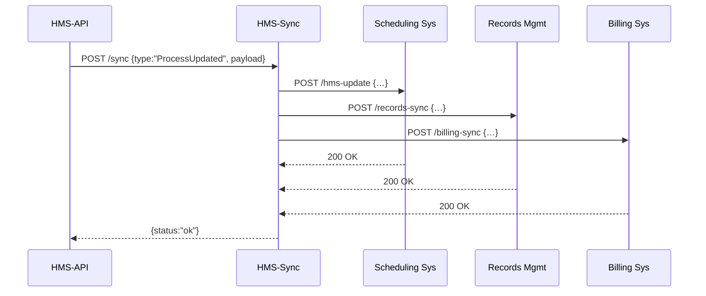

# Chapter 11: External System Synchronization

In the previous chapter, we tracked system health and performance in the [Monitoring & Metrics Service](10_monitoring___metrics_service_.md). Now we’ll ensure that every change you make in HMS-EMR shows up instantly in outside systems—scheduling, records management, billing—so nothing ever gets out of sync.

## Why Do We Need External System Synchronization?

Imagine a federal health clinic updates its **appointment workflow**—maybe it adds a new “telehealth” slot. If the central HMS-EMR system rolls out that change, the external scheduling service, the patient records database, and the billing platform all need to reflect it **right away**. No delays, no mismatches—just a perfect mirror.

Without this real-time link:

- Citizens might book old slots that no longer exist.
- Records could store outdated workflows.
- Bills might charge for services that have changed.

With External System Synchronization, any process or policy change is broadcast like flipping one pane of mirrored glass—every other pane shifts at the same moment, keeping everything consistent.

## Key Concepts

1. **Event Publisher**  
   Any HMS-EMR component (e.g., [Backend API](05_backend_api__hms_api___hms_mkt__.md)) emits a small “sync” event whenever a process or policy changes.

2. **Sync Service**  
   A dedicated microservice that receives those events and fans them out to adapters for each external system.

3. **Adapters**  
   Tiny pieces of code that know how to talk to specific external APIs (scheduling, records, billing).

4. **Reliability & Retry**  
   If any adapter call fails (network glitch, external downtime), the Sync Service can retry or log the failure for manual review.

## How to Use External System Synchronization

### 1. Emit an Event from HMS-API

Whenever you deploy or update a process, call your sync publisher:

```js
// Inside processService.js (HMS-API)
import axios from 'axios';

export async function deployProcess(def) {
  // ... validate and save to DB ...
  await axios.post('http://hms-sync:7003/sync', {
    type: 'ProcessUpdated',
    payload: { processId: def.processId, timestamp: new Date() }
  });
  return { status: 'success' };
}
```
Explanation:
- After saving the new process, we POST a small JSON event to the Sync Service.
- `type` tells adapters what changed; `payload` carries details.

### 2. Receive and Dispatch in the Sync Service

```js
// hms-sync/server.js
import express from 'express';
import { handleSync } from './syncService';

const app = express();
app.use(express.json());

app.post('/sync', handleSync);
app.listen(7003, () => console.log('HMS-Sync running on 7003'));
```
Explanation:
- We set up an HTTP endpoint `/sync` to accept events.
- Incoming events are passed to `handleSync`.

```js
// hms-sync/syncService.js
import schedulingAdapter from './adapter/schedulingAdapter';
import recordsAdapter    from './adapter/recordsAdapter';
import billingAdapter    from './adapter/billingAdapter';

export async function handleSync(req, res) {
  const event = req.body;
  // Fan-out to each external system
  await schedulingAdapter.push(event);
  await recordsAdapter.push(event);
  await billingAdapter.push(event);
  res.send({ status: 'ok' });
}
```
Explanation:
- We import three adapters.
- We call each adapter’s `push` method with the same event.
- When all succeed, we reply `{ status: 'ok' }`.

### 3. Adapters Talk to External APIs

```js
// hms-sync/adapter/schedulingAdapter.js
import axios from 'axios';

export default {
  push(event) {
    // Forward to the government scheduling API
    return axios.post(
      'https://scheduling.gov/api/hms-update',
      event
    );
  }
};
```
Explanation:
- This adapter wraps the external scheduling endpoint.
- It simply forwards the event JSON.

The `recordsAdapter.js` and `billingAdapter.js` look the same, just pointing at different URLs.

## What Happens Behind the Scenes



1. **HMS-API** posts a sync event.  
2. **HMS-Sync** receives it and calls each external system adapter.  
3. Each external API returns `200 OK`.  
4. **HMS-Sync** reports success back to **HMS-API**.

## Internal Implementation Overview

Folder structure for the Sync Service:

```
hms-sync/
├── server.js           # HTTP entry point
├── syncService.js      # Core fan-out logic
└── adapter/
    ├── schedulingAdapter.js
    ├── recordsAdapter.js
    └── billingAdapter.js
```

- **server.js** wires the Express route.  
- **syncService.js** loads adapters and pushes events.  
- **adapter/** contains one file per external system, each with a simple `push(event)` function.

You can enhance this with retries, circuit breakers, or a message queue (instead of HTTP) to guarantee delivery.

## Summary

In this chapter you learned how to:

- Emit real-time sync events from the [Backend API](05_backend_api__hms_api___hms_mkt__.md).  
- Build a **Sync Service** that fans events out to external systems.  
- Write **Adapters** to connect with scheduling, records management, and billing platforms.  

With this mirror-like link, any change in HMS-EMR reflects immediately wherever it matters—no more stale data or manual updates.

Next up: meet your friendly neighborhood AI agent in [AI Representative Agent (HMS-A2A)](12_ai_representative_agent__hms_a2a__.md).

---

Generated by [AI Codebase Knowledge Builder](https://github.com/The-Pocket/Tutorial-Codebase-Knowledge)