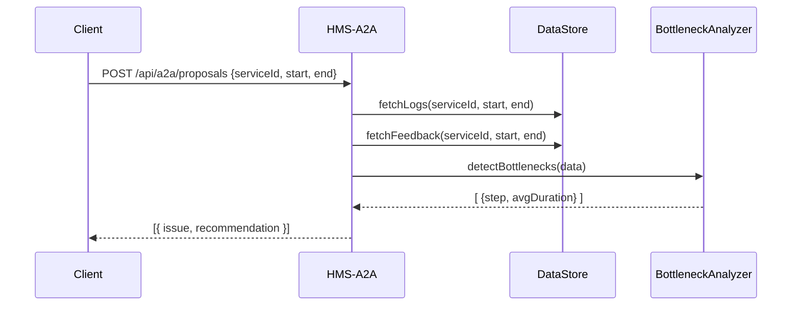

# Chapter 12: AI Representative Agent (HMS-A2A)

Now that you’ve seen how we keep external systems in sync in the [External System Synchronization](11_external_system_synchronization_.md) chapter, it’s time to give our workflows a smart consultant. Enter the **AI Representative Agent (HMS-A2A)**—an autonomous service that studies how people use the platform, reads citizen feedback, spots bottlenecks and drafts improvement plans.

---

## 12.1 Motivation: Solving Licensing Delays

Imagine the Department of Licensing is drowning in complaints:

- Citizens report “My business license took 30 days!”
- Managers can’t pinpoint why approvals stall.

HMS-A2A acts like an on-duty expert consultant. It:

1. Ingests usage logs, user surveys and operational metrics.  
2. Finds slow steps in the “approve license” workflow.  
3. Drafts a plan: “Merge step A and B to cut 5 days.”

With this agent, teams get data-driven suggestions without digging through spreadsheets.

---

## 12.2 Key Concepts

1. **Data Ingestion**  
   Collect logs (timestamps, user actions), feedback (ratings, comments), and metrics (average durations).

2. **Bottleneck Detection**  
   Identify steps where average processing time spikes above a threshold.

3. **Proposal Generation**  
   Turn detected issues into human-readable recommendations.

4. **Recommendation API**  
   A simple HTTP interface consumers call to fetch AI-generated proposals.

---

## 12.3 How to Use HMS-A2A

Here’s a minimal client to request recommendations for the “license-approval” service:

```js
// File: A2AClient.js
import axios from 'axios';

export async function getRecommendations(serviceId, start, end) {
  const res = await axios.post('/api/a2a/proposals', {
    serviceId, startDate: start, endDate: end
  });
  return res.data; // an array of { issue, recommendation }
}
```

Explanation:
- We send `serviceId`, `startDate` and `endDate` in the request body.
- The agent responds with an array of proposals.

Example usage:

```js
import { getRecommendations } from './A2AClient';

(async () => {
  const ideas = await getRecommendations(
    'license-approval', '2024-06-01', '2024-06-30'
  );
  console.log('AI Suggestions:', ideas);
})();
```

Possible output:
```json
[
  {
    "issue": "managerApproval",
    "recommendation": "Combine 'managerApproval' and 'finalCheck' into a single step"
  }
]
```

---

## 12.4 Under the Hood: Step-by-Step Flow



1. **Client** calls the agent API.  
2. **HMS-A2A** loads logs and feedback from **DataStore**.  
3. **BottleneckAnalyzer** finds slow steps.  
4. The agent returns a list of `issue` + `recommendation`.

---

## 12.5 Internal Implementation

Here’s a minimal layout for `hms-a2a`:

```
hms-a2a/
└─ src/
   ├─ server.js
   ├─ controllers/
   │   └─ proposalController.js
   ├─ services/
   │   ├─ dataIngestor.js
   │   ├─ bottleneckAnalyzer.js
   │   └─ proposalGenerator.js
   └─ models/
       └─ db.js
```

### src/server.js

```js
import express from 'express';
import proposalController from './controllers/proposalController';

const app = express();
app.use(express.json());
app.post('/api/a2a/proposals', proposalController);
app.listen(7004, () => console.log('HMS-A2A running on 7004'));
```

Sets up a POST endpoint for proposals.

---

### src/controllers/proposalController.js

```js
import { generateProposals } from '../services/proposalGenerator';

export default async function(req, res) {
  const { serviceId, startDate, endDate } = req.body;
  const proposals = await generateProposals(serviceId, startDate, endDate);
  res.json(proposals);
}
```

This controller calls our generator and returns its proposals.

---

### src/services/proposalGenerator.js

```js
import { fetchData } from './dataIngestor';
import { analyze } from './bottleneckAnalyzer';

export async function generateProposals(svc, start, end) {
  const data = await fetchData(svc, start, end);
  const bottlenecks = await analyze(data);
  return bottlenecks.map(b => ({
    issue: b.step,
    recommendation: `Reduce '${b.step}' wait time by 20%`
  }));
}
```

1. Fetch combined logs and feedback.  
2. Analyze for slow steps.  
3. Map each bottleneck to a simple recommendation.

---

## 12.6 Summary

In this chapter you learned how the **AI Representative Agent (HMS-A2A)**:

- Ingests platform logs, user feedback, and metrics.  
- Detects bottlenecks in workflows automatically.  
- Generates actionable process or policy improvement proposals.  
- Exposes a lightweight HTTP API for other services to fetch recommendations.

Next, we’ll bring humans back into the loop with [Human-in-the-Loop Oversight](13_human_in_the_loop_oversight_.md), ensuring every AI suggestion gets the right review.

---

Generated by [AI Codebase Knowledge Builder](https://github.com/The-Pocket/Tutorial-Codebase-Knowledge)